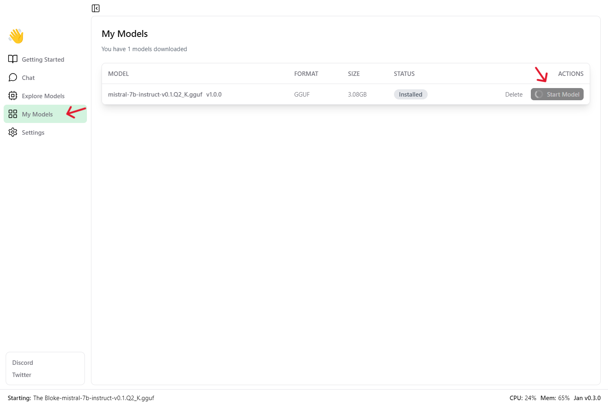

To get your model up and running:

- **Step 1:** Check your model's `status` in the 'My Models' section to see if it's installed.

- **Step 2:** Once installed, start the model by clicking the 'Start Model' button.

Your model is ready to use when its status changes to 'Active'.