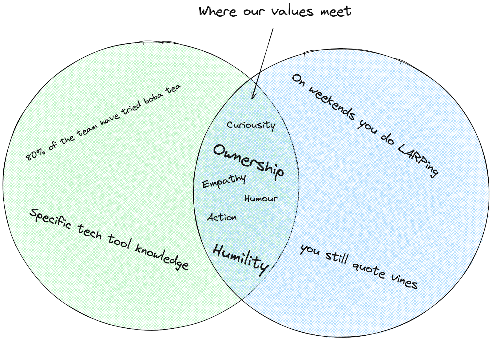

_The purpose - To conduct fair, unbiased interviews that focus on identifying candidates with initiative, scrappiness, and a good fit for a core contributor role at Jan._

## Our Key Principles

### Avoiding Bias

Tempting as it is to judge someone based on the fact that they _also_ binge-watched Severance, every role at Jan is a key hire and should be interviewed to the same standard.

What does fair interviewing look like at Jan?
At Jan, the team assesses candidates based on their skills, experiences, and fit for the role and company culture. We expect an in turn assessment and healthy curiosity.

We’re striving for a middle ground between hiring exclusively within our network (like PayPal in the early days) and broader, more open hiring practices that reduce bias.

[Learn more](./assets/01-learn-more.png)

What the candidate is looking for is just as important as what we at Jan are looking for.

Value alignment isn’t something that’s often spoken about when hiring for a new role. At Jan, we believe that value alignment is the stuff folks really mean when they say “culture fit”.

## We Care About

### Initiative and Scrappiness

We want people on the team who demonstrate resourcefulness, problem-solving skills, and the ability to thrive in a bootstrapped, open-source environment. (This isn’t a mandated “do more with less!” statement, but rather, we appreciate those who _get_ where we’re coming from.)

### Diversity, Equity, and Inclusion (DEI)

While we don't have a large DEI program, we are committed to inclusivity and respect for diverse opinions and backgrounds. Our focus is on individual merit and cultural fit, rather than ticking DEI checkboxes.

### Values

The stuff that’s hard to put into words but you can always tell when it’s missing in your company. Our values play out in our everyday behaviors.

## The Kinds of Questions You Could Expect From an Interview

- Can you describe a time when you had to be resourceful or "scrappy" to solve a problem? What was the outcome?
- How do you stay motivated and productive in environments with limited resources or guidance?
- Can you give an example of a successful project you contributed to in an open-source community?
- How do you handle disagreements or differing opinions in a professional setting?
- Describe a situation where you took the initiative in a project or task. What drove you to take charge?
- In your view, what's the most challenging aspect of working in a bootstrapped company, and how would you navigate this challenge?
- How do you prioritize tasks?
- Can you discuss a time when you had to learn a new skill or technology quickly to complete a task? How did you approach this?
- What does 'cultural fit' mean to you, and why do you think it's important in a workplace?
- How do you balance the need for collaboration with independent work in your professional life?

## The (Ideal) Process

### Pre-Interview

Review the candidate's resume and portfolio without preconceived notions. Focus on their skills and experiences relevant to the role.

### During the Interview (internal notes)

Use the questions as a guide but be flexible to explore interesting points raised by the candidate. Ask the same questions of everyone if possible.

Observe not just what they say, but how they think and approach problems.

### Post-Interview

Evaluate candidates based on their responses, skills, potential cultural fit, and ability to contribute to Jan's goals within their proposed function. Avoid making snap judgments based on first impressions or personal biases.

### Decision Making

Combine feedback from everyone involved in hiring. Consider how the new hire would engage with others in their pod and the wider team.

Hiring isn’t easy, and at Jan, we’re aiming to be as transparent and inclusive as we can, with the knowledge that as a small core contributor team, we need to be extremely selective about who we onboard.

The intention is they’re here for the long haul!
