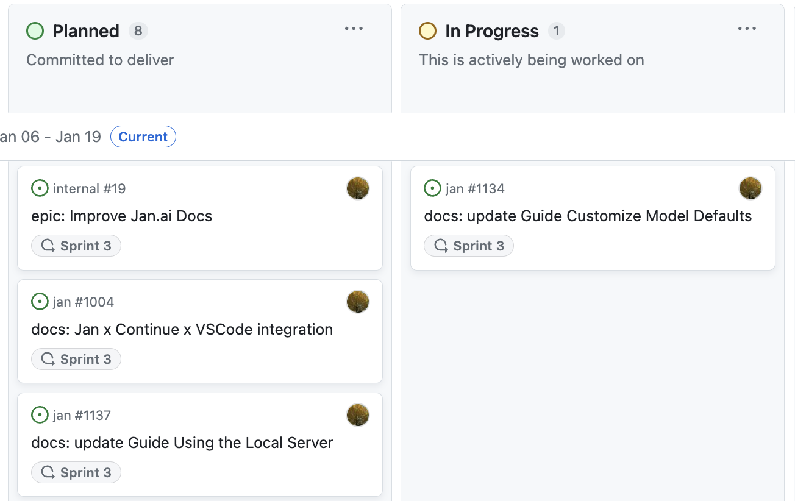

How do you operate fully remotely? How do you run an open source company without everyone going ape? This post aims to answer questions the Jan team answers regularly in Discord.

### Small Pods = Big Impact

At Jan, we operate in small pods- like nerdy dolphins. These are compact, agile teams, each taking ownership of specific aspects of our product. This structure allows us to ship features at an impressive speed, maintain a clear focus on our business goals, and experience minimal roadblocks.

### Our Approach to the Jan Roadmap

How do we decide what gets prioritized when there are so many potentials?

[Our product handbook](https://jan.ai/handbook/product/) is not just a document; it makes up part of our larger open company handbook. The aim is for everything to be outlined - from our high-level roadmap, which is used for strategic alignment and reflects our engineering implementation cycles, to our Standup Kanban, the go-to view for our daily standups.

### How We Label

We use Roadmap Labels to tag large, long-term projects that often span multiple teams and sprints. For example, a label like 'roadmap: Jan has Mobile' signifies a significant strategic initiative.

These roadmaps contain epics – large stories that typically span 1-2 weeks, complete with specs, architecture decisions, and designs. Each epic has one owner, ensuring clear responsibility and accountability.

### Milestones & Tasks

Our milestones, aligned with semantic versioning, track release versions and fit neatly into our 2-week sprint cycles. Tasks, whether they're features, bugs, or chores, are designed to be completed within a few days. They always belong to an epic, tying back to our larger roadmap.

### Kanban - Because a Cluttered Brain Doesn’t Make Decisions

Our Kanban board is a dynamic snapshot of our workflow. It ranges from 'no status' for issues needing triage, to 'done' for completed tasks. This system helps us efficiently manage our workflow and ensures that every team member is aware of their responsibilities and the current state of our projects.

### How We Triage Bugs

Our Triage Standard Operating Procedure (SOP) is crucial for handling urgent bugs by assigning them to an owner and tagging them to the current sprint and milestone. For all other tasks, we assign the correct roadmap label(s) and owner. Determining what fires we let burn is a continuous learning and practice to build.

### Our Rhythm- Standups, sprints, demos, and TGIFs

Our day kicks off with a standup at 11 AM, where we align our tasks and address any immediate concerns. We run in sprints, which keeps us focused and fast. Fridays are special at Jan – not just because it's the end of the week, but because we have demos and TGIF sessions. Not just for kicking back with questionable Google Meet filters but also for celebrating our achievements and learning from our experiences.

### Small Pods, Big Dreams

At Jan our small pod structure is more than just an organizational choice; it's a reflection of our belief in empowerment, agility, and clear focus. Hierarchical management and top-down decision making are something that goes against our core - and we’ve found that by being small and owning functions - our objectives aren’t just goals - they’re becoming reality.
