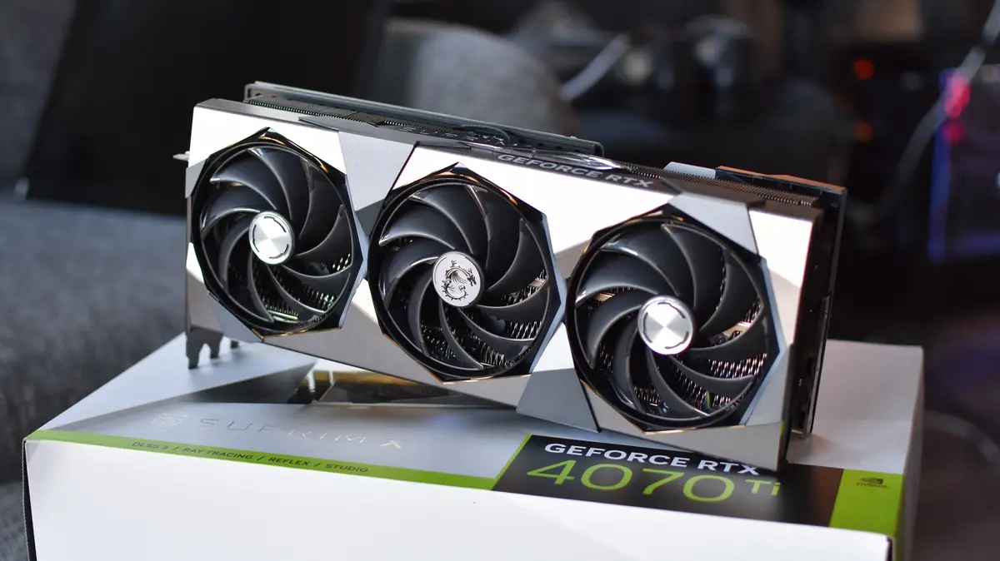
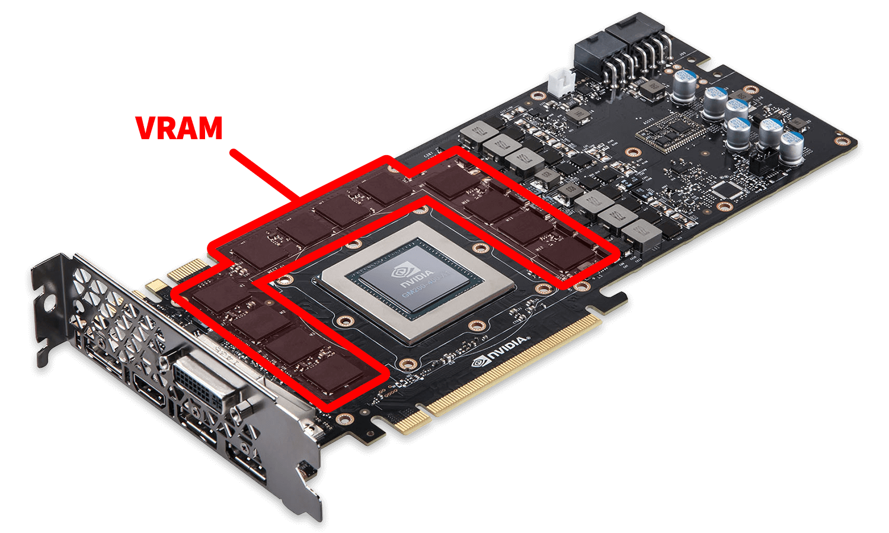
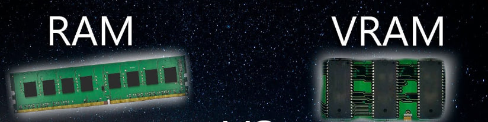
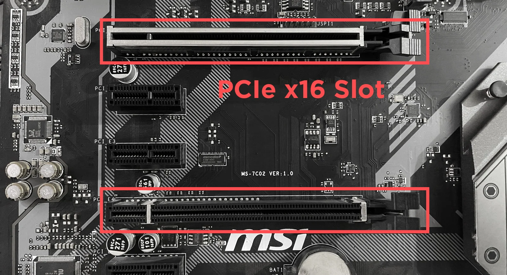
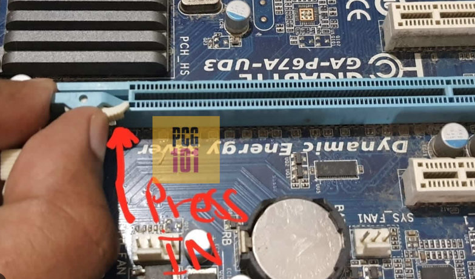
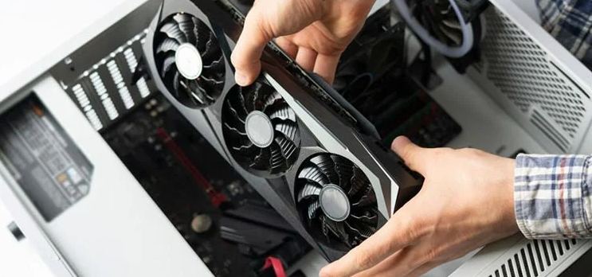
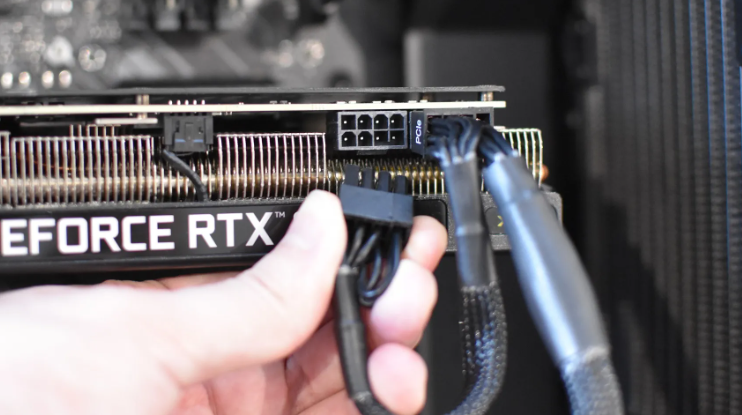

## What Is a GPU?

A Graphics Card, or GPU (Graphics Processing Unit), is a fundamental component in modern computing. Think of it as the powerhouse behind rendering the stunning visuals you see on your screen. Similar to the motherboard in your computer, the graphics card is a printed circuit board. However, it's not just a passive piece of hardware; it's a sophisticated device equipped with essential components like fans, onboard RAM, a dedicated memory controller, BIOS, and various other features. If you want to learn more about GPUs then read here to [Understand the architecture of a GPU.](https://medium.com/codex/understanding-the-architecture-of-a-gpu-d5d2d2e8978b)

## What Are GPUs Used For?

Two decades ago, GPUs primarily enhanced real-time 3D graphics in gaming. But as the 21st century dawned, a revelation occurred among computer scientists. They recognized that GPUs held untapped potential to solve some of the world's most intricate computing tasks.
This revelation marked the dawn of the general-purpose GPU era. Today's GPUs have evolved into versatile tools, more adaptable than ever before. They now have the capability to accelerate a diverse range of applications that stretch well beyond their original graphics-focused purpose.

### **Here are some example use cases:**

1. **Gaming**: They make games look good and run smoothly.
2. **Content Creation**: Help with video editing, 3D design, and graphics work.
3. **AI and Machine Learning**: Used for training smart machines.
4. **Science**: Speed up scientific calculations and simulations.
5. **Cryptocurrency Mining**: Mine digital currencies like Bitcoin.
6. **Medical Imaging**: Aid in analyzing medical images.
7. **Self-Driving Cars**: Help cars navigate autonomously.
8. **Simulations**: Create realistic virtual experiences.
9. **Data Analysis**: Speed up data processing and visualization.
10. **Video Streaming**: Improve video quality and streaming efficiency.

## What is VRAM In GPU?

VRAM, or video random-access memory, is a type of high-speed memory that is specifically designed for use with graphics processing units (GPUs). VRAM is used to store the textures, images, and other data that the GPU needs to render graphics. Its allows the GPU to access the data it needs quickly and efficiently. This is essential for rendering complex graphics at high frame rates.

VRAM is different from other types of memory, such as the system RAM that is used by the CPU. VRAM is optimized for high bandwidth and low latency, which means that it can read and write data very quickly. The amount of VRAM that a GPU has is one of the factors that determines its performance. More VRAM allows the GPU to store more data and render more complex graphics. However, VRAM is also one of the most expensive components of a GPU. So when choosing a graphics card, it is important to consider the amount of VRAM that it has. If you are planning on running demanding LLMs or video games, or 3D graphics software, you will need a graphics card with more VRAM.

## What makes VRAM and RAM different from each other?

RAM (Random Access Memory) and VRAM (Video Random Access Memory) are both types of memory used in computers, but they have different functions and characteristics. Here are the differences between RAM and VRAM.

### RAM (Random Access Memory):

- RAM is a general-purpose memory that stores data and instructions that the CPU needs to access quickly.
- RAM is used for short-term data storage and is volatile, meaning that it loses its contents when the computer is turned off.
- RAM is connected to the motherboard and is accessed by the CPU.
- RAM typically has a larger capacity compared to VRAM, which is designed to store smaller amounts of data with faster access times.
- RAM stores data related to the operating system and the various programs that are running, including code, program files, and user data.

### VRAM (Video Random Access Memory):

- VRAM is a type of RAM that is specifically used to store image data for a computer display.
- VRAM is a graphics card component that is connected to the GPU (Graphics Processing Unit).
- VRAM is used exclusively by the GPU and doesn’t need to store as much data as the CPU.
- VRAM is similar to RAM in that it is volatile and loses its contents when the computer is turned off.
- VRAM stores data related specifically to graphics, such as textures, frames, and other graphical data.
- VRAM is designed to store smaller amounts of data with faster access times than RAM.

In summary, RAM is used for general-purpose memory, while VRAM is used for graphics-related tasks. RAM has a larger capacity and is accessed by the CPU, while VRAM has a smaller capacity and is accessed by the GPU.

**Key differences between VRAM and RAM:**

| Characteristic | VRAM                  | RAM                   |
| -------------- | --------------------- | --------------------- |
| Purpose        | Graphics processing   | General processing    |
| Speed          | Faster                | Slower                |
| Latency        | Lower                 | Higher                |
| Bandwidth      | Higher                | Lower                 |
| Cost           | More expensive        | Less expensive        |
| Availability   | Less widely available | More widely available |

## How to Connect GPU to the Motherboard via PCIe

Connecting hardware components to a motherboard is often likened to assembling LEGO pieces. If the parts fit together seamlessly, you're on the right track. Experienced PC builders find this process straightforward. However, for first-time builders, identifying where each hardware component belongs on the motherboard can be a bit perplexing.

**So follow the below 5 steps to Connect your GPU to the Motherboard:**

1. First, make sure your computer is powered off and unplugged from the electrical outlet to ensure safety.
2. Open your computer case if necessary to access the motherboard. Locate the PCIe x16 on the motherboard where you'll install the GPU. These slots are typically longer than other expansion slots and are used for graphics cards.
   Remove Slot Covers (if applicable): Some PCIe slots may have protective covers or brackets covering them. Remove these covers by unscrewing them from the case using a Phillips-head screwdriver. And PCIe x16 will have plastic lock on one side only. There may be more than one PCIe x16 slot depending on the motherboard. You can use any of the slots according to your choice.

3. Now Insert the Graphics Card slowly:

- Unlock the plastic lock on one side of the PCIe x16 slot by pulling it outwards.

- Align the PCIe slot with your graphics card, making sure that the HDMI port side of the GPU faces the rear side of the CPU case.
- Gently press on the card until you hear it securely snap in place.

4. Insert the Power Connector: If your GPU requires additional power (most modern GPUs do), connect the necessary power cables from your power supply to the GPU's power connectors. These connectors are usually located on the top or side of the GPU.

5. Power on the System: After turning on the PC see if the fans on your graphics card spin. If it does not spin, remove the power cable from the GPU, reconnect it, and power on the PC again.

> :memo: Note: To better understand you can also watch YouTube tutorials on how to Connect the GPU to the Motherboard via PCIe

## How to Choose a Graphics Card for your AI works

Selecting the optimal GPU for running Large Language Models (LLMs) on your home PC is a decision influenced by your budget and the specific LLMs you intend to work with. Your choice should strike a balance between performance, efficiency, and cost-effectiveness.

In general, the following GPU features are important for running LLMs:

- **High VRAM:** LLMs are typically very large and complex models, so they require a GPU with a high amount of VRAM. This will allow the model to be loaded into memory and processed efficiently.
- **CUDA Compatibility:** When running LLMs on a GPU, CUDA compatibility is paramount. CUDA is NVIDIA's parallel computing platform, and it plays a vital role in accelerating deep learning tasks. LLMs, with their extensive matrix calculations, heavily rely on parallel processing. Ensuring your GPU supports CUDA is like having the right tool for the job. It allows the LLM to leverage the GPU's parallel processing capabilities, significantly speeding up model training and inference.
- **Number of CUDA, Tensor, and RT Cores:** High-performance NVIDIA GPUs have both CUDA and Tensor cores. These cores are responsible for executing the neural network computations that underpin LLMs' language understanding and generation. The more CUDA cores your GPU has, the better equipped it is to handle the massive computational load that LLMs impose. Tensor cores in your GPU, further enhance LLM performance by accelerating the critical matrix operations integral to language modeling tasks.
- **Generation (Series)**: When selecting a GPU for LLMs, consider its generation or series (e.g., RTX 30 series). Newer GPU generations often come with improved architectures and features. For LLM tasks, opting for the latest generation can mean better performance, energy efficiency, and support for emerging AI technologies. Avoid purchasing, RTX-2000 series GPUs which are much outdated nowadays.

### Here are some of the best GPU options for this purpose:

1. **NVIDIA RTX 3090**: The NVIDIA RTX 3090 is a high-end GPU with a substantial 24GB of VRAM. This copious VRAM capacity makes it exceptionally well-suited for handling large LLMs. Moreover, it's known for its relative efficiency, meaning it won't overheat or strain your home PC's cooling system excessively. The RTX 3090's robust capabilities are a boon for those who need to work with hefty language models.
2. **NVIDIA RTX 4090**: If you're looking for peak performance and can afford the investment, the NVIDIA RTX 4090 represents the pinnacle of GPU power. Boasting 24GB of VRAM and featuring a cutting-edge Tensor Core architecture tailored for AI workloads, it outshines the RTX 3090 in terms of sheer capability. However, it's important to note that the RTX 4090 is also pricier and more power-hungry than its predecessor, the RTX 3090.
3. **AMD Radeon RX 6900 XT**: On the AMD side, the Radeon RX 6900 XT stands out as a high-end GPU with 16GB of VRAM. While it may not quite match the raw power of the RTX 3090 or RTX 4090, it strikes a balance between performance and affordability. Additionally, it tends to be more power-efficient, which could translate to a more sustainable and quieter setup in your home PC.

If budget constraints are a consideration, there are more cost-effective GPU options available:

- **NVIDIA RTX 3070**: The RTX 3070 is a solid mid-range GPU that can handle LLMs effectively. While it may not excel with the most massive or complex language models, it's a reliable choice for users looking for a balance between price and performance.
- **AMD Radeon RX 6800 XT**: Similarly, the RX 6800 XT from AMD offers commendable performance without breaking the bank. It's well-suited for running mid-sized LLMs and provides a competitive option in terms of both power and cost.

When selecting a GPU for LLMs, remember that it's not just about the GPU itself. Consider the synergy with other components in your PC:

- **CPU**: To ensure efficient processing, pair your GPU with a powerful CPU. LLMs benefit from fast processors, so having a capable CPU is essential.
- **RAM**: Sufficient RAM is crucial for LLMs. They can be memory-intensive, and having enough RAM ensures smooth operation.
- **Cooling System**: LLMs can push your PC's hardware to the limit. A robust cooling system helps maintain optimal temperatures, preventing overheating and performance throttling.

By taking all of these factors into account, you can build a home PC setup that's well-equipped to handle the demands of running LLMs effectively and efficiently.
