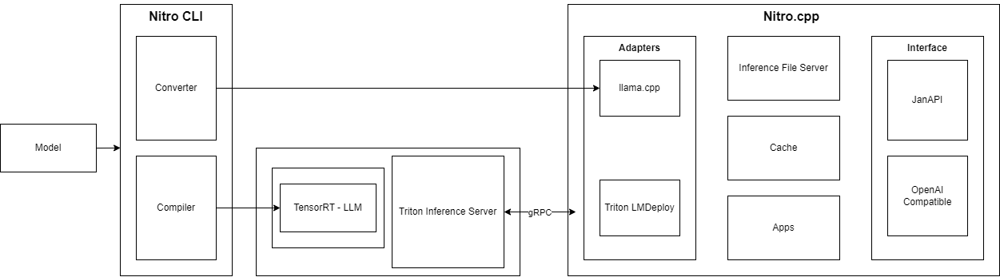

:::info
This document is being updated. Please stay tuned.
:::

### Components

- **Nitro CLI**: A command-line interface that manages model conversion and compilation for deployment.

    - **Converter**: Transforms the model into a compatible format (GGUF) for the Nitro system.
    - **Compiler**: Optimizes the converted model for efficient execution.

- **TensorRT - LLM**: A specialized component for large language models using NVIDIA's TensorRT optimization.

- **Triton Inference Server**: Serves the optimized model, facilitating scalable and efficient inference requests via gRPC.

- **Nitro.cpp**: The C++ implementation handling the deployment and interfacing of the models.

    - **Adapters**:
        - **llama.cpp**:
        - **Triton LMDeploy**:.
    - **Inference File Server**: Manages files necessary for inference operations.
    - **Cache**: Stores temporary data to improve performance.
    - **Apps**:
    - **Interface**:
        - **JanAPI**:
        - **OpenAI Compatible**: Ensures compatibility with OpenAI standards for ease of integration.

