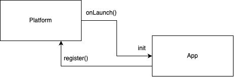

Platform has 3 events that are broadcast to installed Apps

- onLaunch()
  
- onStart()
  
- onDispose()
  
- At any given time, when there is new App installtion/ unintallation, the Platform restarts and trigger
- When App is being used, here is how the information passes between Platform and Apps
  
