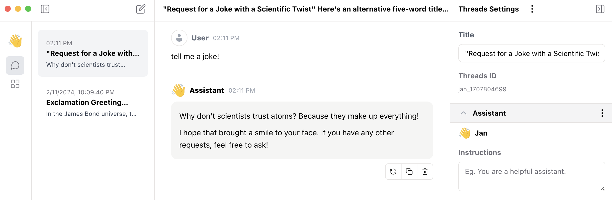
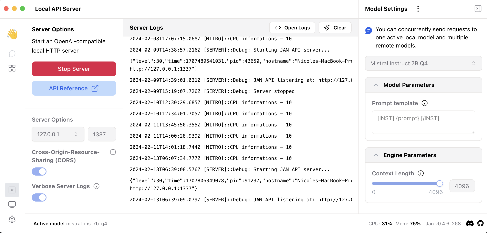
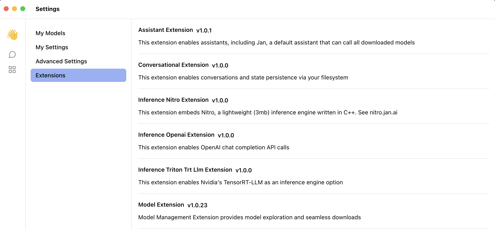

# Turn any computer into an AI computer

<!-- TODO replace with GIF when we turn this page into a website -->

### Designed for Everyone

- **Installs with 1 click.** Jan is easy to use, beautiful, and the core features are free forever.
- **Runs on consumer laptops.** Tested by 250k+ users across `Windows, Mac, and Linux`, Jan even works on `CPU-only mode`.
- **Automatic GPU acceleration**. Models responds faster across `NVIDIA, AMD, Apple, and Intel` when benchmarked against industry alternatives.

:::tip

“Normies” can run LLMs like an AI engineer on the Desktop App - no programming experience needed.

:::

### Private & Offline

- **Runs 100% locally**. AI models run directly on your laptop without an internet connection. `You own your AI`.
- **Private conversations.** Data is saved on your own filesystem in a transparent non-proprietary data format. `You own your data.`
- **Open source security**. Jan is open source, so you can scruntinize every line in our codebase. So when we say your data is not our product, we mean it. See [the code](https://github.com/janhq/jan) and our [data policy](/how-we-work/analytics).

### Customizable AI

- **Use AI without limitations.** Take control of censorship levels. Jan is usable from the classroom to the boardroom (and few other rooms if that’s your jam).
- **Use any models**. Download open source models from HuggingFace or upload your own custom models. [link]

:::tip

Download Jan Desktop Client [here](https://github.com/janhq/jan?tab=readme-ov-file#download).

:::

## Jan Desktop is

### For Developers

**You can easily integrate a locally running LLM into your own projects.**

- Turn on `Local API Server` mode to start building on an `OpenAI compatible API`.
- Jan Desktop comes with a Developer Console out of the box.
- The UI makes it easy to see logs, configure models and more.

<!-- CTA ⇒ Developer Hub -->

### For Your Home Server

<!-- [Insert Screenshot of: Jan running in a Terminal (left) || the OpenAI configuration Yaml (right)] -->

- Use Jan as a UI only, pointing to a different backend. [See Docs](/guides/using-models/integrate-with-remote-server)
- Use Jan as a backend only, pointing to a different frontend. [See Docs](/guides/using-models/integrate-with-remote-server)
- Run Jan in team-mode on production-grade GPUs. [See Server Suite](/server-suite)

<!-- CTA ⇒ Server Docs -->

### For People who Tinker

- Customize the app’s look and feel though Themes.
- Customize assistants, models and other features with **no code**.
- Customize the entire Application through Extensions. Inspired by VSCode extensions, the desktop app can be entirely customized.

[See the default extensions](https://github.com/janhq/jan/tree/main/extensions) bundled with every Desktop install.

