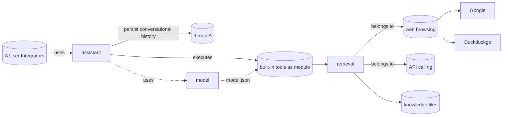

:::warning

This page is still under construction, and should be read as a scratchpad

:::

- Jan is built using modules
- Plugin architecture (on Pluggable-Electron)

Jan is comprised of system-level modules that mirror OpenAI’s, exposing similar APIs and objects

- Modules are modular, atomic implementations of a single OpenAI-compatible endpoint
- Modules can be swapped out for alternate implementations
  - The default `messages` module persists messages in thread-specific `.json`
  - `messages-postgresql` uses Postgres for production-grade cloud-native environments

| Jan Module | Description   | API Docs                     |
| ---------- | ------------- | ---------------------------- |
| Chat       | Inference     | [/chat](/api/chat)           |
| Models     | Models        | [/model](/api/model)         |
| Assistants | Apps          | [/assistant](/api/assistant) |
| Threads    | Conversations | [/thread](/api/thread)       |
| Messages   | Messages      | [/message](/api/message)     |

## Concepts

- User/ Integrator
- Assistant object
- Model object
- Thread object
- Built-in tool object
