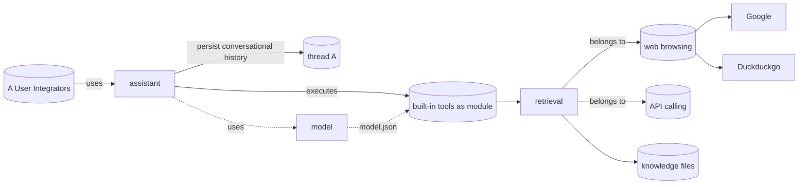

## Concepts


- User/ Integrator
- Assistant object
- Model object
- Thread object
- Built-in tool object

## File system
```sh
janroot/
	assistants/
		assistant-a/
			assistant.json
			src/
				index.ts
			threads/
				thread-a/
				thread-b
	models/
		model-a/
			model.json
```