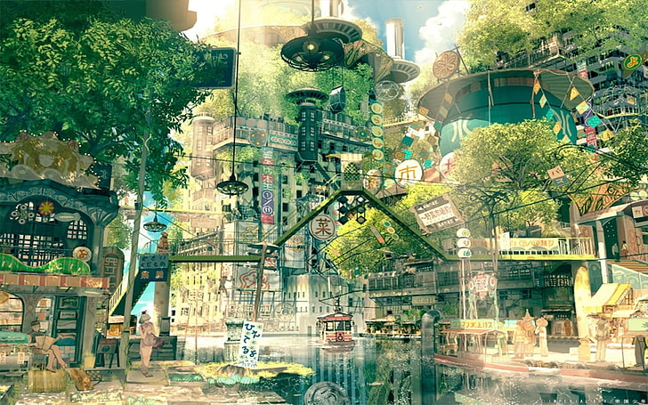
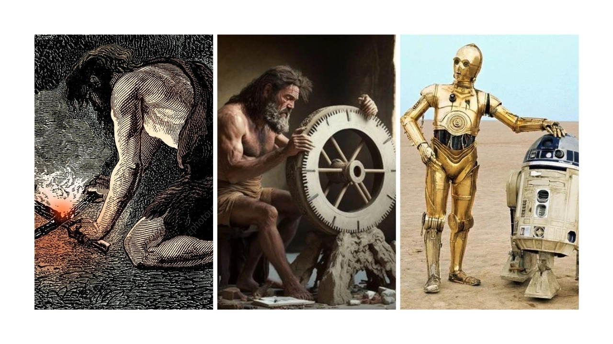

# Vision

> "I do not fear computers. I fear the lack of them" - Isaac Asimov

- Harmonious symbiosis of humans, nature, and machines
- Humanity has over millennia adopted tools. Fire, electricity, computers, and AI.
- AI is no different. It is a tool that can propel humanity forward.
- We reject the 
- Go beyond the apocalypse narratives of Dune and Terminator, and you will find a kernel of progress

We want to continue a legacy of craftsmen making tools that propel humanity forward.

## Collaborating with Thinking Machines

Our vision is to develop thinking machines that work alongside humans.

We envision a future where AI is safely used as a tool in our daily lives, like fire and electricity. These robots enhance human potential and do not replace our key decision-making. You own your own AI.

> We like that Luke can just open up R2-D2 and tinker around. He was not submitting support tickets to a centralized server somewhere in the galaxy.

## Solarpunk, not Dune

Our vision is rooted in an optimistic view of AI's role in humanity's future.

Like the [Solarpunk movement](https://en.wikipedia.org/wiki/Solarpunk), we envision a world where technology and nature coexist harmoniously, supporting a sustainable and flourishing ecosystem.

We focus on AI's positive impacts on our world. From environmental conservation to the democratization of energy, AI has the potential to address some of the most pressing challenges facing our planet.

https://www.yesmagazine.org/environment/2021/01/28/climate-change-sustainable-solarpunk