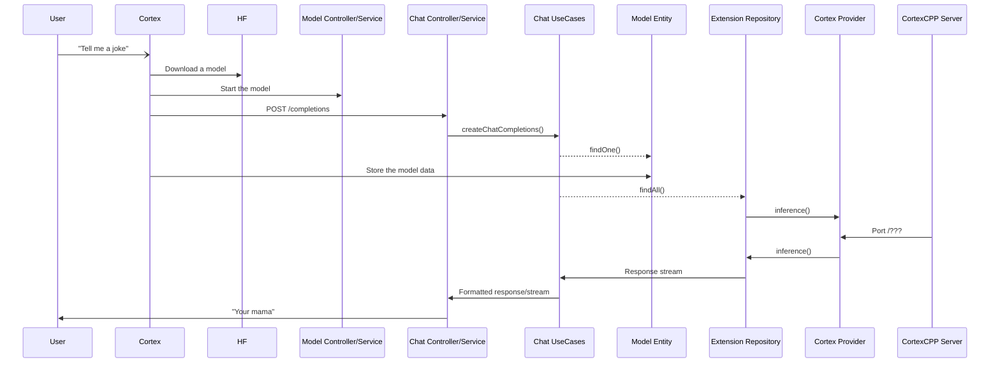

import { Callout, Steps } from 'nextra/components'
import { Cards, Card } from 'nextra/components'

<Callout type="warning">
🚧 Cortex is under construction.
</Callout>

## Introduction

Cortex is an alternative to the OpenAI API designed to operate entirely on your local hardware infrastructure. This headless backend platform is also engineered to support TensorRT-LLM, ensuring high-performance machine-learning model execution. It is packaged with a Docker-inspired command-line interface and a Typescript client library.

The following guide details Cortex's core components, providing insights and instructions for those interested in customizing It to meet specific requirements.


## Architecture


### Main Components

Cortex is architected with several key components, each designed to fulfill specific roles within the system, ensuring efficient processing and response to client requests.

1. **Cortex JS**: This component acts as the interface layer where requests are received and responses are sent.
2. **Server:** The central processing unit of Cortex, this component coordinates all activities across the system. It manages the data flow and ensures operations are correctly executed.
3. **Kernel**: This component checks the server's hardware configuration. Based on the current hardware setup, it determines whether additional dependencies are required, optimizing the system for performance and compatibility.
4. **Runtime**: This process involves dynamically loading necessary libraries and models based on the server's current needs and processing requests.
5. **Dynamic Libraries**: Consists of inference engines loaded on-demand to enhance Cortex's processing power. These engines are essential for performing specialized computational tasks. Currently, Cortex supports:
    - Llama.cpp Engine
    - TensorRT-LLM Engine
    - Python-runtime Engine

### Data Structure

Cortex is equipped with **MySQL** and **SQLite** databases, offering flexible data management options that can be easily adapted to different environments and requirements. It also has a filesystem data that can store and retrieve data using file-based mechanisms.

#### MySQL

This database is used because it is ideal for Cortex environments where scalability, security, and data integrity are critical. MySQL is well-suited for handling large model-size data from the core extensions.

#### SQLite

This database is used for simplicity and minimal setup. It can handle the small model size from the core extensions and any data from the External extensions.

#### File System

Cortex uses a filesystem approach for managing configuration files, such as `model.yaml` files. These files are stored in a structured directory hierarchy, enabling efficient data retrieval and management.

### Providers

#### Internal Provider

Integral to the CLI, it includes the core binary (**`.cpp`**) and is compiled directly with the CLI, facilitating all application parts' direct access to core functionalities.

#### Core Extensions

These are bundled with the CLI and include additional functionalities like remote engines and API models, facilitating more complex operations and interactions within the same architectural framework.

#### External Extensions

These are designed to be more flexible and are stored externally. They represent potential future expansions or integrations, allowing the architecture to extend its capabilities without modifying the core system.

### Key Dependencies

Cortex developed using NestJS and operates via a Node.js server framework, handling all incoming and outgoing requests. It also has a C++ runtime to handle stateless requests. 

Below is a detailed overview of its core architecture components:

#### NestJS Framework

NestJS framework serves as the backbone of the Cortex. This framework facilitates the organization of server-side logic into modules, controllers, and extensions, which are important for maintaining a clean codebase and efficient request handling.

#### Node.js Server

Node.js is the primary runtime for Cortex, which handles the HTTP requests, executes the server-side logic, and manages the responses.

#### C++ Runtime

C++ runtime is important for managing stateless requests. This component can handle intensive tasks that require optimized performance.

## Code Structure

The repository is organized to separate concerns between domain definitions, business rules, and adapters or implementations.
```
# Entity Definitions
domain/                    # This is the core directory where the domains are defined.
  abstracts/               # Abstract base classes for common attributes and methods.
  models/                  # Domain interface definitions, e.g. model, assistant.
  repositories/            # Extensions abstract and interface

# Business Rules
usecases/                  # Application logic 
	assistants/              # CRUD logic (invokes dtos, entities).
	chat/                    # Logic for chat functionalities.
	models/                  # Logic for model operations.

# Adapters & Implementations
infrastructure/            # Implementations for Cortex interactions
  commanders/              # CLI handlers
    models/
    questions/             # CLI installation UX
    shortcuts/             # CLI chained syntax
    types/
    usecases/              # Invokes UseCases

  controllers/             # Nest controllers and HTTP routes
		assistants/						 # Invokes UseCases
	  chat/     						 # Invokes UseCases
		models/                # Invokes UseCases
	
  database/                # Database providers (mysql, sqlite)
	
	# Framework specific object definitions
  dtos/                    # DTO definitions (data transfer & validation)
  entities/                # TypeORM entity definitions (db schema)
  
	# Providers
  providers/cortex         # Cortex [server] provider (a core extension)
  repositories/extensions  # Extension provider (core & external extensions)

extensions/                # External extensions
command.module.ts          # CLI Commands List
main.ts                    # Entrypoint

```
<Callout type="info">
The structure above promotes clean architecture principles, allowing for scalable and maintainable Cortex development.
</Callout>

## Runtime

The sequence diagram above outlines the interactions between various components in the Cortex system during runtime, particularly when handling user requests via a CLI. Here’s a detailed breakdown of the runtime sequence:

1. **User Request**: The user initiates an interaction by requesting “a joke” via the Cortex CLI.
2. **Model Activation**:
    - The API directs the request to the `Model Controller/Service`.
    - The service pulls and starts the appropriate model and posts a request to `'/completions'` to prepare the model for processing.
3. **Chat Processing**:
    - The `Chat Controller/Service` processes the user's request using `Chat UseCases`.
    - The `Chat UseCases` interact with the Model Entity and Extension Repository to gather necessary data and logic.
4. **Data Handling and Response Formation**:
    - The `Model Entity` and `Extension Repository` perform data operations, which may involve calling a `Provider` for additional processing.
    - Data is fetched, stored, and an inference is performed as needed.
5. **Response Delivery**:
    - The response is formatted by the `Chat UseCases` and streamed back to the user through the API.
    - The user receives the processed response, completing the cycle of interaction.

## Roadmap

Our development roadmap outlines key features and epics we will focus on in the upcoming releases. These enhancements aim to improve functionality, increase efficiency, and expand Cortex's capabilities.

- **Crash Report Telemetry**: Enhance error reporting and operational stability by automatically collecting and analyzing crash reports.
- **RAG**: Improve response quality and contextual relevance in our AI models.
- **Cortex TensorRT-LLM**: Optimize NVIDIA TensorRT optimizations for LLMs.
- **Cortex Presets**: Streamline model configurations.
- **Cortex Python Runtime**: Provide a scalable Python execution environment for Cortex.

## Risks & Technical Debt

Cortex CLI, built with Nest-commander, incorporates extensions to integrate various inference providers. This flexibility, however, introduces certain risks related to dependency management and the objective of bundling the CLI into a single executable binary.

### Key Risks

1. **Complex Dependencies**: Utilizing Nest-commander involves a deep dependency tree, risking version conflicts and complicating updates.
2. **Bundling Issues**: Converting to a single executable can reveal issues with `npm` dependencies and relative asset paths, leading to potential runtime errors due to unresolved assets or incompatible binary dependencies.