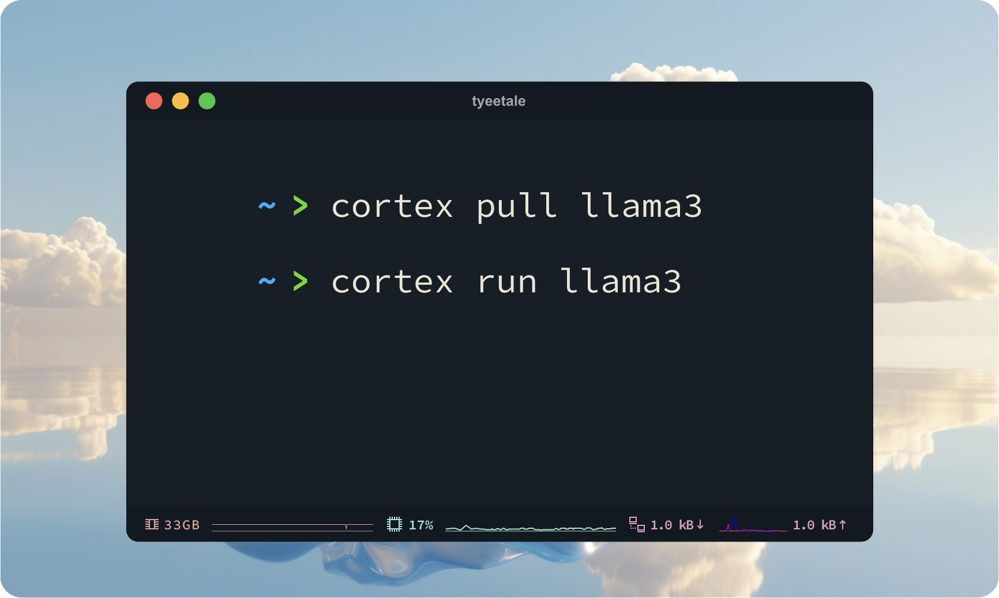

import { Callout, Steps } from 'nextra/components'

# Cortex
<Callout type="warning">
🚧 Cortex is under construction.
</Callout>

Cortex is an [OpenAI compatible](https://platform.openai.com/docs/introduction), local AI server that developers can use to build LLM apps. It can be used as a standalone server, or imported as a library. 

Cortex currently supports two inference engines: 
- Llama.cpp
- TensorRT-LLM

<Callout>
  **Real-world Use**: Cortex powers [Jan](/docs), our local ChatGPT-alternative. 
  
  Cortex has been battle-tested through 900k downloads, and handles a variety of hardware and software edge cases.
</Callout>

### Roadmap

Cortex's roadmap is to implement an [OpenAI-equivalent API](https://platform.openai.com/docs/api-reference) using a fully open source stack. Our goal is to make switching to open source AI as easy as possible for developers.

### Architecture

Cortex's [architecture](/cortex/architecture) features C++ inference core, with [higher-order features](/cortex/architecture) handled in Typescript. 

Our [long-term direction](/cortex/roadmap) is to (eventually) move towards being a full C++ library to enable embedded and robotics use cases.