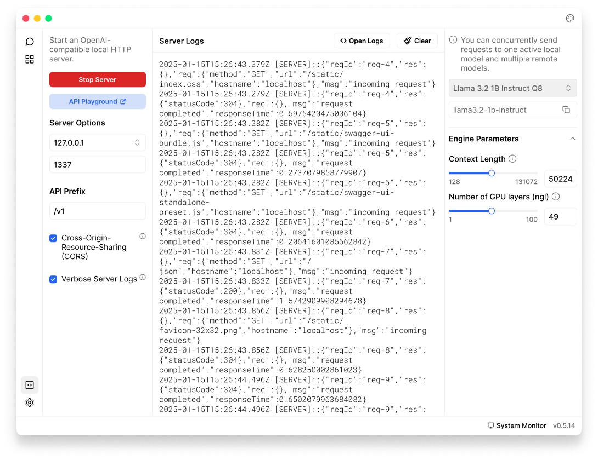

import { Callout, Steps } from 'nextra/components'
import { Settings, EllipsisVertical } from 'lucide-react'

# Local API Server

Jan includes a built-in API server that is compatible with OpenAI's API specification, allowing you to interact with AI models through a local HTTP interface. This means you can use Jan as a drop-in replacement for OpenAI's API, but running entirely on your computer.

Jan uses **Cortex** as its core engine for running AI models. If you need a standalone API server without Jan's desktop interface (for example, in server environments or for command-line usage), you can use Cortex directly: https://cortex.so.

<Callout>
Full API documentation is available at [Cortex's API Reference](https://cortex.so/api-reference#tag/chat).
</Callout>

 

 

## Start Server

<Steps>

### Step 1: Start Server
1. Navigate to the **Local API Server**
2. Configure [Server Settings](/docs/api-server#server-settings)
3. Click **Start Server** button
4. Wait for the confirmation message in the logs panel, your server is ready when you see: `JAN API listening at: http://127.0.0.1:1337`

### Step 2: Test Server
The easiest way to test your server is through the API Playground:
1. Click the **API Playground** button to open its testing interface
2. Select a model from the dropdown menu in Jan interface
3. Try a simple [chat completion](https://cortex.so/api-reference#tag/chat/post/v1/chat/completions) request
4. View the response in real-time

### Step 3: Use the API 
Navigate to [Cortex's API Reference](https://cortex.so/api-reference#tag/chat) to see full API endpoints for your use case.
</Steps>

## Server Settings

#### Host Address Options
- **127.0.0.1 (Recommended)**: 
  - Only accessible from your computer
  - Most secure option for personal use
- **0.0.0.0**: 
  - Makes server accessible from other devices on your network
  - Use with caution and only when necessary

#### Port Number
- Default: `1337`
- Can be any number between 1-65535
- Avoid common ports (80, 443, 3000, 8080) that might be used by other applications

#### API Prefix
- Default: `/v1`
- Defines the base path for all API endpoints
- Example: http://127.0.0.1:1337/v1/chat/completions

#### Cross-Origin Resource Sharing (CORS)
CORS controls which websites can access your API, which is important for web applications running in browsers.

**When to enable:**
- If you're building a web application that needs to access the API
- If you're using browser extensions

**When to leave disabled:**
- If you're only using the API from your local applications
- If you're concerned about security

#### Verbose Server Logs
Enable to show:
- Detailed information about each API request
- Error messages and debugging information
- Server status updates

## Troubleshooting Guide

<Callout>
Enable **Verbose Server Logs** for detailed error messages.
</Callout>

**1. Common Issues**
   - Confirm the server is running
   - Check if model is successfully loaded in Jan

   - Check if the port is already in use by another application
   - Verify you have admin/sudo rights if needed
   - Make sure your API endpoint matches your server settings. Example: Using `http://localhost:1337` when you set a different port.
   - Make sure the model name in your API request matches exactly what's shown in Jan. Example: If you selected "Llama 3.2 1B Instruct Q8" in Jan, use `llama3.2-1b-instruct` in your API request.
   - Verify your JSON request format is correct
   - Verify firewall settings
   - Look for detailed error messages in the logs

**2. CORS Errors in Web Apps**
   - Enable CORS in server settings if using from a webpage
   - Verify the origin of the request
   - Verify your web app's request URL matches the server address exactly
   - Check browser console for specific error messages

**3. Performance Issues**
   - Monitor system resources (CPU, RAM, and GPU usage)
   - Try to reduce the context length or `ngl` (number of GPU layers)
   - Check for other resource-intensive applications
