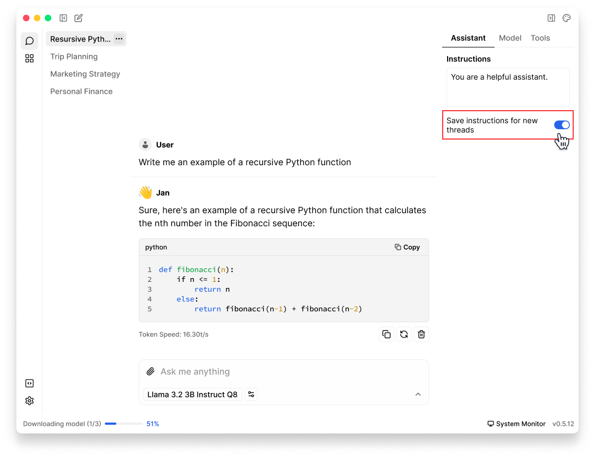

import { Callout, Steps } from 'nextra/components'

# Assistants
Assistant is a configuration profile that determines how the AI should behave and respond to your inputs. It consists of:
- A set of instructions that guide the AI's behavior
- Model settings for AI responses
- Tool configurations (like [knowlegde retrieval](/docs/tools/retrieval) settings)

Currently, Jan comes with a single default Assistant named **Jan**, which is used across all your threads. We're working on the ability to create and switch between multiple assistants. 

## Set Assistant Instructions
By modifying assistant instructions, you can customize how Jan understands and responds to your queries, what context it should consider, and how it should format its responses.

1. In any **Thread**, click the **Assistant** tab in the **right sidebar**
2. Enter your custom instructions in **Instructions** input field
3. Your instructions will be applied to the current thread right after you click out of the instruction field .


**Best Practices for Instructions:**
- Be clear and specific about the desired behavior
- Include any consistent preferences for formatting, tone, or style

**Examples:**
```
Act as a software development mentor focused on Python and JavaScript. 
Provide detailed explanations with code examples when relevant.
Use markdown formatting for code blocks.
```
```
Respond in a casual, friendly tone. Keep explanations brief and use simple language.
Provide examples when explaining complex topics.
```


## Apply Instructions to New Threads
You can save Assistant instructions to be automatically applied to all new threads:

1. In any **Thread**, click the **Assistant** tab in the **right sidebar**
2. Toggle the **Save instructions for new threads** slider 
3. When enabled, all **new threads** will use these instructions as their default, old threads are not affected

<br/>



<br/>