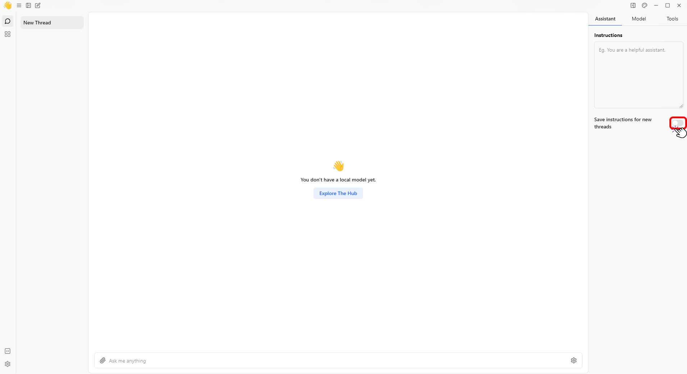

import { Callout, Steps } from 'nextra/components'

# Assistants
This guide explains how to set the Assistant instructions in the Jan application.

## Applied the Instructions to All Threads
To apply the instructions to all the new threads, follow these steps:
1. Select a **Thread**.
2. Click the **Assistant** tab.
3. Toggle the **slider** to ensure these instructions are applied to all new threads. (Activate the **Experimental Mode** feature to enable this option.)
 

 