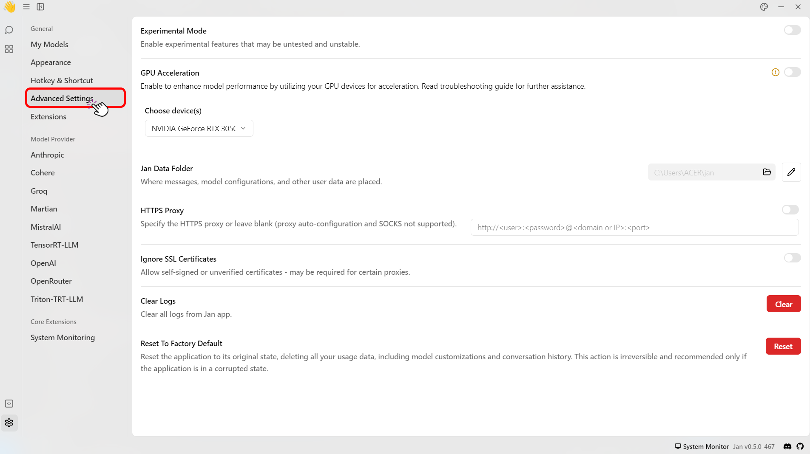
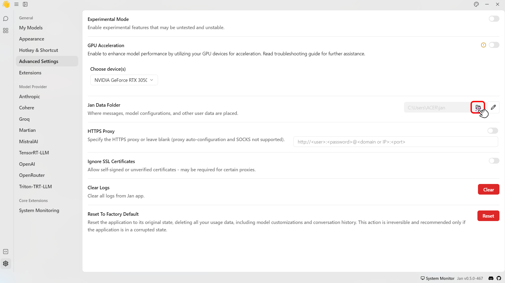

import { Tabs } from 'nextra/components'
import { Callout, Steps } from 'nextra/components'

# llama.cpp (Default)

## Overview

Jan has a default [C++ inference server](https://github.com/janhq/cortex) built on top of [llama.cpp](https://github.com/ggerganov/llama.cpp). This server provides an OpenAI-compatible API, queues, scaling, and additional features on top of the wide capabilities of `llama.cpp`.

## llama.cpp Engine

This guide shows you how to initialize the `llama.cpp` to download and install the required dependencies to start chatting with a model using the `llama.cpp` engine.

## Prerequisites
- Mac Intel:
  - Make sure you're using an Intel-based Mac. For a complete list of supported Intel CPUs, please see [here](https://en.wikipedia.org/wiki/MacBook_Pro_(Intel-based)).
  - For Mac Intel, it is recommended to utilize smaller models.
- Mac Sillicon:
  - Make sure you're using a Mac Silicon. For a complete list of supported Apple Silicon CPUs, please see [here](https://en.wikipedia.org/wiki/Apple_Silicon).
  - Using an adequate model size based on your hardware is recommended for Mac Silicon.
<Callout type="info">
  This can use Apple GPU with Metal by default for acceleration. Apple ANE is not supported yet.
</Callout>
- Windows:
  - Ensure that you have **Windows with x86_64** architecture.
- Linux:
  - Ensure that you have **Linux with x86_64** architecture.

#### GPU Acceleration Options
Enable the GPU acceleration option within the Jan application by following the [Installation Setup](/docs/desktop-installation) guide.
## Step-by-step Guide
<Steps>
### Step 1: Open the `model.json`
1. Navigate to the **Advanced Settings**.
<br/>

<br/>
2. On the **Jan Data Folder** click the **folder icon (📂)** to access the data.
<br/>

<br/>
3. Select **models** folder > Click the **name** of the model folder that you want to modify > click the `model.json`.
4. This will open up a `model.json`. For example, the `model.json` of `TinyLlama Chat 1.1B Q4` is shown below:
```json
{
  "sources": [
    {
      "filename": "tinyllama-1.1b-chat-v1.0.Q4_K_M.gguf",
      "url": "https://huggingface.co/TheBloke/TinyLlama-1.1B-Chat-v1.0-GGUF/resolve/main/tinyllama-1.1b-chat-v1.0.Q4_K_M.gguf"
    }
  ],
  "id": "tinyllama-1.1b",
  "object": "model",
  "name": "TinyLlama Chat 1.1B Q4",
  "version": "1.0",
  "description": "TinyLlama is a tiny model with only 1.1B. It's a good model for less powerful computers.",
  "format": "gguf",
  "settings": {
    "ctx_len": 4096,
    "prompt_template": "<|system|>\n{system_message}<|user|>\n{prompt}<|assistant|>",
    "llama_model_path": "tinyllama-1.1b-chat-v1.0.Q4_K_M.gguf"
  },
  "parameters": {
    "temperature": 0.7,
    "top_p": 0.95,
    "stream": true,
    "max_tokens": 2048,
    "stop": [],
    "frequency_penalty": 0,
    "presence_penalty": 0
  },
  "metadata": {
    "author": "TinyLlama",
    "tags": [
      "Tiny",
      "Foundation Model"
    ],
    "size": 669000000
  },
  "engine": "nitro"
}
```
### Step 2: Modify the `model.json`
1. Modify the model's engine settings under the settings array. You can modify the settings with the following parameters:

| Parameter       | Type        | Description                                                                                                                        |
| --------------- | ----------- | ---------------------------------------------------------------------------------------------------------------------------------- |
| `ctx_len`       | **Integer** | Provides ample context for model operations like `GPT-3.5`. The default value is `2048` (_Maximum_: `4096`, _Minimum_: `1`). |
| `prompt_template`           | **String** | Defines the template used to format prompts                                                                            |
| `model_path`           | **String** | Specifies the path to the model `.GGUF` file.                                                                             |
| `ngl`           | **Integer** | Determines GPU layer usage. The default value is `100`.                                                                             |
| `cpu_threads`   | **Integer** | Determines CPU inference threads, limited by hardware and OS. (_Maximum_ determined by system)                                     |
| `cont_batching` | **Integer** | Controls continuous batching, enhancing throughput for LLM inference.                                                              |
| `embedding`     | **Integer** | Enables embedding utilization for tasks like document-enhanced chat in RAG-based applications.                                     |
2. Save the `model.json` file.
<Callout type='info'>
  If you use a different model, you must set it up again. As this only affects the selected model.
</Callout>
### Step 3: Start the Model
1. Restart the Jan application to apply your settings.
2. Navigate to the **Threads**.
3. Chat with your model.
</Steps>
<Callout type='info'>
  - To utilize the embedding feature, include the JSON parameter `"embedding": true`. It will enable Nitro to process inferences with embedding capabilities. Please refer to the [Embedding in the Nitro documentation](https://nitro.jan.ai/features/embed) for a more detailed explanation.
  - To utilize the continuous batching feature for boosting throughput and minimizing latency in large language model (LLM) inference, include `cont_batching: true`. For details, please refer to the [Continuous Batching in the Nitro documentation](https://nitro.jan.ai/features/cont-batch).
</Callout>


<Callout type='info'>
  If you have questions, please join our [Discord community](https://discord.gg/Dt7MxDyNNZ) for support, updates, and discussions.
</Callout>
