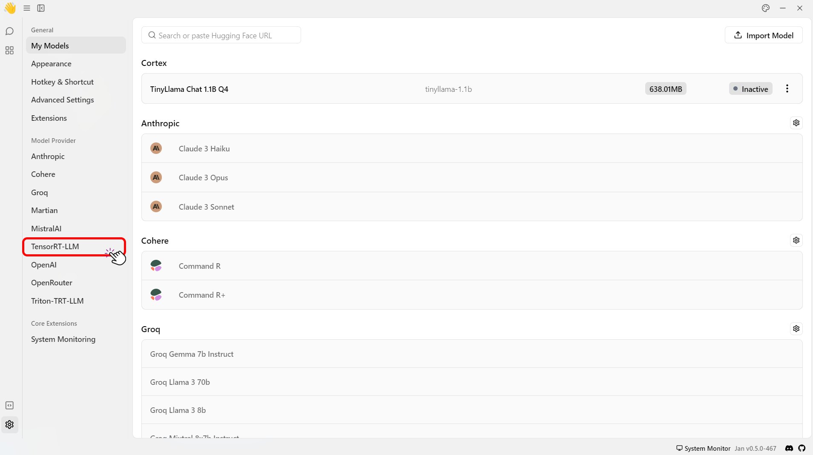
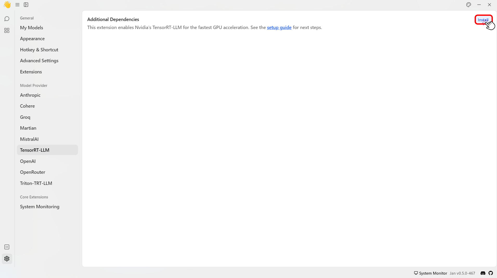

import { Callout, Steps } from 'nextra/components'

# TensorRT-LLM

## Overview

This guide walks you through installing Jan's official [TensorRT-LLM Engine](https://github.com/janhq/nitro-tensorrt-llm). This engine uses [Cortex-TensorRT-LLM](https://github.com/janhq/cortex.tensorrt-llm) as the AI engine instead of the default [Cortex-Llama-CPP](https://github.com/janhq/cortex).  It includes an efficient C++ server that executes the [TRT-LLM C++ runtime](https://nvidia.github.io/TensorRT-LLM/gpt_runtime.html) natively. It also includes features and performance improvements like OpenAI compatibility, tokenizer improvements, and queues.

<Callout type='warning' emoji="">
 This feature is only available for Windows users. Linux is coming soon.
</Callout>

### Pre-requisites

- A **Windows** PC.
- **Nvidia GPU(s)**: Ada or Ampere series (i.e. RTX 4000s & 3000s). More will be supported soon.
- Sufficient disk space for the TensorRT-LLM models and data files (space requirements vary depending on the model size).


<Steps>
### Step 1: Install TensorRT-Extension

1. Click the **Gear Icon (⚙️)** on the bottom left of your screen.
<br/>

<br/>
2. Select the **TensorRT-LLM** under the **Model Provider** section.
<br/>

<br/>
3. Click **Install** to install the required dependencies to use TensorRT-LLM.
<br/>

<br/>
3. Check that files are correctly downloaded.

```bash
ls ~/jan/data/extensions/@janhq/tensorrt-llm-extension/dist/bin
# Your Extension Folder should now include `nitro.exe`, among other artifacts needed to run TRT-LLM
```

### Step 2: Download a Compatible Model

TensorRT-LLM can only run models in `TensorRT` format. These models, aka "TensorRT Engines", are prebuilt for each target OS+GPU architecture.

We offer a handful of precompiled models for Ampere and Ada cards that you can immediately download and play with:

1. Restart the application and go to the Hub.
2. Look for models with the `TensorRT-LLM` label in the recommended models list > Click **Download**.

<Callout type='info'>
  This step might take some time. 🙏
</Callout>


3. Click **Download** to download the model.

### Step 3: Configure Settings

1. Navigate to the Thread section.
2. Select the model that you have downloaded.
3. Customize the default parameters of the model for how Jan runs TensorRT-LLM.
<Callout type='info'>
  Please see [here](/docs/models/model-parameters) for more detailed model parameters.
</Callout>
<br/>


</Steps>