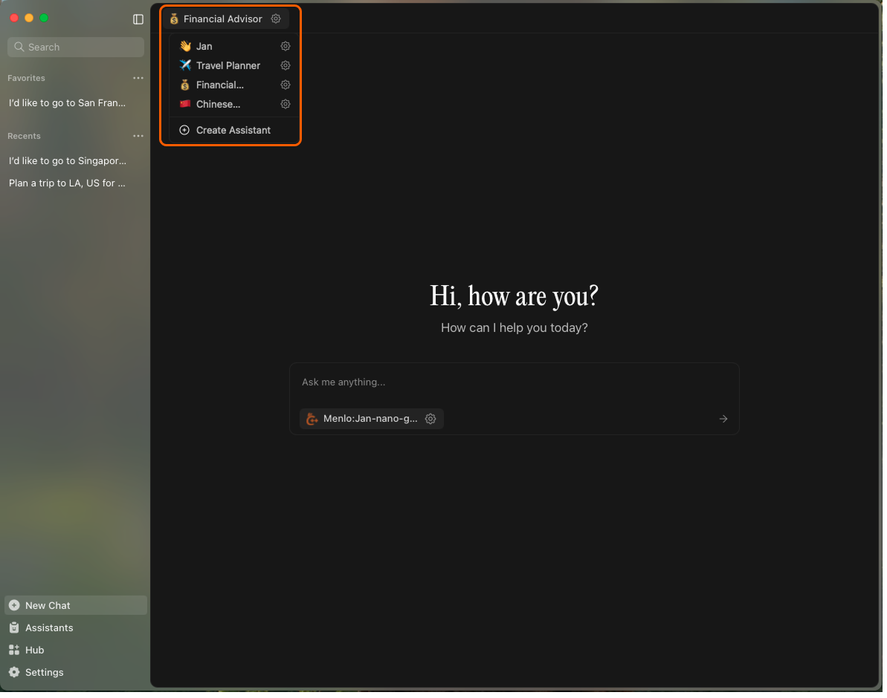

import { Callout, Steps } from 'nextra/components'

# Assistants

Jan allows you to give models specific sets of instructions without having to repeat yourself. We called these
models with your instructions, Assistants. Each of these assistants can also have their own set of configuration
which can help guide how the AI model should behave and respond to your inputs. You can add, edit, or delete
assistants, and customize their instructions and settings from the Assistants tab.


To find the Assistants tab:

1. Open Jan and look at the left sidebar.
2. Click on the **Assistants** tab (see highlighted section in the screenshot above).
3. The main panel will display all your current assistants.

## Managing Assistants

- **Add a New Assistant**: Click the `+` button in the Assistants panel to create a new assistant with your instructions.
- **Edit an Assistant**: Click the pencil (✏️) icon on any assistant card to update its name, description, or instructions.
- **Delete an Assistant**: Click the trash (🗑️) icon to remove an assistant you no longer need.

## Customizing Assistant Instructions

Each assistant can have its own set of instructions to guide its behavior. For example:

```
Act as a software engineering mentor focused on Python and JavaScript.
Provide detailed explanations with code examples when relevant.
Use markdown formatting for code blocks.
```

Or:

```
Respond in a casual, friendly tone. Keep explanations brief and use simple language.
Provide examples when explaining complex topics.
```

Or:

```
Respond in a casual, friendly tone. Keep explanations brief and use simple language.
Provide examples when explaining complex topics.
```

## Best Practices
- Be clear and specific about the desired behavior for each assistant.
- Include preferences for formatting, tone, or style.
- Include examples to increase the model's compliance with your request.
- Use different assistants for different tasks (e.g., translation, travel planning, financial advice).


## Switching and Managing Assistants in Chat

You can quickly switch between assistants, or create and edit them, directly from the Chat screen using the
assistant dropdown menu at the top:



- Click the assistant's name (e.g., "Travel Planner") at the top of the Chat screen to open the dropdown menu.
- The dropdown lists all of your assistants. Click on any of the assistants available to switch to it for the
current chat session.
- To create a new assistant, select **Create Assistant** at the bottom of the dropdown. This opens the Add Assistant dialog:


- To edit an existing assistant, click the gear (⚙️) icon next to its name in the dropdown. This opens the Edit Assistant dialog:


### Add/Edit Assistant Dialogs
- Set an (optional) emoji and name for your assistant.
- Optionally add a description.
- Enter detailed instructions to guide the assistant's behavior.
- Adjust the predefined parameters (like Temperature, Top P, etc.) or add custom parameters as needed.
- Click **Save** to apply your changes.

This workflow allows you to seamlessly manage and switch between assistants while chatting, making it easy to tailor
Jan to your needs in real time.
