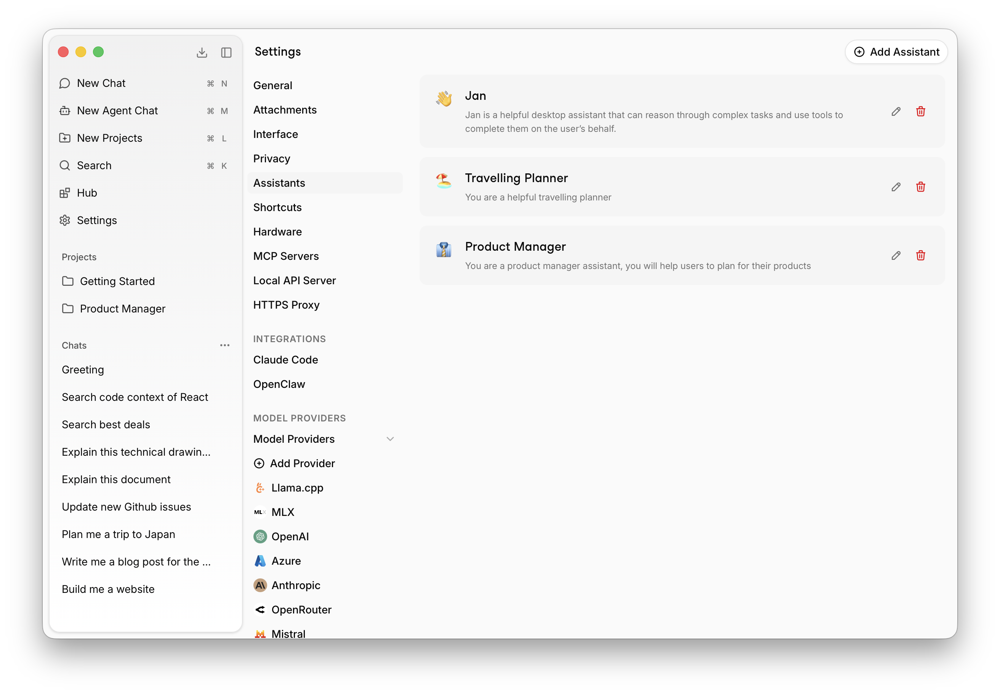
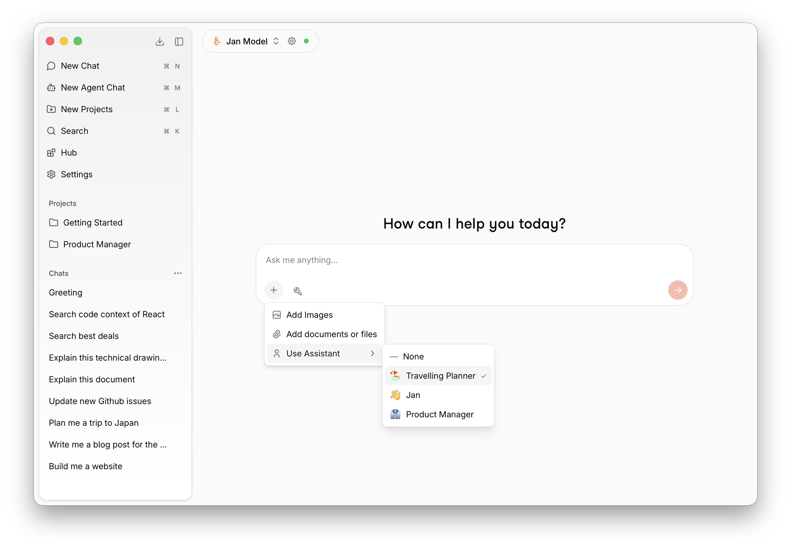
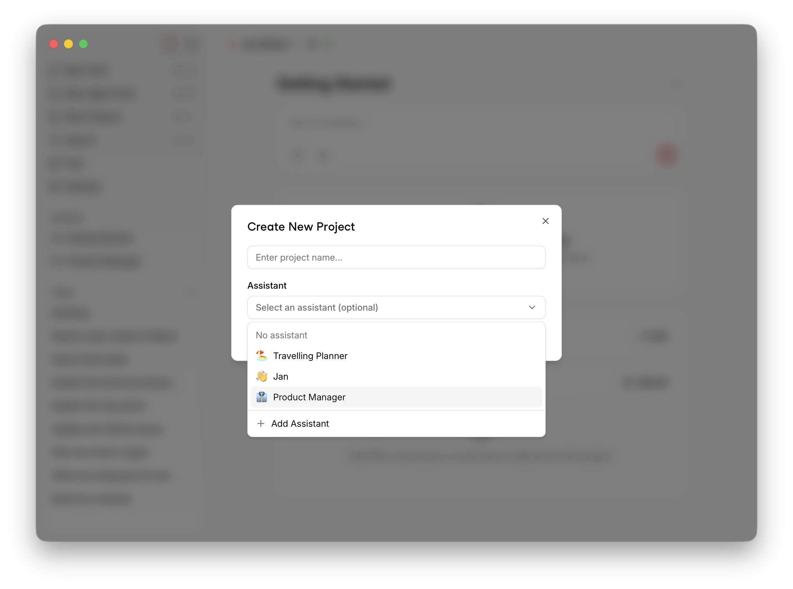

import { Callout, Steps } from 'nextra/components'

# Assistants

Jan allows you to give models specific sets of instructions without having to repeat yourself. We called these
models with your instructions, Assistants. Each of these assistants can also have their own set of configuration
which can help guide how the AI model should behave and respond to your inputs. You can add, edit, or delete
assistants, and customize their instructions and settings from the Assistants tab.



To manage your assistants, click **Settings** in the left sidebar, then select **Assistants**.

## Managing Assistants

- **Add a New Assistant**: Click the `+` button in the Assistants panel to create a new assistant with your instructions.
- **Edit an Assistant**: Click the pencil (✏️) icon on any assistant card to update its name, description, or instructions.
- **Delete an Assistant**: Click the trash (🗑️) icon to remove an assistant you no longer need.

## Customizing Assistant Instructions

Each assistant can have its own set of instructions to guide its behavior. For example:

```
Act as a software engineering mentor focused on Python and JavaScript.
Provide detailed explanations with code examples when relevant.
Use markdown formatting for code blocks.
```

Or:

```
Respond in a casual, friendly tone. Keep explanations brief and use simple language.
Provide examples when explaining complex topics.
```

Or:

```
Respond in a casual, friendly tone. Keep explanations brief and use simple language.
Provide examples when explaining complex topics.
```

## Best Practices
- Be clear and specific about the desired behavior for each assistant.
- Include preferences for formatting, tone, or style.
- Include examples to increase the model's compliance with your request.
- Use different assistants for different tasks (e.g., translation, travel planning, financial advice).


## Switching Assistants in Chat

You can switch assistants directly from the chat input without going into Settings.



Click the **+** icon in the input field, then select **Use Assistant** to pick from your available assistants. The currently active assistant is shown with a checkmark.

## Using Assistants in Projects

When creating a new project, you can assign an assistant to it so every conversation in that project automatically uses your chosen persona and instructions.



Click **New Projects** in the left sidebar, enter a project name, and select an assistant from the dropdown — or leave it as **No assistant** to use the default. You can also create a new assistant on the spot by clicking **+ Add Assistant**.

