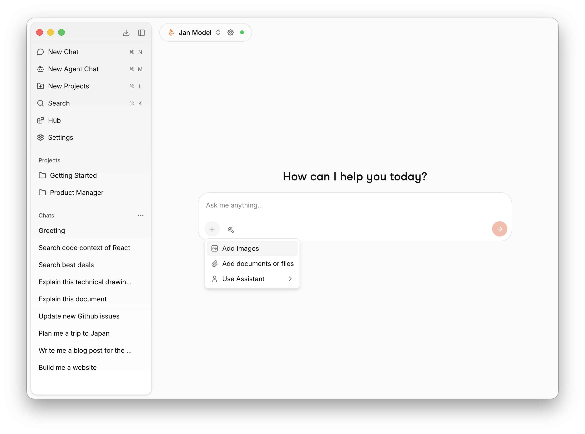
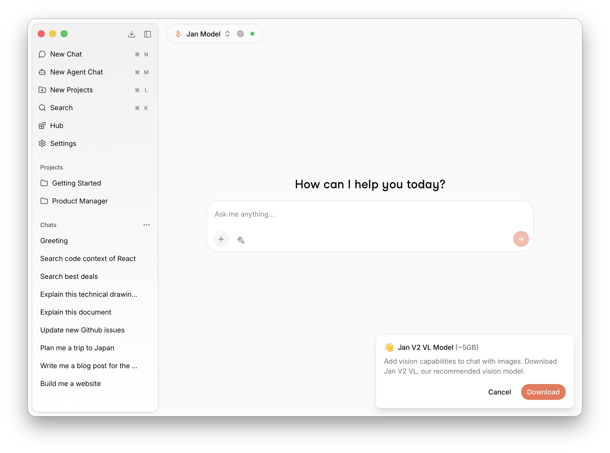

# File Upload

Jan lets you upload images and documents directly in the chat. Click the **+** button in the message input to add files.

## Supported File Types

- **Images** — Share screenshots, photos, or diagrams for the model to analyze
- **Documents & Files** — Upload PDFs or other files for the model to read and reason about

## How to Upload

1. Click the **+** button at the bottom left of the chat input
2. Choose **Add Images** or **Add documents or files**
3. Select your file — it will be attached to your next message
4. Type your question and send

### Vision Model Required for Images

If your current model does not support vision, Jan will automatically prompt you to download **Jan V2 VL** — the recommended vision model (~5GB). Click **Download** to install it, then you'll be ready to chat with images.

All files are processed locally on your machine. When using a local model such as Jan's built-in models, your files never leave your device — inference happens entirely on your own hardware with full privacy. If you use a cloud model provider (e.g. OpenAI, Anthropic), files are sent to that provider's API as part of the request.
