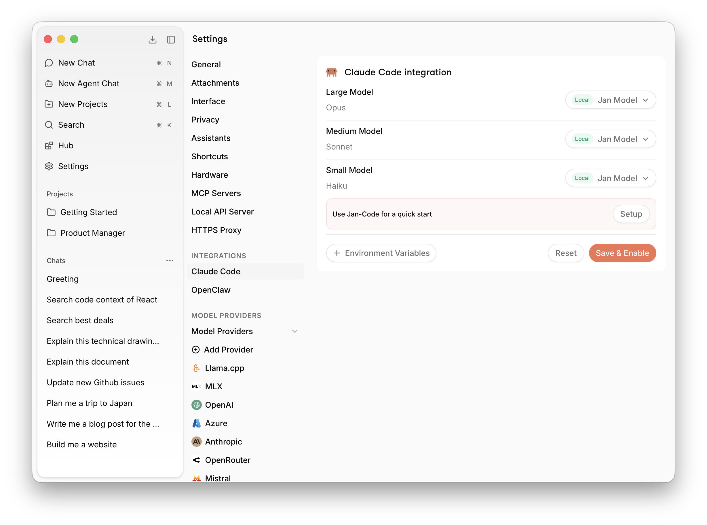
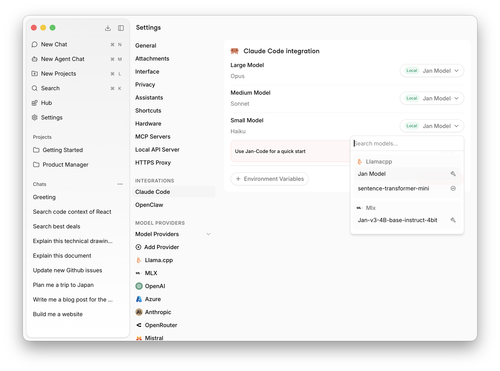

import { Steps } from 'nextra/components'

# Claude Code

Use Jan as a local AI backend for Claude Code. Run inference entirely on your own hardware — your code never leaves your machine.

Jan replaces Claude's cloud models with local ones. You can assign a Jan model to each tier:
- **Large Model** (Opus) — for complex reasoning tasks
- **Medium Model** (Sonnet) — for balanced performance
- **Small Model** (Haiku) — for fast, lightweight tasks

## Setup

<Steps>

### Open Settings

Go to **Settings** → **Integrations** → **Claude Code**.

### Assign models

Select a Jan model for each tier — Large, Medium, and Small. Click the model dropdown next to each tier to pick from your installed models. Use **Jan-Code** for a quick start by clicking **Setup** next to the suggestion.

### Save & Enable

Click **Save & Enable**. Jan will now serve as the local backend for Claude Code.

</Steps>

## Environment Variables

You can add custom environment variables via the **+ Environment Variables** button if your setup requires additional configuration.
