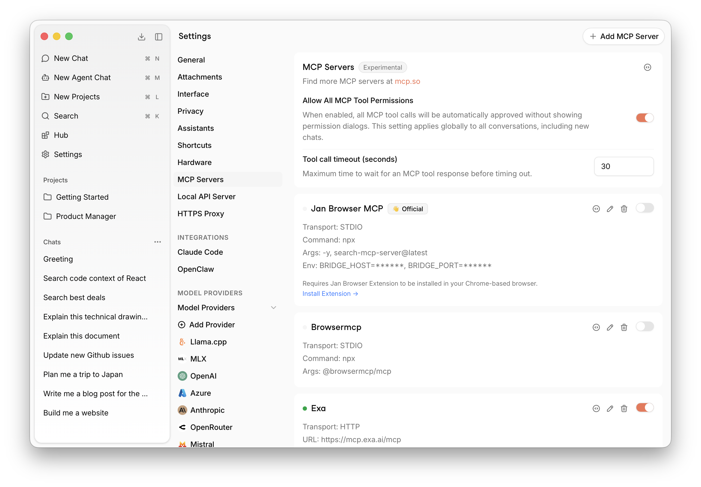

import { Steps, Callout } from 'nextra/components'

# MCP Servers

Jan supports the [Model Context Protocol](https://modelcontextprotocol.io), letting you connect any MCP-compatible server to extend what your AI can do — web search, browser control, code execution, databases, and more.

## Settings

- **Allow All MCP Tool Permissions** — When enabled, all MCP tool calls are automatically approved without showing permission dialogs. Applies globally to all conversations.
- **Tool call timeout** — Maximum time (in seconds) to wait for an MCP tool response before timing out. Default is 30 seconds.

## Add an MCP Server

<Steps>

### Open Settings

Go to **Settings** → **MCP Servers**.

### Add server

Click **+ Add MCP Server** in the top right corner.

### Configure

Enter the server details:
- **Transport**: `STDIO` (local process), `HTTP` (Streamable HTTP), or `SSE` (Server-Sent Events)
- **Command / URL**: the command to run or the server endpoint
- **Args**: any arguments to pass
- **Env**: environment variables (e.g. API keys)

### Enable

Toggle the server on. It will appear in the list with a green indicator when active.

</Steps>

<Callout type="info">
Find more MCP servers at [mcp.so](https://mcp.so).
</Callout>