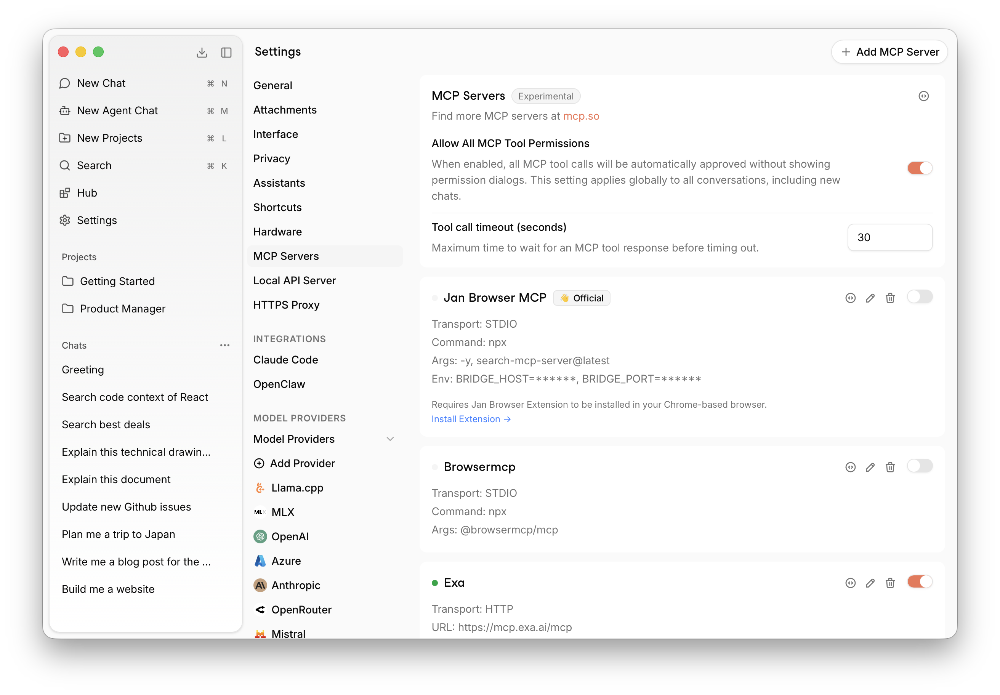

import { Steps, Callout } from 'nextra/components'

# MCP Servers

Jan supports the [Model Context Protocol](https://modelcontextprotocol.io), letting you connect any MCP-compatible server to extend what your AI can do — web search, browser control, code execution, databases, and more.

## Settings

- **Allow All MCP Tool Permissions** — When enabled, all MCP tool calls are automatically approved without showing permission dialogs. Applies globally to all conversations.
- **Tool call timeout** — Maximum time (in seconds) to wait for an MCP tool response before timing out. Default is 30 seconds.
- **Smart MCP tool routing** — When enabled, Jan narrows which MCP servers are queried for tools on each turn when you have more than a small number of connected servers, reducing context size. You can optionally use a **dedicated lightweight model** for that routing step.
- **Routing model** — Single picker for provider + model; only lightweight models are listed. Requires smart routing and “Use a dedicated model for routing” to be on.

For developers tuning routing behavior (latency, fallbacks, token usage), see [MCP routing](../mcp-routing-telemetry).

## Add an MCP Server

<Steps>

### Open Settings

Go to **Settings** → **MCP Servers**.

### Add server

Click **+ Add MCP Server** in the top right corner.

### Configure

Enter the server details:
- **Transport**: `STDIO` (local process), `HTTP` (Streamable HTTP), or `SSE` (Server-Sent Events)
- **Command / URL**: the command to run or the server endpoint
- **Args**: any arguments to pass
- **Env**: environment variables (e.g. API keys)

### Enable

Toggle the server on. It will appear in the list with a green indicator when active.

</Steps>

## Authentication

Each remote (`HTTP` / `SSE`) server shows an **Auth** line with its current state and the actions
that state allows.

- **Sign in** runs OAuth against the server: Jan discovers the provider's metadata, registers itself
  dynamically, and completes the authorization-code flow with PKCE against a loopback redirect. Your
  browser opens automatically; if it does not, use the **Open the sign-in page** link that appears
  while the flow is pending. The wait times out after five minutes.
- **Clear authentication** forgets the stored tokens and disconnects the server, since the live
  connection still holds the old token. The server stays configured, so signing back in brings it up
  again.

A server that fails to connect purely for want of a sign-in says so, instead of showing a transport
error - Jan asks the server whether it advertises OAuth rather than guessing from the failure.

Tokens are stored in `mcp_oauth.json` in the Jan data folder, next to `mcp_config.json` and never
inside it, with owner-only permissions. They are refreshed automatically shortly before they expire
when the provider issued a refresh token. Changing a server's URL invalidates its tokens rather than
sending credentials issued for a different endpoint, and removing a server clears them too.

<Callout type="info">
If you set an `Authorization` header on a server yourself, that credential is used as-is: OAuth is
never attempted and never reported as missing, because wrapping it would put two credentials on one
request.
</Callout>

<Callout type="info">
Find more MCP servers at [mcp.so](https://mcp.so).
</Callout>