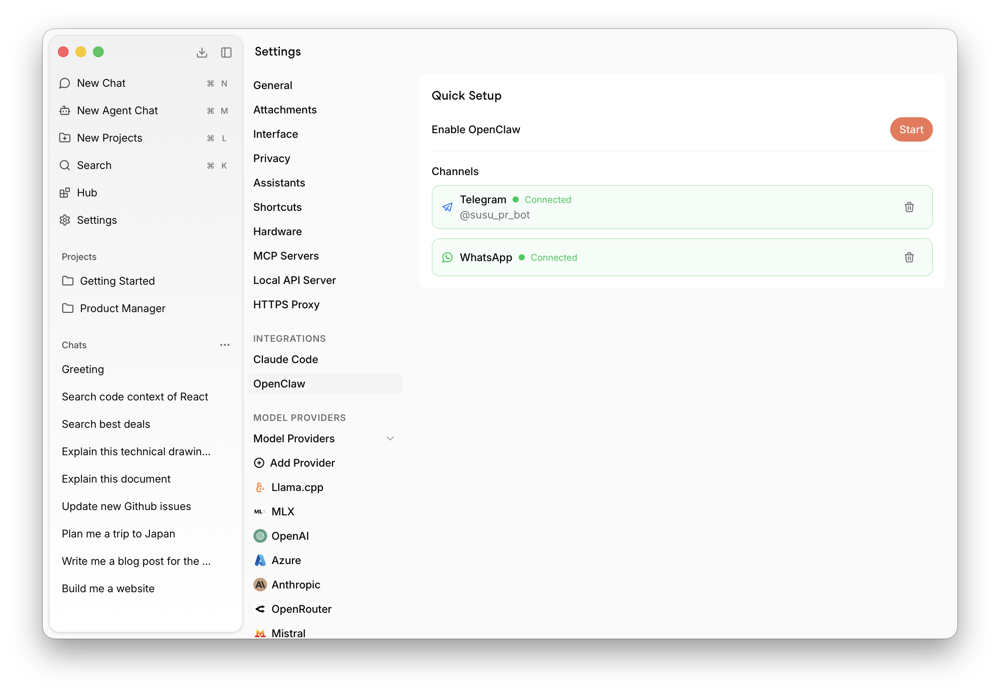
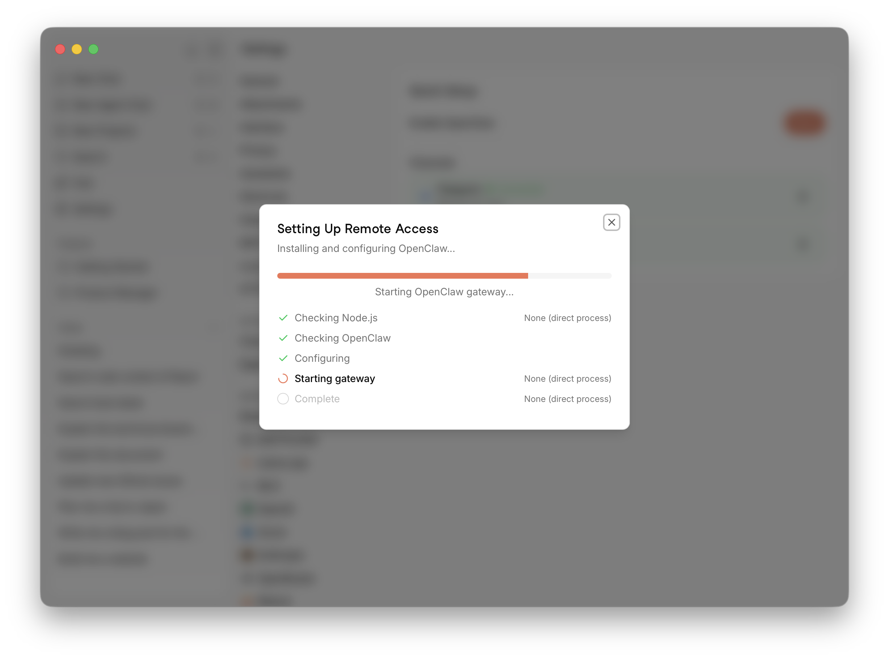
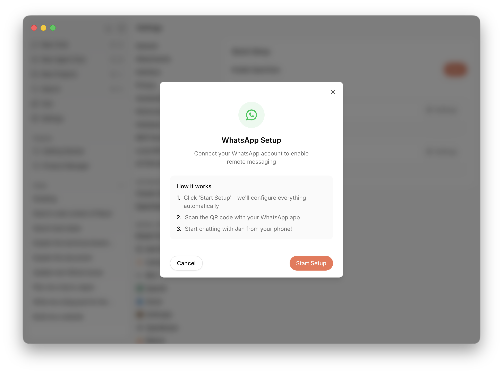
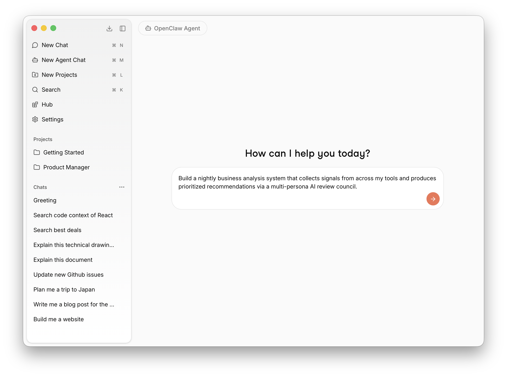
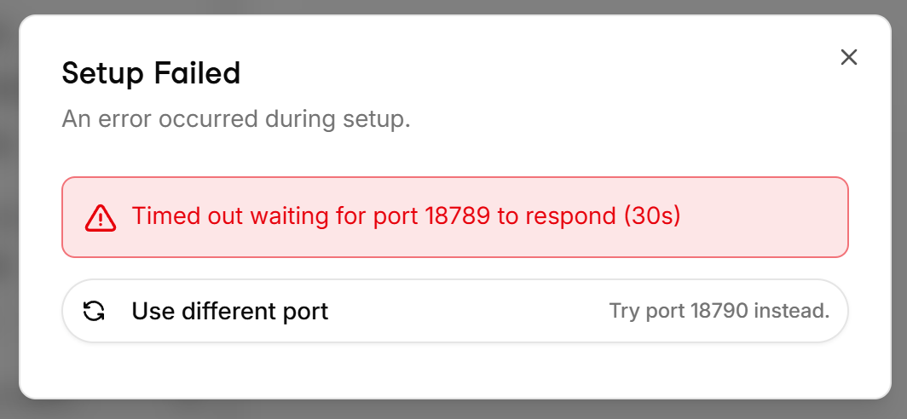

import { Callout, Steps } from 'nextra/components'

# Agents

Jan supports autonomous AI agents that run entirely on your own hardware — no cloud required.

## OpenClaw Agent

OpenClaw is Jan's first default agent. Unlike a chatbot that only answers questions, OpenClaw acts as a personal assistant that can take real actions on your behalf.

<Callout type="warning">
OpenClaw requires Node.js v22.12 or later to be installed.
</Callout>


**What it can do:**
- Read and manage local files on your computer
- Manage your calendar
- Send and receive messages via WhatsApp, Discord, or Slack
- Execute commands and automate tasks

**Skills:**
Extend OpenClaw with skills to add new capabilities and integrations.

<Steps>

### Enable OpenClaw

Go to **Settings > Integrations > OpenClaw** and click **Start** next to **Enable OpenClaw**. Jan will automatically walk you through the required installation steps — just wait for the process to complete.



A **Setting Up Remote Access** dialog will appear, automatically checking Node.js, installing OpenClaw, configuring it, and starting the gateway. Wait until all steps complete before moving on.



### Add Channels

Once setup is complete, connect your messaging channels under the **Channels** section. Click the **Settings** icon on the channel you want to add — for example, WhatsApp — and a setup dialog will appear.



Click **Start Setup** and Jan will configure everything automatically, then display a QR code. Scan it with your WhatsApp app to pair your account. Once connected, you can chat with Jan directly from your phone.

### Start Chatting

Click **New Agent Chat** from the left sidebar (or press `⌘M`) to open a new agent session and start interacting with OpenClaw.



</Steps>

## Troubleshooting

#### **Q**: The agent responds with empty or blank messages

**1. Check that the Local API Server is running**

Go to **Settings > Local API Server** and make sure the server is running. If it's stopped, click **Start Server**. OpenClaw routes requests through the local API server, so it must be running for the agent to respond.

**2. Increase the context size to at least 32k**

A context window that is too small can cause the agent to produce empty responses, especially for multi-step tasks. Go to the model dropdown in the chat area, click the **gear icon** next to your loaded model, and set **Context Length** to at least **32768**. If you enabled OpenClaw through the setup wizard, this should already be configured automatically.

**3. Verify that a local model is loaded**

OpenClaw in local mode requires a model to be loaded in the **llamacpp** engine. Check the model dropdown at the top of the chat — it should show an active local model (not just "Select a model"). If no model is loaded, select one from the dropdown and wait for it to finish loading before chatting with the agent again.

#### **Q**: Timeout waiting for port to respond



**1. Verify that Node.js v22.12 or later is installed**

Open a terminal and run `node -v`. If Node.js is not installed or the version is below v22.12, download and install it from [nodejs.org](https://nodejs.org/).

**2. (macOS) Delete the OpenClaw gateway plist and reconnect**

If Node.js is already installed correctly, the gateway launch agent may be in a bad state. 
On macOS, delete this file `~/Library/LaunchAgents/ai.openclaw.gateway.plist` and try connecting again:

```bash
rm ~/Library/LaunchAgents/ai.openclaw.gateway.plist
```

## Uninstalling OpenClaw

Currently, Jan does not have a built-in feature to uninstall OpenClaw. However, you can remove it manually by following the steps below.

<Callout type="info">
When you enable OpenClaw through Jan, Jan installs the OpenClaw binary into its own data folder (inside the `openclaw/bunx/bin/` subdirectory), which is **not** on your system PATH. This means running `openclaw` directly in a terminal will likely result in a "command not found" error. The instructions below account for this.

The default Jan data folder locations are:
- **macOS:** `~/Library/Application Support/Jan/data/`
- **Linux:** `~/.local/share/Jan/data/`
- **Windows:** `%APPDATA%\Jan\data\`

If you have customized your Jan data folder, you can find the actual path in **Settings > Advanced > Jan Data Folder**.
</Callout>

### Step 1: Stop the Gateway and Uninstall the Service

Use OpenClaw's built-in uninstall command to stop the gateway and remove the service registration. Since Jan's OpenClaw binary is not on your PATH, you have several options:

#### Option A: Using npx (requires Node.js and npm)

This is the simplest method if you have Node.js installed:

```bash
npx -y openclaw uninstall --all --yes --non-interactive
```

#### Option B: Using the full path to Jan's OpenClaw binary

**macOS:**

```bash
"$HOME/Library/Application Support/Jan/data/openclaw/bunx/bin/openclaw" uninstall --all --yes --non-interactive
```

**Linux:**

```bash
~/.local/share/Jan/data/openclaw/bunx/bin/openclaw uninstall --all --yes --non-interactive
```

**Windows (PowerShell):**

```powershell
& "$env:APPDATA\Jan\data\openclaw\bunx\bin\openclaw.exe" uninstall --all --yes --non-interactive
```

#### Option C: If you installed OpenClaw yourself (npm/bun)

If you installed OpenClaw globally yourself (outside of Jan), the `openclaw` command should already be on your PATH:

```bash
openclaw uninstall --all --yes --non-interactive
```

Then remove the global package:

```bash
# If installed with npm
npm uninstall -g openclaw

# If installed with bun
bun remove -g openclaw
```

If none of the above options work, skip to Step 2 and follow the manual cleanup instructions for your platform.

### Step 2: Remove the Gateway Service Manually (if Step 1 failed)

If you were unable to run the uninstall command in Step 1, manually remove the gateway service for your platform:

**macOS (launchd):**

```bash
launchctl bootout gui/$(id -u)/ai.openclaw.gateway 2>/dev/null
rm -f ~/Library/LaunchAgents/ai.openclaw.gateway.plist
```

**Linux (systemd):**

```bash
systemctl --user disable --now openclaw-gateway.service 2>/dev/null
rm -f ~/.config/systemd/user/openclaw-gateway.service
systemctl --user daemon-reload
```

**Windows (Task Scheduler, run in PowerShell as Administrator):**

```powershell
schtasks /Delete /F /TN "OpenClaw Gateway"
Remove-Item -Force "$env:USERPROFILE\.openclaw\gateway.cmd" -ErrorAction SilentlyContinue
```

### Step 3: Remove the OpenClaw Binary

Delete Jan's internal OpenClaw installation directory.

**macOS:**

```bash
rm -rf ~/Library/Application\ Support/Jan/data/openclaw
```

**Linux:**

```bash
rm -rf ~/.local/share/Jan/data/openclaw
```

**Windows (PowerShell):**

```powershell
Remove-Item -Recurse -Force "$env:APPDATA\Jan\data\openclaw"
```

### Step 4: Remove OpenClaw Configuration and State

Delete the OpenClaw configuration, state, and workspace data:

**macOS / Linux:**

```bash
rm -rf ~/.openclaw
```

**Windows (PowerShell):**

```powershell
Remove-Item -Recurse -Force "$env:USERPROFILE\.openclaw"
```

### Docker Mode

If you were running OpenClaw in Docker mode, you can remove the container and image instead. You can do this via the command line or through Docker Desktop.

**Via command line:**

```bash
# Stop and remove the container
docker rm -f jan-openclaw

# Remove the Docker image
docker rmi openclaw
```

**Via Docker Desktop:**

1. Open **Docker Desktop**
2. Go to the **Containers** tab, find `jan-openclaw`, click the stop button, then delete it
3. Go to the **Images** tab, find the `openclaw` image, and delete it

<Callout type="info">
After uninstalling, you can always reinstall OpenClaw later by going to **Settings > Integrations > OpenClaw** and clicking **Start** again.
</Callout>

## What's Next

You're all set — start from here and explore what OpenClaw can do for you. We'll be adding a lot of useful real-world use cases and guides to the docs soon.
