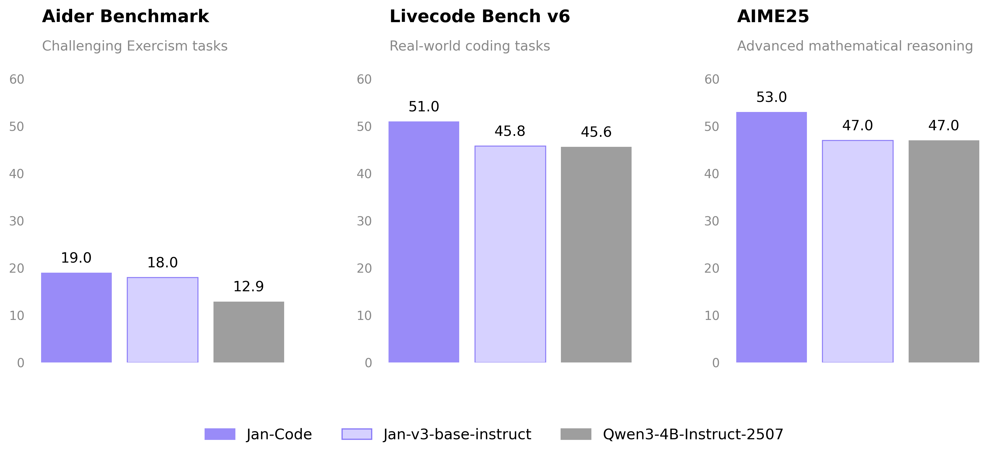

import { Callout } from 'nextra/components'

# Jan-Code-4B

Jan-Code-4B is a lightweight, code-tuned 4B parameter model built for fast local inference. Fine-tuned on [Jan-v3-4B-base-instruct](/docs/desktop/jan-models/jan-v3-4b-base-instruct), it is designed for practical coding tasks with an emphasis on handling well-scoped subtasks reliably while keeping latency and compute requirements low.

<a
  href="jan://models/huggingface/janhq/Jan-code-4b-gguf"
  style={{
    display: 'inline-flex',
    alignItems: 'center',
    gap: '8px',
    padding: '10px 20px',
    backgroundColor: '#000',
    color: '#fff',
    borderRadius: '8px',
    fontWeight: '600',
    fontSize: '15px',
    textDecoration: 'none',
    marginTop: '8px',
  }}
>
  Open in Jan
</a>

## Overview

| Property | Value |
|----------|-------|
| **Parameters** | 4B |
| **Base Model** | Jan-v3-4B-base-instruct (Qwen3-4B-Instruct-2507) |
| **Fine-tuning focus** | Code generation, editing, refactoring, debugging |
| **License** | Apache 2.0 |

## Capabilities

- **Coding assistant**: Code generation, editing, refactoring, and debugging
- **Agent workflows**: Use as a fast worker/sub-agent in agentic setups (e.g., generating patches or tests)
- **Claude Code integration**: Can replace the Haiku model in a Claude Code setup for a fully local coding workflow

<Callout type="tip">
  Jan-Code-4B is designed to work as a drop-in local alternative to cloud coding models in agentic pipelines, keeping your code private and inference fast.
</Callout>

## Performance

Jan-Code-4B leads Jan-v3-base-instruct and the Qwen3-4B-Instruct-2507 base model across all three coding and reasoning benchmarks:



- **Aider** (challenging Exercism tasks): 19.0 vs 18.0 vs 12.9
- **Livecode Bench v6** (real-world coding): 51.0 vs 45.8 vs 35.1
- **AIME25** (advanced math reasoning): 53.0 vs 47.0 vs 47.0

## Requirements

- **Memory**:
  - Minimum: 8GB RAM (with Q4 quantization)
  - Recommended: 16GB RAM (with Q8 quantization)
- **Hardware**: CPU or GPU
- **API Support**: OpenAI-compatible at localhost:1337

## Using Jan-Code-4B

### Quick Start

1. Download Jan Desktop
2. Select Jan-Code-4B from the model list
3. Start coding — no additional configuration needed

### Deployment Options

**Using vLLM:**
```bash
vllm serve janhq/Jan-code-4b \
    --host 0.0.0.0 \
    --port 1234 \
    --enable-auto-tool-choice \
    --tool-call-parser hermes
```

**Using llama.cpp:**
```bash
llama-server --model Jan-code-4b-Q8_0.gguf \
    --host 0.0.0.0 \
    --port 1234 \
    --jinja \
    --no-context-shift
```

### Recommended Parameters

```yaml
temperature: 0.7
top_p: 0.8
top_k: 20
```

## What Jan-Code-4B Does Well

- **Code generation**: Write new functions, classes, and modules from natural language descriptions
- **Editing & refactoring**: Modify existing code with targeted, reliable edits
- **Debugging**: Identify and fix bugs in provided code snippets
- **Agentic subtasks**: Fast, focused execution of scoped coding tasks within larger agent pipelines
- **Low latency**: Runs efficiently on consumer hardware with fast response times

## Limitations

- **Model size**: 4B parameters limit handling of very large codebases or complex architectural decisions in a single context
- **General tasks**: Optimized for coding — for general-purpose tasks, consider [Jan-v3-4B-base-instruct](/docs/desktop/jan-models/jan-v3-4b-base-instruct)

## Available Formats

### GGUF Quantizations

- **Q4_K_M**: Good balance of size and quality
- **Q5_K_M**: Better quality, slightly larger
- **Q8_0**: Highest quality quantization (recommended)

## Models Available

- [Jan-Code-4B on Hugging Face](https://huggingface.co/janhq/Jan-code-4b)

## Community

- **Discussions**: [HuggingFace Community](https://huggingface.co/janhq/Jan-code-4b/discussions)
- **Support**: Available through Jan App at [jan.ai](https://jan.ai)
