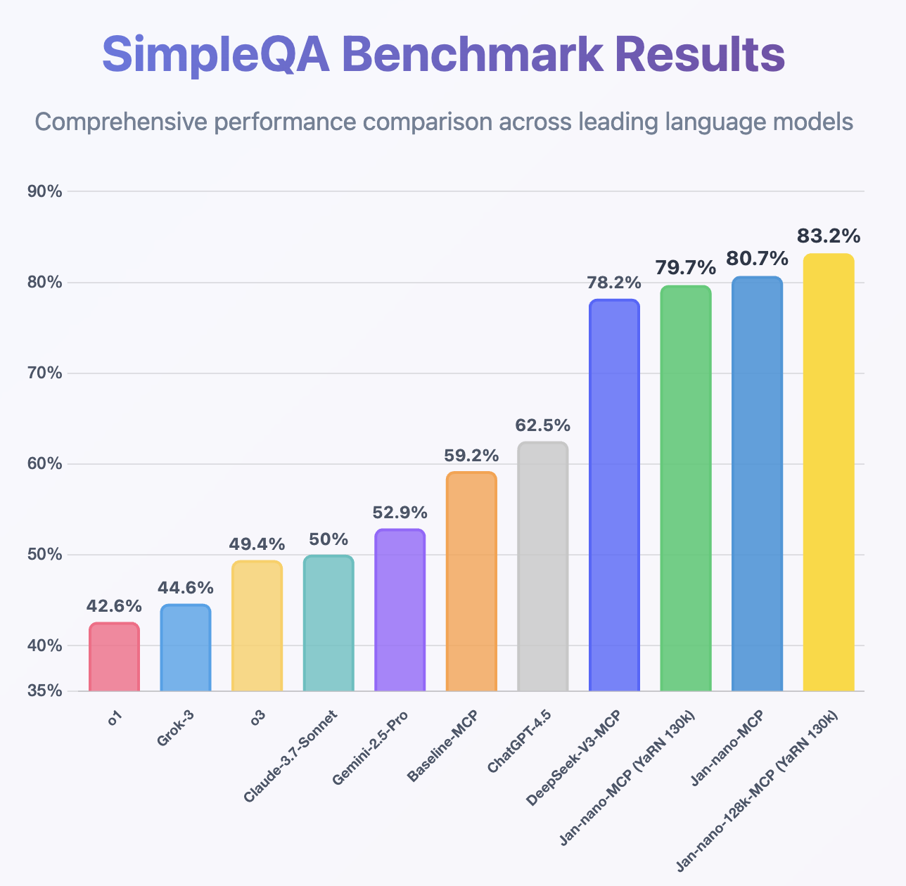

import { Callout } from 'nextra/components'

# Jan-Nano-128k

> Enabling deeper research through extended context understanding.

Jan-Nano-128k represents a notable advancement in compact language models for different applications. Building upon the 
success of Jan-Nano-32k, this enhanced version features a native 128k context window that enables deeper, more comprehensive 
research capabilities without the performance degradation typically associated with context extension methods.

You can have a look at all of our models, and download them from the HuggingFace [Menlo Models page](https://huggingface.co/Menlo).

**Key Improvements:**

- 🔍 Deeper Research: Extended context allows for processing entire research papers, lengthy documents, and complex multi-turn conversations
- ⚡ Native 128k Window: Built to handle long contexts efficiently, maintaining performance across the full context range
- 📈 Enhanced Performance: Unlike traditional context extension methods, Jan-Nano-128k's performance remains consistent with longer contexts

This model maintains full compatibility with Model Context Protocol (MCP) servers while dramatically expanding the scope of research 
tasks it can handle in a single session.


## Why Jan-Nano-128k?

Most small models hit a wall at 8-32k tokens. Jan-Nano-128k goes beyond this limitation with a native 128k context window—that's roughly 
300 pages of text or an entire novel's worth of information processed simultaneously.

Unlike YaRN or PI methods that retrofit models beyond their limits and degrade performance, Jan-Nano-128k was architecturally rewired for 
128k contexts from the ground up. The result: an inverse scaling behavior where performance actually improves with longer contexts, 
maintaining consistent accuracy from 1k to 128k tokens as the model leverages more information for synthesis.


<Callout type="info">
**Position Interpolation (PI):** A method that extends a model's context by scaling down position indices to fit within the original context 
window. For example, to extend a 4k model to 32k, PI compresses the 32k positions into the original 4k range by dividing each position by 8.

**YaRN (Yet another RoPE extensioN method):** A more sophisticated context extension method that preserves frequently occurring tokens while 
selectively scaling others. YaRN divides position embeddings into frequency groups and applies different scaling factors to each, resulting 
in more efficient training and better performance than PI.

The key difference is that PI applies uniform scaling across all dimensions, while YaRN uses targeted interpolation based on frequency analysis—preserving 
high-frequency information that's crucial for distinguishing nearby tokens while interpolating lower frequencies more aggressively.
</Callout>

**Applications unlocked:**
- **Academic**: Extract key findings from 50+ papers simultaneously
- **Legal**: Pinpoint relevant clauses across thousand-page contracts
- **Code**: Trace specific functions through massive codebases
- **Business**: Distill insights from quarters of financial data
- **Content**: Maintain narrative coherence across book-length outputs

**MCP Usage:** Jan-Nano-128k doesn't memorize, it orchestrates. With MCP integration, it becomes a research conductor that fetches dozens 
of sources, holds everything in active memory, extracts precisely what's needed, and synthesizes findings across a marathon research session. It's 
not about understanding every word; it's about finding the needle in a haystack of haystacks.

## Evaluation

Jan-Nano-128k has been rigorously evaluated on the SimpleQA benchmark using our MCP-based methodology, demonstrating superior performance compared to its predecessor:



**Key findings:**
- 15% improvement over Jan-Nano-32k on complex multi-document tasks
- Consistent performance across all context lengths (no cliff at 64k like other extended models)
- Superior citation accuracy when handling 10+ sources simultaneously

## 🖥️ How to Run Locally

### Demo

<video width="100%" controls>
  <source src="https://catalog.jan.ai/docs/jan-nano-demo.mp4" type="video/mp4" />
  Your browser does not support the video tag.
</video>

### Quick Start Guide

1. **Download Jan**
2. **Download Jan-Nano-128k**
3. **Enable MCP**, the serper or the exa MCPs work very well with Jan-Nano-128k
4. **Start researching**

### Usage

Deploy using VLLM:

```bash
vllm serve Menlo/Jan-nano-128k \
 --host 0.0.0.0 \
 --port 1234 \
 --enable-auto-tool-choice \
 --tool-call-parser hermes \
 --rope-scaling '{"rope_type":"yarn","factor":3.2,"original_max_position_embeddings":40960}' --max-model-len 131072
```

Or with `llama-server` from `llama.cpp`:

```bash
llama-server ... --rope-scaling yarn --rope-scale 3.2 --yarn-orig-ctx 40960
```

**Note:** The chat template is included in the tokenizer. For troubleshooting, download the [Non-think chat template](https://qwen.readthedocs.io/en/latest/_downloads/c101120b5bebcc2f12ec504fc93a965e/qwen3_nonthinking.jinja).

### Recommended Sampling Parameters

```yaml
Temperature: 0.7
Top-p: 0.8
Top-k: 20
Min-p: 0.0
```

### Hardware Requirements
- **Minimum**: 16GB RAM for Q4 quantization
- **Recommended**: 24GB RAM for Q8 quantization
- **Optimal**: 32GB+ RAM for full precision

## 🤝 Community & Support
- **Discussions**: [HuggingFace Community](https://huggingface.co/Menlo/Jan-nano-128k/discussions)
- **Issues**: [GitHub Repository](https://github.com/janhq/deep-research/issues)
- **Discord**: Join our research community for tips and best practices
