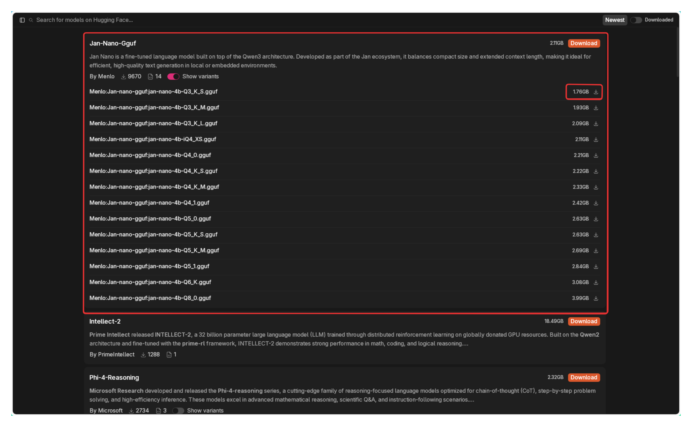
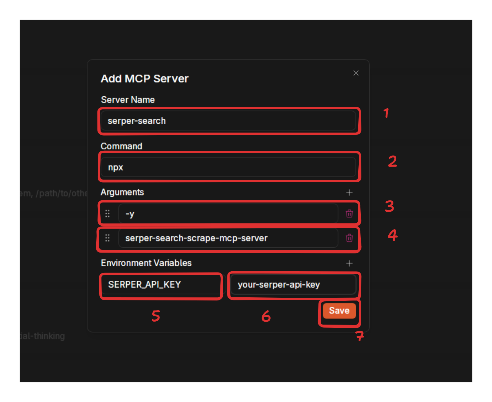

import { Callout } from 'nextra/components'

# Jan Nano

## Why Jan Nano?

Most language models face a fundamental tradeoff where powerful capabilities require a lot of computational resources. Jan 
Nano breaks this constraint through a focused design philosophy where instead of trying to know everything, it excels at 
knowing how to find anything.

## What is Jan Nano?

Jan Nano is a compact 4-billion parameter language model specifically designed and trained for deep research tasks. 
This model has been optimized to work seamlessly with Model Context Protocol (MCP) servers, enabling efficient integration 
with various research tools and data sources.

The model and its different model variants are fully supported by Jan.

<Callout type="info">
  To use Jan-Nano, you will need to use a search engine via MCP. You can enable MCP in the **Settings** 
  tab under **Advanced Settings**.
</Callout>

## System Requirements

- Minimum Requirements:
  - 8GB RAM (with iQ4_XS quantization)
  - 12GB VRAM (for Q8 quantization)
  - CUDA-compatible GPU
- Recommended Setup:
  - 16GB+ RAM
  - 16GB+ VRAM
  - Latest CUDA drivers
  - RTX 30/40 series or newer

## Using Jan-Nano-32k

**Step 1**
Download Jan from [here](https://jan.ai/download/).

**Step 2**
Go to the Hub Tab, search for Jan-Nano-Gguf, and click on the download button to the best model size for your system.

**Step 3**
Go to **Settings** > **Model Providers** > **Llama.cpp** click on the pencil icon and enable tool use for Jan-Nano-Gguf.

**Step 4**
To take advantage of Jan-Nano's full capabilities, you need to enable MCP support. We're going to use it with Serper's 
API. You can get a free API key from [here](https://serper.dev/). Sign up and they will immediately generate one for you.

**Step 5**
Add the serper MCP to Jan via the **Settings** > **MCP Servers** tab.

**Step 6**
Open up a new chat and ask Jan-Nano to search the web for you.

## Queries to Try

Here are some example queries to showcase Jan-Nano's web search capabilities:

1. **Current Events**: What are the latest developments in renewable energy adoption in Germany and Denmark?
2. **International Business**: What is the current status of Tesla's Gigafactory in Berlin and how has it impacted the local economy?
3. **Technology Trends**: What are the newest AI developments from Google, Microsoft, and Meta that were announced this week?
4. **Global Weather**: What's the current weather forecast for Tokyo, Japan for the next 5 days?
5. **Stock Market**: What are the current stock prices for Apple, Samsung, and Huawei, and how have they performed this month?
6. **Sports Updates**: What are the latest results from the Premier League matches played this weekend?
7. **Scientific Research**: What are the most recent findings about climate change impacts in the Arctic region?
8. **Cultural Events**: What major music festivals are happening in Europe this summer and who are the headliners?
9. **Health & Medicine**: What are the latest developments in mRNA vaccine technology and its applications beyond COVID-19?
10. **Space Exploration**: What are the current missions being conducted by NASA, ESA, and China's space program?

## FAQ

- What are the recommended GGUF quantizations?
  - Q8 GGUF is recommended for best performance
  - iQ4_XS GGUF for very limited VRAM setups
  - Avoid Q4_0 and Q4_K_M as they show significant performance degradation

- Can I run this on a laptop with 8GB RAM?
  - Yes, but use the recommended quantizations (iQ4_XS)
  - Note that performance may be limited with Q4 quantizations

- How much did the training cost?
  - Training was done on internal A6000 clusters
  - Estimated cost on RunPod would be under $100 using H200
  - Hardware used:
    - 8xA6000 for training code
    - 4xA6000 for vllm server (inferencing)

- What frontend should I use?
  - Jan (recommended)
  - Download link: https://jan.ai/download

- Getting Jinja errors in LM Studio?
  - Use Qwen3 template from other LM Studio compatible models
  - Disable “thinking” and add the required system prompt
  - Fix coming soon in future GGUF releases
- Having model loading issues in Jan?
  - Use latest beta version: Jan-beta_0.5.18-rc6-beta
  - Ensure proper CUDA support for your GPU
  - Check VRAM requirements match your quantization choice

## Resources

- [Jan-Nano Model on Hugging Face](https://huggingface.co/Menlo/Jan-nano)
- [Jan-Nano GGUF on Hugging Face](https://huggingface.co/Menlo/Jan-nano-gguf)
