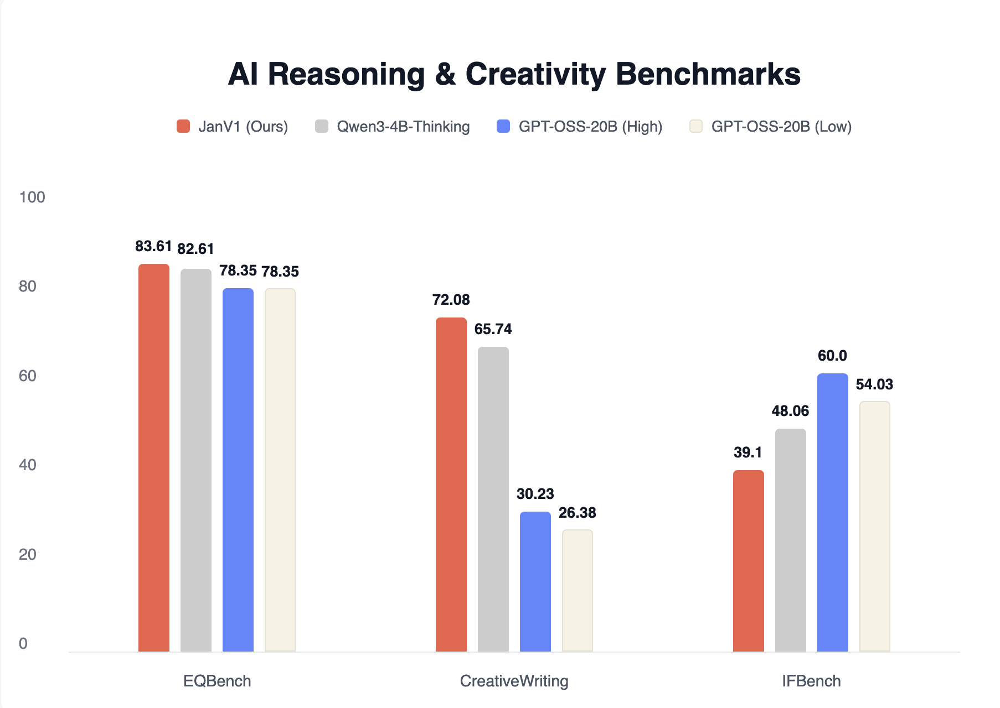

import { Callout } from 'nextra/components'

# Jan-v1

## Overview

Jan-v1 is a 4B parameter model based on Qwen3-4B-thinking, designed for reasoning and problem-solving tasks. The model achieves 91.1% accuracy on SimpleQA through model scaling and fine-tuning approaches.

## Performance

### SimpleQA Benchmark

Jan-v1 demonstrates strong factual question-answering capabilities:


At 91.1% accuracy, Jan-v1 outperforms several larger models on SimpleQA, including Perplexity's 70B model. This performance represents effective scaling and fine-tuning for a 4B parameter model.

### Chat and Creativity Benchmarks

Jan-v1 has been evaluated on conversational and creative tasks:



These benchmarks (EQBench, CreativeWriting, and IFBench) measure the model's ability to handle conversational nuance, creative expression, and instruction following.

## Requirements

- **Memory**: 
  - Minimum: 8GB RAM (with Q4 quantization)
  - Recommended: 16GB RAM (with Q8 quantization)
- **Hardware**: CPU or GPU
- **API Support**: OpenAI-compatible at localhost:1337

## Using Jan-v1

### Quick Start

1. Download Jan Desktop
2. Select Jan-v1 from the model list
3. Start chatting - no additional configuration needed

### Demo


### Deployment Options

**Using vLLM:**
```bash
vllm serve janhq/Jan-v1-4B \
    --host 0.0.0.0 \
    --port 1234 \
    --enable-auto-tool-choice \
    --tool-call-parser hermes
```

**Using llama.cpp:**
```bash
llama-server --model jan-v1.gguf \
    --host 0.0.0.0 \
    --port 1234 \
    --jinja \
    --no-context-shift
```

### Recommended Parameters

```yaml
temperature: 0.6
top_p: 0.95
top_k: 20
min_p: 0.0
max_tokens: 2048
```

## What Jan-v1 Does Well

- **Question Answering**: 91.1% accuracy on SimpleQA
- **Reasoning Tasks**: Built on thinking-optimized base model
- **Tool Calling**: Supports function calling through hermes parser
- **Instruction Following**: Reliable response to user instructions

## Limitations

- **Model Size**: 4B parameters limits complex reasoning compared to larger models
- **Specialized Tasks**: Optimized for Q&A and reasoning, not specialized domains
- **Context Window**: Standard context limitations apply

## Available Formats

### GGUF Quantizations

- **Q4_K_M**: 2.5 GB - Good balance of size and quality
- **Q5_K_M**: 2.89 GB - Better quality, slightly larger
- **Q6_K**: 3.31 GB - Near-full quality
- **Q8_0**: 4.28 GB - Highest quality quantization

## Models Available

- [Jan-v1 on Hugging Face](https://huggingface.co/janhq/Jan-v1-4B)
- [Jan-v1 GGUF on Hugging Face](https://huggingface.co/janhq/Jan-v1-4B-GGUF)

## Technical Notes

<Callout type="info">
The model includes a system prompt in the chat template by default to match benchmark performance. A vanilla template without system prompt is available in `chat_template_raw.jinja`.
</Callout>

## Community

- **Discussions**: [HuggingFace Community](https://huggingface.co/janhq/Jan-v1-4B/discussions)
- **Support**: Available through Jan App at [jan.ai](https://jan.ai)