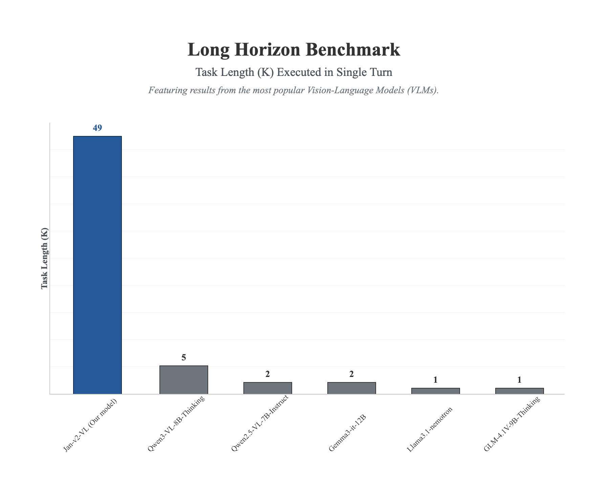
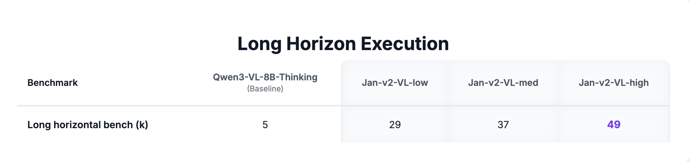
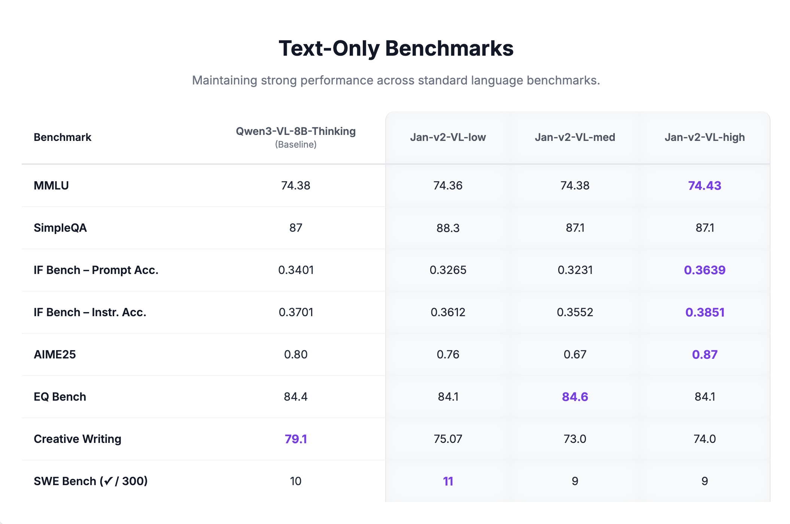
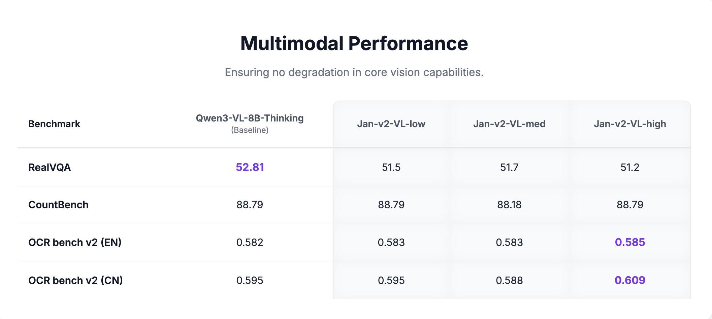

import { Callout } from 'nextra/components'

# Jan-v2-VL

Jan-v2-VL is an 8B vision-language model built on Qwen3-VL-8B-Thinking, designed for **long-horizon, multi-step agentic tasks** in real software environments — browsers, desktop apps, and beyond. It combines language reasoning with visual perception to execute stable, many-step automation chains with minimal drift.

<a
  href="jan://models/huggingface/janhq/Jan-v2-VL-med-gguf"
  style={{
    display: 'inline-flex',
    alignItems: 'center',
    gap: '8px',
    padding: '10px 20px',
    backgroundColor: '#000',
    color: '#fff',
    borderRadius: '8px',
    fontWeight: '600',
    fontSize: '15px',
    textDecoration: 'none',
    marginTop: '8px',
  }}
>
  Open in Jan
</a>

## Variants

Jan-v2-VL comes in three variants tuned for different latency/quality tradeoffs:

| Variant | Focus |
|---------|-------|
| **Jan-v2-VL-low** | Efficiency-oriented, lower latency |
| **Jan-v2-VL-med** | Balanced latency and quality |
| **Jan-v2-VL-high** | Deeper reasoning, higher think time |

## Capabilities

- **Agentic automation & UI control**: Follow complex multi-step instructions in browsers and desktop apps
- **Screenshot grounding**: Perceive and act on visual state of the screen
- **Tool calling**: Native support for BrowserMCP and similar integrations
- **Error recovery**: Maintain intermediate state and recover from minor execution errors
- **Long-horizon execution**: Stable performance across many-step automation chains

## Performance

### Long-Horizon Execution

Jan-v2-VL dramatically outperforms competing VLMs on the long-horizon benchmark, completing tasks up to 49 steps in a single turn — nearly 10x more than the next best model.



All three Jan-v2-VL variants significantly exceed the Qwen3-VL-8B-Thinking baseline (score: 5):



### Text-Only Benchmarks

Jan-v2-VL maintains strong performance on standard language benchmarks with no degradation from the base model:



### Multimodal Benchmarks

Core vision capabilities are fully preserved across all variants:



## Requirements

- **Memory**:
  - Minimum: 16GB RAM (with Q4 quantization)
  - Recommended: 24GB RAM (with Q8 quantization)
- **Hardware**: GPU recommended for real-time agentic use
- **API Support**: OpenAI-compatible at localhost:1337

## Using Jan-v2-VL

### Quick Start

1. Download Jan Desktop
2. Select Jan-v2-VL-med (or your preferred variant) from the model list
3. Start using it for browser automation or visual tasks

### Deployment Options

**Using vLLM:**
```bash
vllm serve janhq/Jan-v2-VL-high \
    --host 0.0.0.0 \
    --port 1234 \
    --enable-auto-tool-choice \
    --tool-call-parser hermes \
    --reasoning-parser qwen3
```

**Using llama.cpp:**
```bash
llama-server --model Jan-v2-VL-high-Q8_0.gguf \
    --vision-model-path mmproj-Jan-v2-VL-high.gguf \
    --host 0.0.0.0 \
    --port 1234 \
    --jinja \
    --no-context-shift
```

### Recommended Parameters

```yaml
temperature: 1.0
top_p: 0.95
top_k: 20
repetition_penalty: 1.0
presence_penalty: 1.5
```

## What Jan-v2-VL Does Well

- **UI automation**: Navigate and interact with browsers and desktop applications via screenshots
- **Long-horizon tasks**: Execute multi-step plans without losing context or drifting
- **Visual grounding**: Identify and interact with specific UI elements from screenshots
- **Tool calling**: Integrate with MCP servers like BrowserMCP for end-to-end automation

## Limitations

- **GPU recommended**: Real-time agentic use benefits significantly from GPU acceleration
- **8B size**: More capable than 4B models for visual tasks, but larger resource footprint
- **Vision required**: Text-only tasks do not benefit from the vision-language architecture

## Available Formats

### GGUF Quantizations

- **Q4_K_M**: Good balance of size and quality
- **Q5_K_M**: Better quality, slightly larger
- **Q8_0**: Highest quality quantization

## Models Available

- [Jan-v2-VL-low on Hugging Face](https://huggingface.co/janhq/Jan-v2-VL-low)
- [Jan-v2-VL-med on Hugging Face](https://huggingface.co/janhq/Jan-v2-VL-med)
- [Jan-v2-VL-high on Hugging Face](https://huggingface.co/janhq/Jan-v2-VL-high)

## Community

- **Discussions**: [HuggingFace Community](https://huggingface.co/janhq/Jan-v2-VL-med/discussions)
- **Support**: Available through Jan App at [jan.ai](https://jan.ai)
