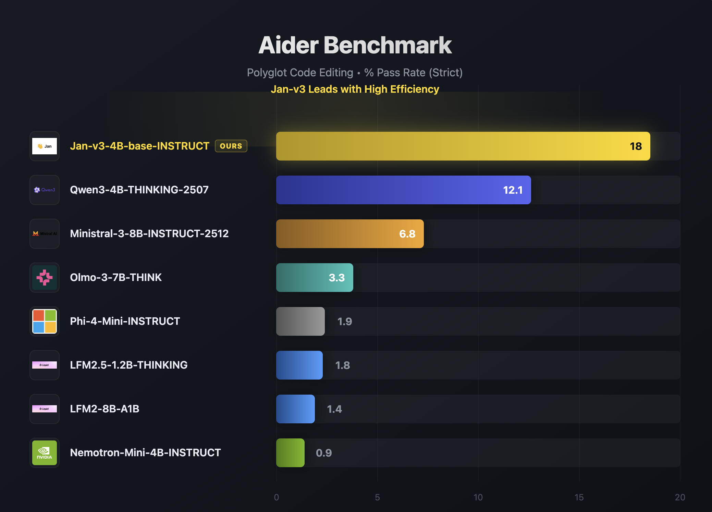
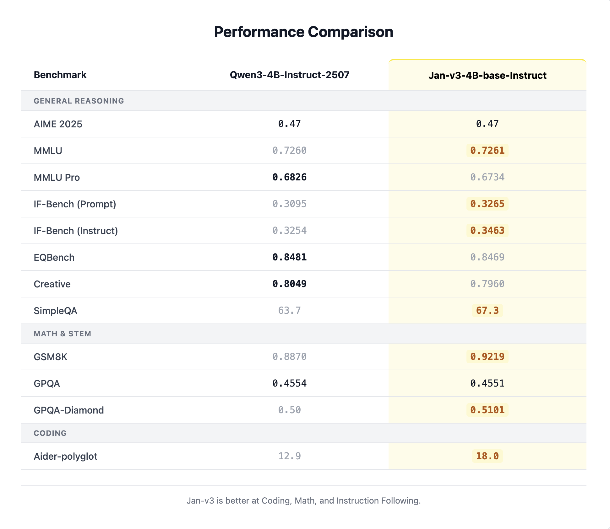

import { Callout } from 'nextra/components'

# Jan-v3-4B

Jan-v3-4B-base-instruct is a compact 4B parameter model created via post-training distillation from a larger teacher model. It is designed as an ownable, general-purpose base that is straightforward to fine-tune, with strong instruction following out of the box.

<a
  href="jan://models/huggingface/janhq/Jan-v3-4B-base-instruct-gguf"
  style={{
    display: 'inline-flex',
    alignItems: 'center',
    gap: '8px',
    padding: '10px 20px',
    backgroundColor: '#000',
    color: '#fff',
    borderRadius: '8px',
    fontWeight: '600',
    fontSize: '15px',
    textDecoration: 'none',
    marginTop: '8px',
  }}
>
  Open in Jan
</a>

## Overview


| Property | Value |
|----------|-------|
| **Parameters** | 4B (3.6B non-embedding) |
| **Base Model** | Qwen3-4B-Instruct-2507 |
| **Context Length** | 262,144 tokens (native) |
| **Architecture** | 36 layers, 32 Q heads / 8 KV heads (GQA) |
| **License** | Apache 2.0 |

## Capabilities

- **Instruction following**: Strong compliance with user instructions out of the box
- **Fine-tuning base**: Designed as a starting point for downstream fine-tuning
- **Coding assistance**: Effective lightweight coding help (a dedicated code variant, Jan-Code-4B, is also available)
- **General purpose**: Distillation preserves broad capabilities across standard benchmarks

<Callout type="info">
  Jan-v3-4B-base-instruct is the base model for [Jan-Code-4B](/docs/desktop/jan-models/jan-code-4b), the code-tuned variant.
</Callout>

## Performance

### Aider Benchmark (Polyglot Code Editing)

Jan-v3-4B leads its weight class on the Aider polyglot benchmark with a strict pass rate of 18, nearly 50% higher than the next best model (Qwen3-4B-Thinking at 12.1):



### General Performance Comparison

Jan-v3-4B-base-instruct outperforms Qwen3-4B-Instruct-2507 (its base) across coding, math, and instruction-following benchmarks while remaining competitive on reasoning:



## Requirements

- **Memory**:
  - Minimum: 8GB RAM (with Q4 quantization)
  - Recommended: 16GB RAM (with Q8 quantization)
- **Hardware**: CPU or GPU
- **API Support**: OpenAI-compatible at localhost:1337

## Using Jan-v3-4B

### Quick Start

1. Download Jan Desktop
2. Select Jan-v3-4B-base-instruct from the model list
3. Start chatting — no additional configuration needed

### Demo

Try it live at [chat.jan.ai](https://chat.jan.ai/)

### Deployment Options

**Using vLLM:**
```bash
vllm serve janhq/Jan-v3-4B-base-instruct \
    --host 0.0.0.0 \
    --port 1234 \
    --enable-auto-tool-choice \
    --tool-call-parser hermes
```

**Using llama.cpp:**
```bash
llama-server --model Jan-v3-4B-base-instruct-Q8_0.gguf \
    --host 0.0.0.0 \
    --port 1234 \
    --jinja \
    --no-context-shift
```

### Recommended Parameters

```yaml
temperature: 0.7
top_p: 0.8
top_k: 20
```

## What Jan-v3-4B Does Well

- **Long context**: Native 262k token context window for handling large documents
- **Instruction following**: Reliable and consistent response to user instructions
- **Fine-tuning**: Designed to be a strong, ownable starting point for specialization
- **General tasks**: Broad capabilities preserved through distillation from a larger model

## Limitations

- **Model size**: 4B parameters limit complex multi-step reasoning compared to larger models
- **Specialized domains**: For coding specifically, consider [Jan-Code-4B](/docs/desktop/jan-models/jan-code-4b)

## Available Formats

### GGUF Quantizations

- **Q4_K_M**: Good balance of size and quality
- **Q5_K_M**: Better quality, slightly larger
- **Q8_0**: Highest quality quantization (recommended)

## Models Available

- [Jan-v3-4B-base-instruct on Hugging Face](https://huggingface.co/janhq/Jan-v3-4B-base-instruct)

## Community

- **Discussions**: [HuggingFace Community](https://huggingface.co/janhq/Jan-v3-4B-base-instruct/discussions)
- **Support**: Available through Jan App at [jan.ai](https://jan.ai)
