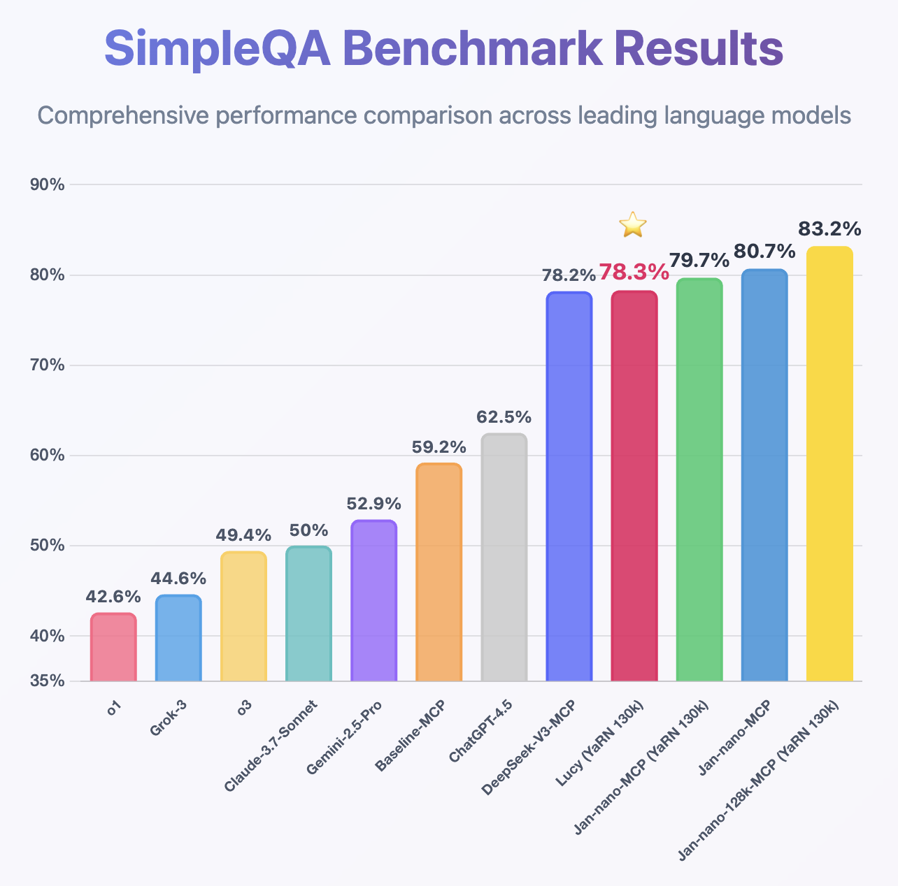

import { Callout } from 'nextra/components'

# Lucy

## Overview

Lucy is a 1.7B parameter model built on Qwen3-1.7B, optimized for web search through tool calling. The model has been trained to work effectively with search APIs like Serper, enabling web search capabilities in resource-constrained environments.

## Performance

### SimpleQA Benchmark

Lucy achieves competitive performance on SimpleQA despite its small size:



The benchmark shows Lucy (1.7B) compared against models ranging from 4B to 600B+ parameters. While larger models generally perform better, Lucy demonstrates that effective web search integration can partially compensate for smaller model size.

## Requirements

- **Memory**:
  - Minimum: 4GB RAM (with Q4 quantization)
  - Recommended: 8GB RAM (with Q8 quantization)
- **Search API**: Serper API key required for web search functionality
- **Hardware**: Runs on CPU or GPU

<Callout type="info">
To use Lucy's web search capabilities, you'll need a Serper API key. Get one at [serper.dev](https://serper.dev).
</Callout>

## Using Lucy

### Quick Start

1. Download Jan Desktop
2. Download Lucy from the Hub
3. Configure Serper MCP with your API key
4. Start using web search through natural language

### Demo


### Deployment Options

**Using vLLM:**
```bash
vllm serve Menlo/Lucy-128k \
    --host 0.0.0.0 \
    --port 1234 \
    --enable-auto-tool-choice \
    --tool-call-parser hermes \
    --rope-scaling '{"rope_type":"yarn","factor":3.2,"original_max_position_embeddings":40960}' \
    --max-model-len 131072
```

**Using llama.cpp:**
```bash
llama-server model.gguf \
    --host 0.0.0.0 \
    --port 1234 \
    --rope-scaling yarn \
    --rope-scale 3.2 \
    --yarn-orig-ctx 40960
```

### Recommended Parameters

```yaml
Temperature: 0.7
Top-p: 0.9
Top-k: 20
Min-p: 0.0
```

## What Lucy Does Well

- **Web Search Integration**: Optimized to call search tools and process results
- **Small Footprint**: 1.7B parameters means lower memory requirements
- **Tool Calling**: Reliable function calling for search APIs

## Limitations

- **Requires Internet**: Web search functionality needs active connection
- **API Costs**: Serper API has usage limits and costs
- **Context Processing**: While supporting 128k context, performance may vary with very long inputs
- **General Knowledge**: Limited by 1.7B parameter size for tasks beyond search

## Models Available

- [Lucy on Hugging Face](https://huggingface.co/Menlo/Lucy-128k)
- [Lucy GGUF on Hugging Face](https://huggingface.co/Menlo/Lucy-128k-gguf)

## Citation

```bibtex
@misc{dao2025lucyedgerunningagenticweb,
      title={Lucy: edgerunning agentic web search on mobile with machine generated task vectors},
      author={Alan Dao and Dinh Bach Vu and Alex Nguyen and Norapat Buppodom},
      year={2025},
      eprint={2508.00360},
      archivePrefix={arXiv},
      primaryClass={cs.CL},
      url={https://arxiv.org/abs/2508.00360},
}
```
