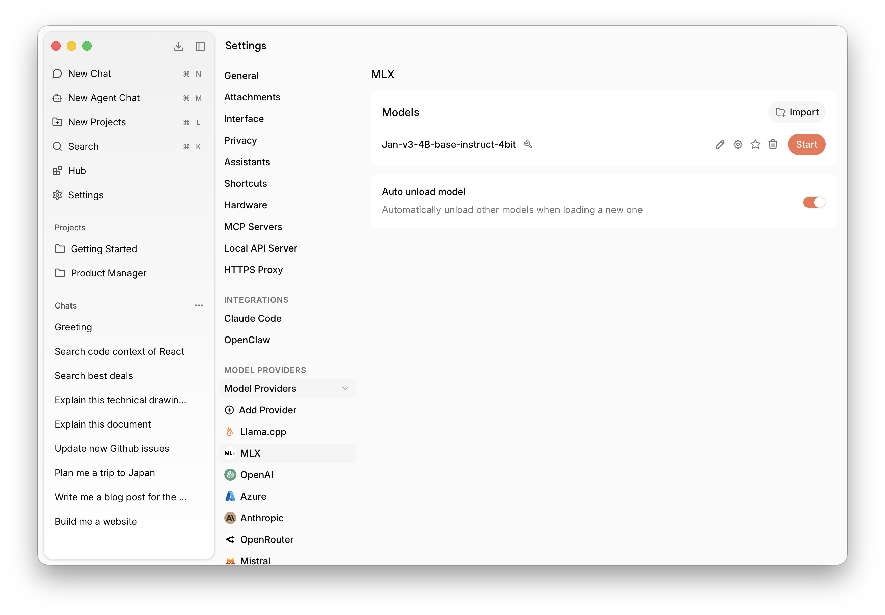

import { Callout } from 'nextra/components'

# MLX

MLX is an inference engine for Apple Silicon (M1 and later). It uses Metal GPU acceleration for fast, efficient local inference — available on macOS 14+.

<Callout type="warning">
MLX support in Jan is currently in beta and will be improved significantly over time.
</Callout>

## Requirements

- macOS 14 or higher
- Apple Silicon (M1, M2, M3 or later)

## Accessing Engine Settings

Find MLX settings at **Settings** > **MLX** under Model Providers:

## Model Management

MLX supports models in MLX-Swift format. Jan ships with MLX-compatible versions of its foundation models.

### Download from Hub

Browse and download MLX-compatible models directly from the [Hub](/docs/desktop/manage-models) tab in the left sidebar. Downloaded models will appear here automatically.

### Import Local Files

Click **Import** to link an MLX model file already on your computer. This is useful for models downloaded via your browser from Hugging Face, or models shared with other apps — Jan links to the file in place without copying it.

### Delete a Model

Click the trash icon next to any model to remove it. Linked files leave the original intact.

## How It Works

Jan integrates MLX via [mlx-swift-lm](https://github.com/ml-explore/mlx-swift-lm), running a local inference server on top of it. The server is spawned and managed by Jan's MLX plugin, which handles model loading, lifecycle, and communication with the rest of the app.
