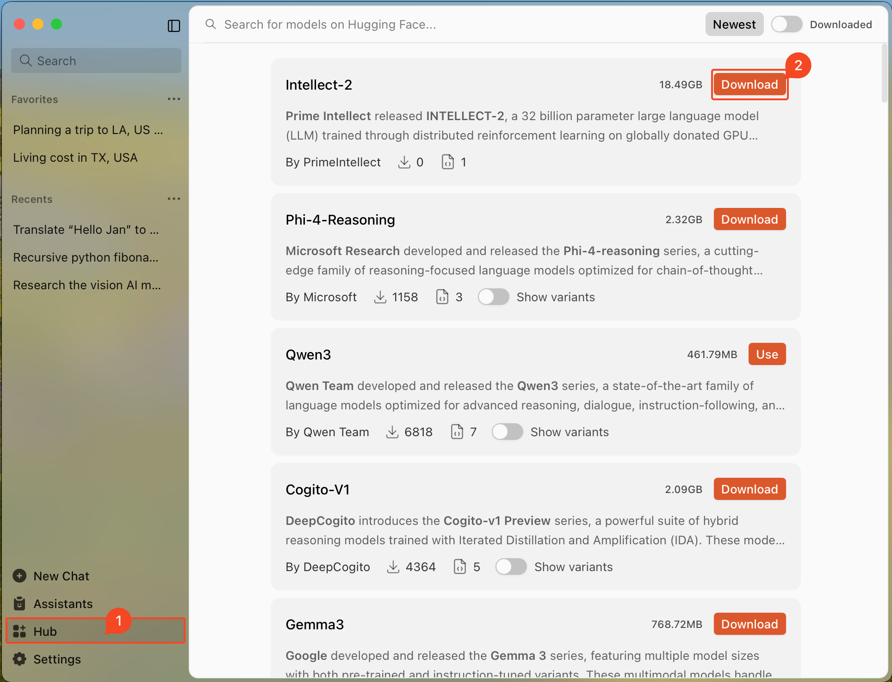
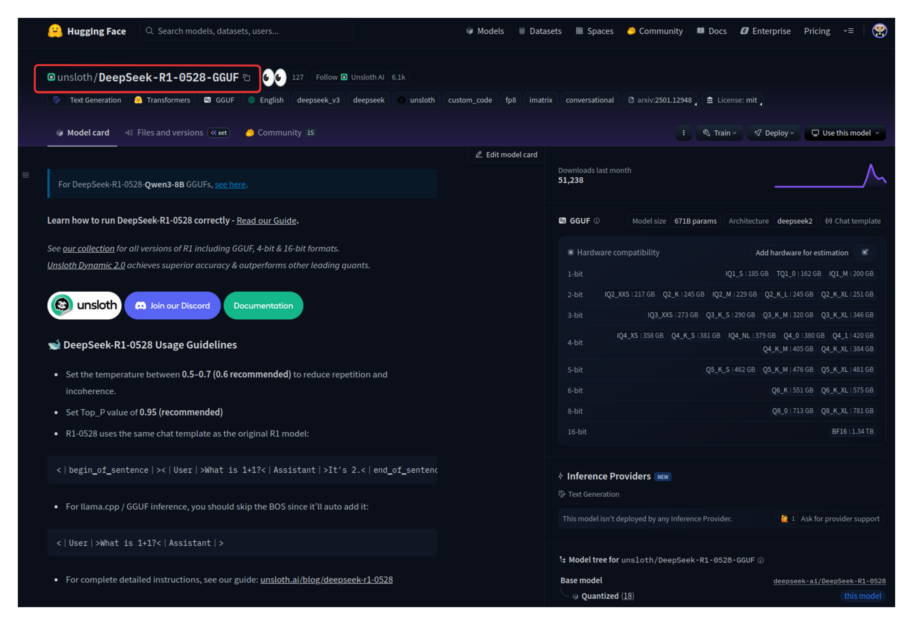
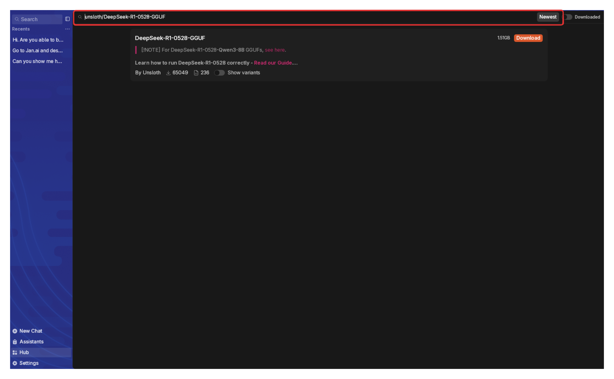
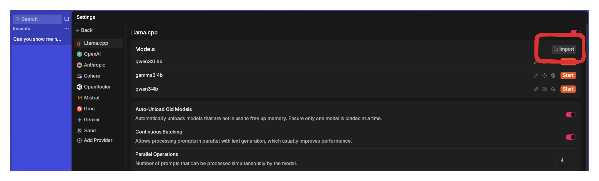
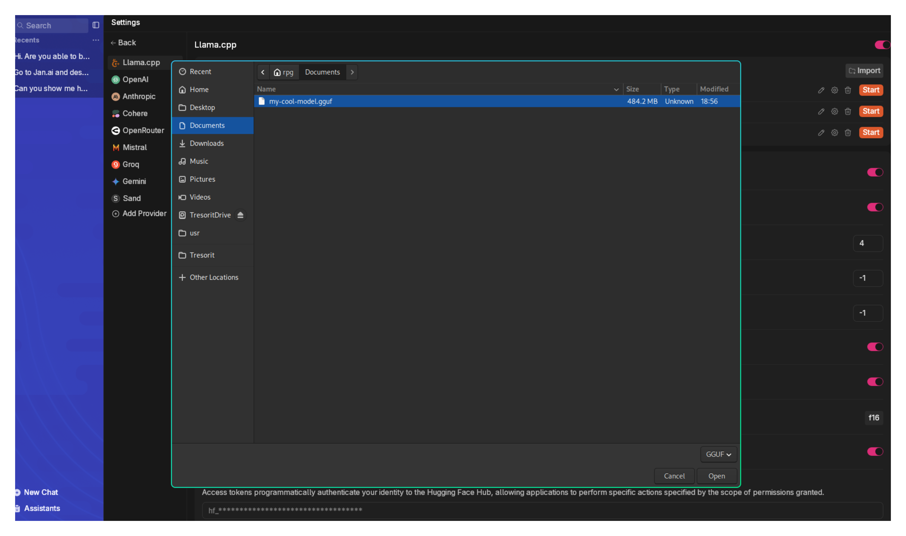
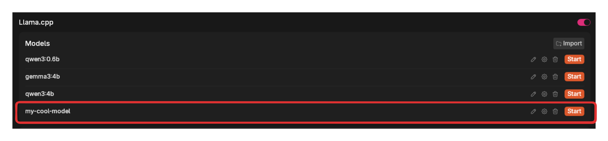
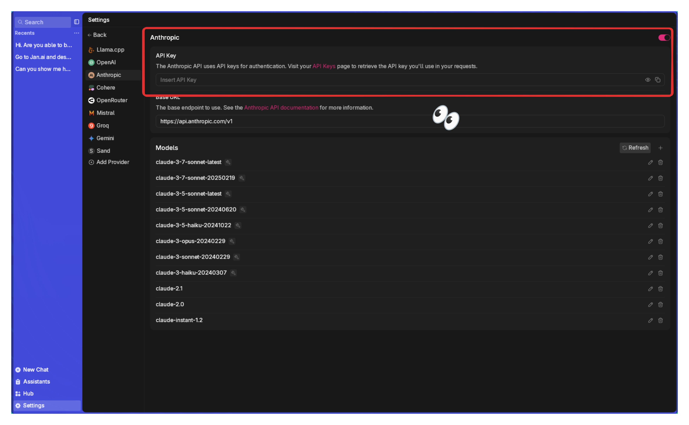
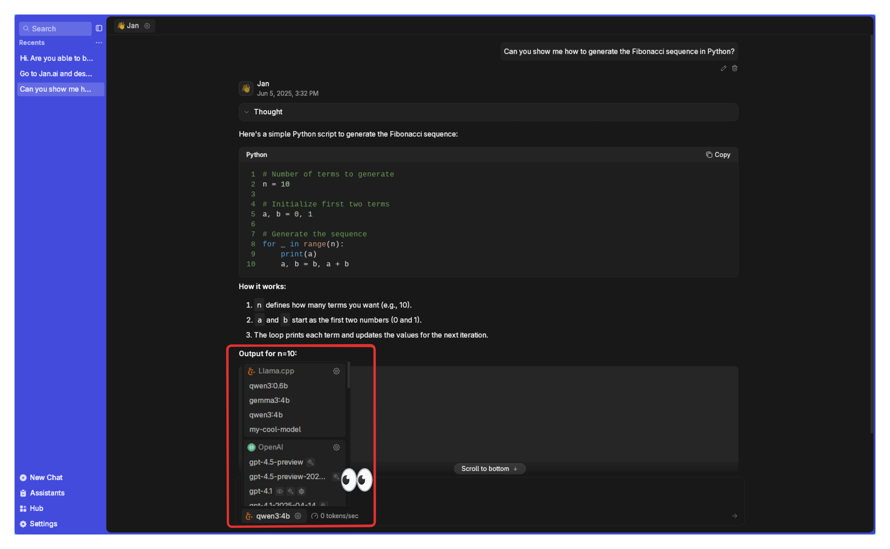

import { Callout, Steps } from 'nextra/components'
import { Settings, Trash2, EllipsisVertical, Plus, FolderOpen, Pencil } from 'lucide-react'


# Model Management

This guide shows you how to add, customize, and delete models within Jan.

## Local Model

Local models are managed through [Llama.cpp](https://github.com/ggerganov/llama.cpp), and these models are in a
format called GGUF. When you run them locally, they will use your computer's memory (RAM) and processing power, so
please make sure that you download models that match the hardware specifications for your operating system:
- [Mac](/docs/desktop/install/mac#compatibility)
- [Windows](/docs/desktop/install/windows#compatibility)
- [Linux](/docs/desktop/install/linux#compatibility).

### Adding Models

#### 1. Download from Jan Hub (Recommended)

The easiest way to get started is using Jan's built-in model hub (which is connected to [HuggingFace's Model Hub](https://huggingface.co/models):
1. Go to the **Hub** tab
2. Browse available models and click on any model to see details about it
3. Choose a model that fits your needs & hardware specifications
4. Click **Download** on your chosen model

<Callout type="info">
Jan will indicate if a model might be **Slow on your device** or **Not enough RAM** based on your system specifications.
</Callout>

<br/>

<br/>

#### 2. Import from [Hugging Face](https://huggingface.co/)

You can download models with a direct link from Hugging Face:

**Note:** Some models require a Hugging Face Access Token. Enter your token in **Settings > Model Providers > Hugging Face** before importing.

1. Visit the [Hugging Face Models](https://huggingface.co/models) page.
2. Find the model you want to use, make sure it is a GGUF file that fits in your computer.
3. Copy the **model ID** (e.g., TheBloke/Mistral-7B-v0.1-GGUF)
4. In Jan, paste the model ID to the **Search** bar in **Hub** page
5. Select your preferred quantized version to download (if the option is available)

<br/>
**Copy the model ID.**


<br/>
**Paste it in Jan's Hub Search Bar.**

<br/>

#### 3. Import Local Files

If you already have one or many GGUF model files on your computer:
1. In Jan, go to **Settings > Model Providers > Llama.cpp**
2. Click **Import** and select your GGUF file(s)
3. Choose how you want to import:
  - **Link Files:** Creates symbolic links to your model files (saves space)
  - **Duplicate:** Makes a copy of model files in Jan's directory
4. Click **Import** to complete (check the [Jan Data Folder](./data-folder) section for more info)

<Callout type="warning">
You need to own your **model configurations**, use at your own risk. Misconfigurations may result in lower
quality or unexpected outputs. Learn about [model configurations here](./model-parameters).
</Callout>

<br/>

<br/>

<br/>

<br/>

<br/>

<br/>

#### 4. Manual Setup

For advanced users who want to add a specific model that is not available within the Jan **Hub**:

<Steps>
##### Step 1: Create Model File
1. Navigate to the [Jan Data Folder](./data-folder)
2. Open `models` folder
3. Create a new **Folder** for your model
4. Add your `model.gguf` file
5. Add your `model.json` file with your configuration. Here's an example with "TinyLlama Chat 1.1B Q4":

```json
{
  "sources": [
    {
      "filename": "tinyllama-1.1b-chat-v1.0.Q4_K_M.gguf",
      "url": "https://huggingface.co/TheBloke/TinyLlama-1.1B-Chat-v1.0-GGUF/resolve/main/tinyllama-1.1b-chat-v1.0.Q4_K_M.gguf"
    }
  ],
  "id": "tinyllama-1.1b",
  "object": "model",
  "name": "TinyLlama Chat 1.1B Q4",
  "version": "1.0",
  "description": "TinyLlama is a tiny model with only 1.1B. It's a good model for less powerful computers.",
  "format": "gguf",
  "settings": {
    "ctx_len": 4096,
    "prompt_template": "<|system|>\n{system_message}<|user|>\n{prompt}<|assistant|>",
    "llama_model_path": "tinyllama-1.1b-chat-v1.0.Q4_K_M.gguf"
  },
  "parameters": {
    "temperature": 0.7,
    "top_p": 0.95,
    "stream": true,
    "max_tokens": 2048,
    "stop": [],
    "frequency_penalty": 0,
    "presence_penalty": 0
  },
  "metadata": {
    "author": "TinyLlama",
    "tags": [
      "Tiny",
      "Foundation Model"
    ],
    "size": 669000000
  },
  "engine": "nitro"
}
```
##### Step 2: Modify Model Parameters

Key fields to configure:
1. The **Settings** array is where you can set the path or location of your model in your computer, the context
length allowed, and the chat template expected by your model.
2. The [**Parameters**](/docs/desktop/model-parameters) are the adjustable settings that affect how your model operates or
processes the data. The fields in the parameters array are typically general and can be used across different
models. Here is an example of model parameters:

```json
"parameters":{
  "temperature": 0.7,
  "top_p": 0.95,
  "stream": true,
  "max_tokens": 4096,
  "frequency_penalty": 0,
  "presence_penalty": 0,
}
```
</Steps>

### Delete Models
1. Go to **Settings > Model Providers > Llama.cpp**
2. Find the model you want to remove
3. Select the three dots <EllipsisVertical width={16} height={16} style={{display:"inline"}}/> icon next to it and select **Delete Model**

<br/>

<br/>


## Cloud Models

<Callout type="info">
When using cloud models, be aware of any associated costs and rate limits from the providers. See detailed guide for
each cloud model provider [here](/docs/desktop/remote-models/anthropic).
</Callout>

Jan supports connecting to various AI cloud providers that are OpenAI API-compatible, including: OpenAI (GPT-4o, o3,...),
Anthropic (Claude), Groq, Mistral, and more.
1. Navigate to **Settings** (<Settings width={16} height={16} style={{display:"inline"}}/>)
2. Under **Model Providers** section in the left sidebar, choose your preferred provider (OpenAI, Anthropic, etc.)
3. Enter your API key
4. The activated cloud models will be available in your model selector inside the **Chat** panel

<br/>

<br/>
As soon as you add your key for a model provider like Anthropic or OpenAI, you will be able to pick one of their models to chat with.

<br/>
