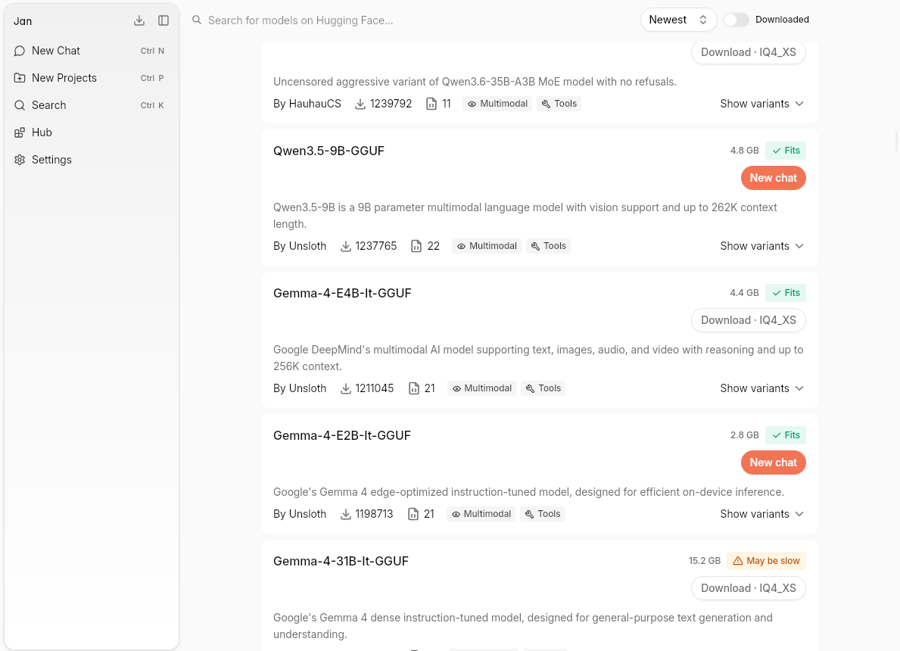
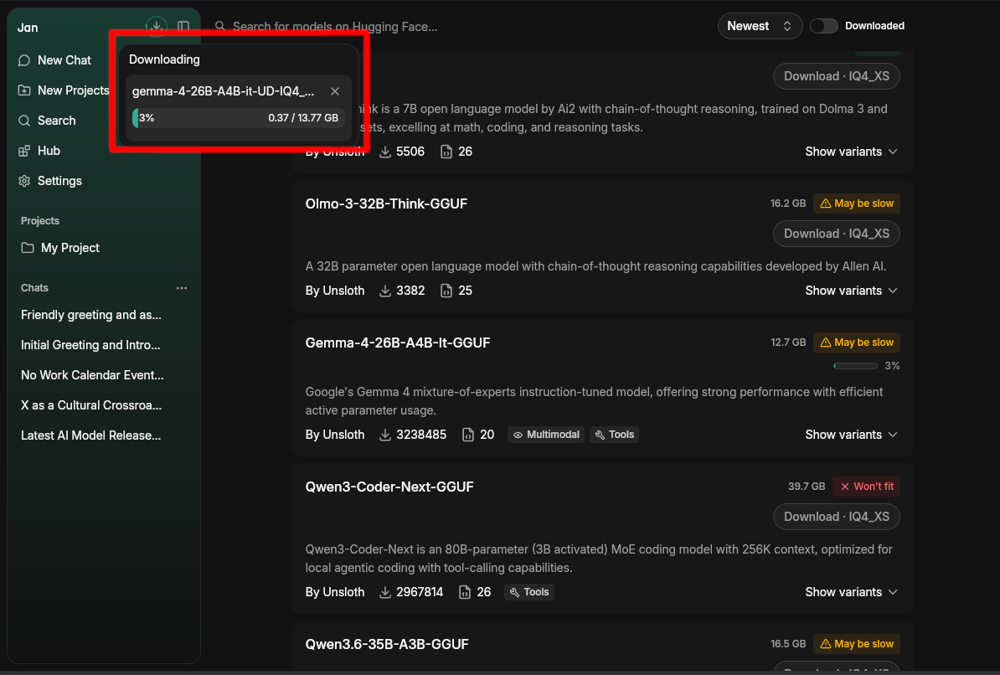
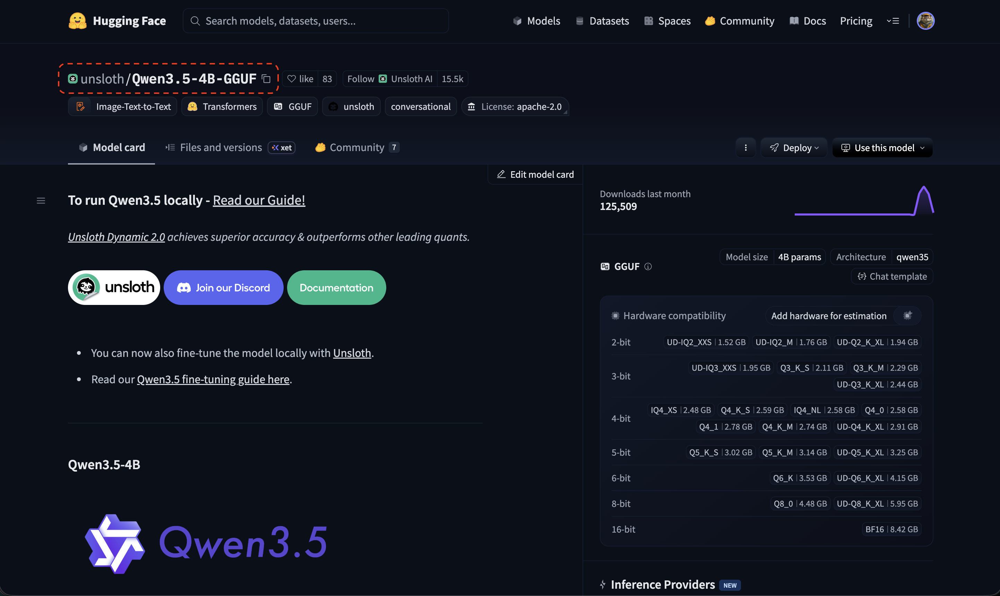
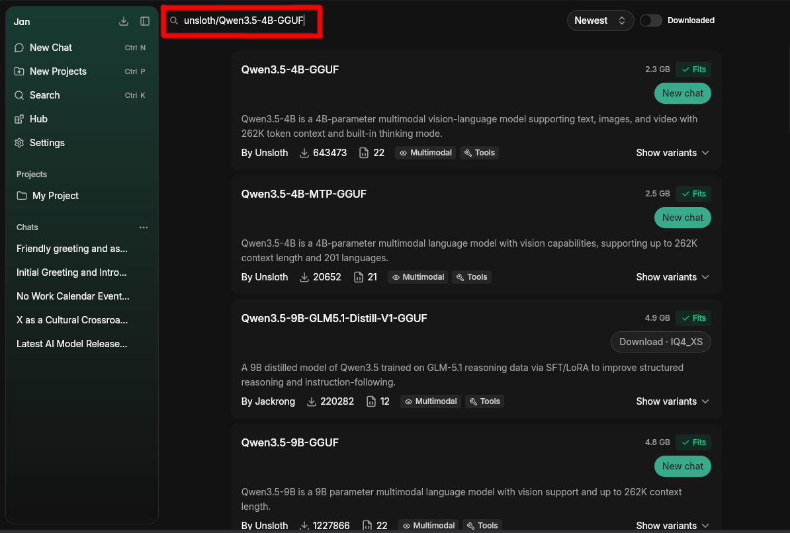
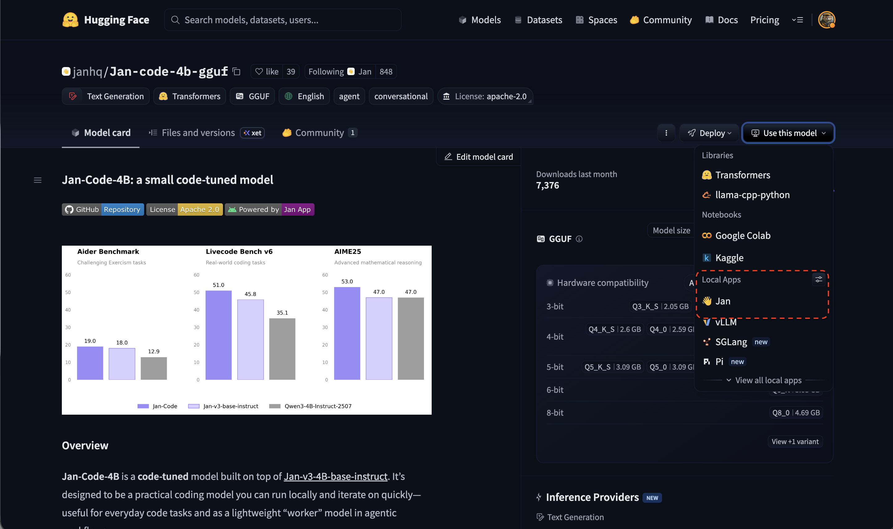

import { Callout, Steps } from 'nextra/components'
import { Settings, Trash2, EllipsisVertical, Cpu, Zap, Sparkles, Brain, Globe, Network, Wind, GitBranch } from 'lucide-react'
import { DocCard, DocCards } from '@/components/DocCard'

# Model Management

This guide shows you how to add, customize, and delete models within Jan.

## Local Model

Local models are managed through [Llama.cpp](https://github.com/ggerganov/llama.cpp), and these models are in a
format called GGUF. When you run them locally, they will use your computer's memory (RAM) and processing power, so
please make sure that you download models that match the hardware specifications for your operating system:
- [Mac](/docs/desktop/install/mac#compatibility)
- [Windows](/docs/desktop/install/windows#compatibility)
- [Linux](/docs/desktop/install/linux#compatibility).

### Adding Models

#### 1. Download from Jan Hub (Recommended)

The easiest way to get started is using Jan's built-in model hub (which is connected to [HuggingFace's Model Hub](https://huggingface.co/models):
1. Go to the **Hub** tab
2. Browse available models and click on any model to see details about it
3. Choose a model that fits your needs & hardware specifications
4. Click **Download** on your chosen model

<Callout type="info">
Jan will indicate if a model might be **Slow on your device** or **Not enough RAM** based on your system specifications.
</Callout>

Once you click **Download**, you can track the progress from the download indicator in the top bar. The model name and download percentage are shown in real time — you can cancel at any time by clicking the **×** button.

#### 2. Import from [Hugging Face](https://huggingface.co/)

You can download models with a direct link from Hugging Face:

**Note:** Some models require a Hugging Face Access Token. Enter your token in **Settings > General > Others > HuggingFace Token** before importing.

1. Visit the [Hugging Face Models](https://huggingface.co/models) page.
2. Find the model you want to use, make sure it is a GGUF file that fits in your computer.
3. Copy the **model ID** (e.g., TheBloke/Mistral-7B-v0.1-GGUF)
4. In Jan, paste the model ID to the **Search** bar in **Hub** page
5. Select your preferred quantized version to download (if the option is available)

**Copy the model ID.**

**Paste it in Jan's Hub Search Bar.**

#### 3. Use This Model on Hugging Face

You can also open any model directly in Jan from the Hugging Face model page:

1. On any model page, click **Use this model**
2. Under **Local Apps**, select **Jan**

#### 4. Import Local Files

If you already have model files on your computer, you can import them directly via the engine settings:

<DocCards cols={2}>
  <DocCard title="Llama.cpp" href="/docs/desktop/local-engine/llama-cpp" icon={<Cpu size={20} />}>Import GGUF model files for local inference on CPU or GPU.</DocCard>
  <DocCard title="MLX" href="/docs/desktop/local-engine/mlx" icon={<Zap size={20} />}>Import MLX-Swift models for Apple Silicon.</DocCard>
</DocCards>

## Cloud Models

Jan supports connecting to various AI cloud providers. Go to **Settings > Model Providers**, select your provider, and enter your API key.

<DocCards cols={2}>
  <DocCard title="OpenAI" href="/docs/desktop/remote-models/openai" icon={<Sparkles size={20} />}>Use GPT-4o, o3, and other OpenAI models.</DocCard>
  <DocCard title="Anthropic" href="/docs/desktop/remote-models/anthropic" icon={<Brain size={20} />}>Use Claude models from Anthropic.</DocCard>
  <DocCard title="Google" href="/docs/desktop/remote-models/google" icon={<Globe size={20} />}>Use Gemini models from Google.</DocCard>
  <DocCard title="Groq" href="/docs/desktop/remote-models/groq" icon={<Zap size={20} />}>Fast inference for open-source models.</DocCard>
  <DocCard title="Mistral" href="/docs/desktop/remote-models/mistralai" icon={<Wind size={20} />}>Use Mistral AI models.</DocCard>
  <DocCard title="OpenRouter" href="/docs/desktop/remote-models/openrouter" icon={<Network size={20} />}>Access hundreds of models via a single API.</DocCard>
</DocCards>
