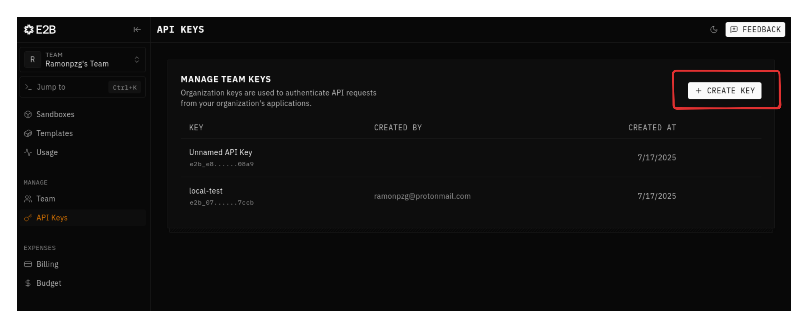
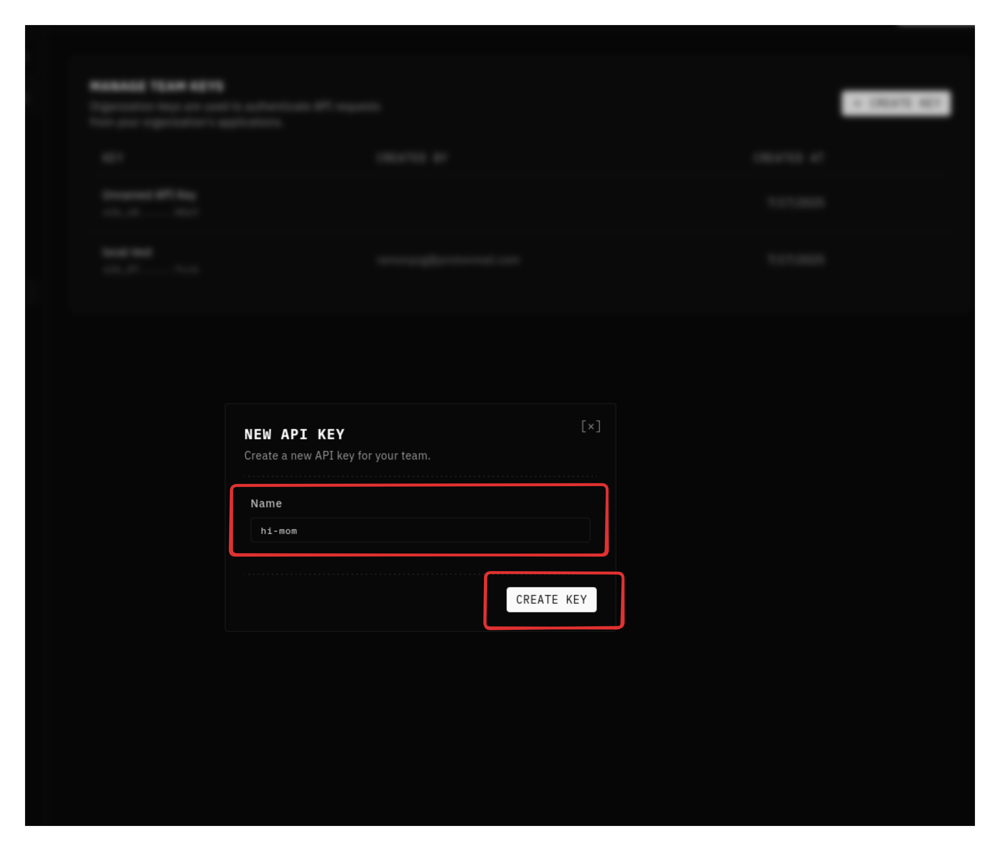
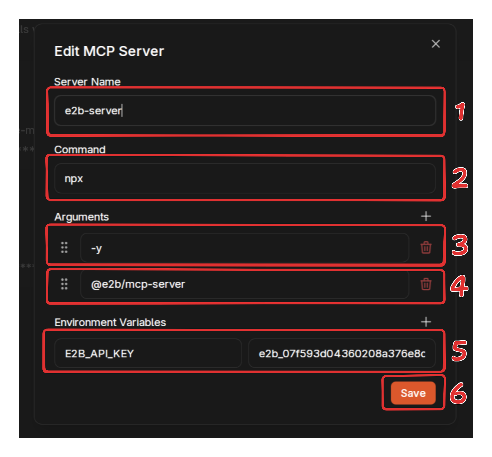
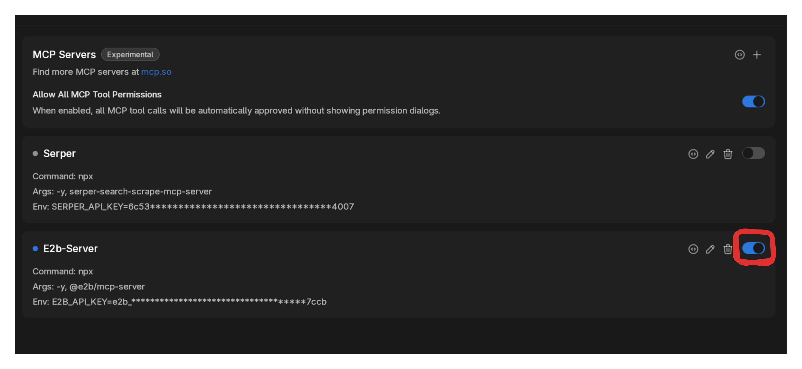
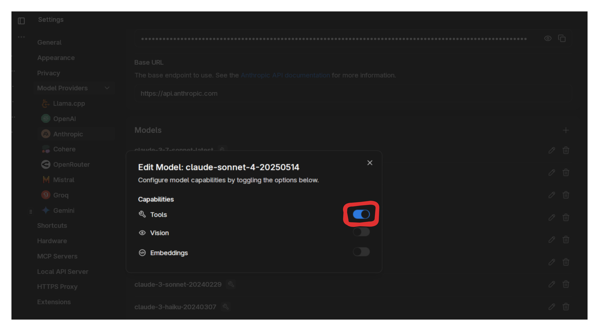
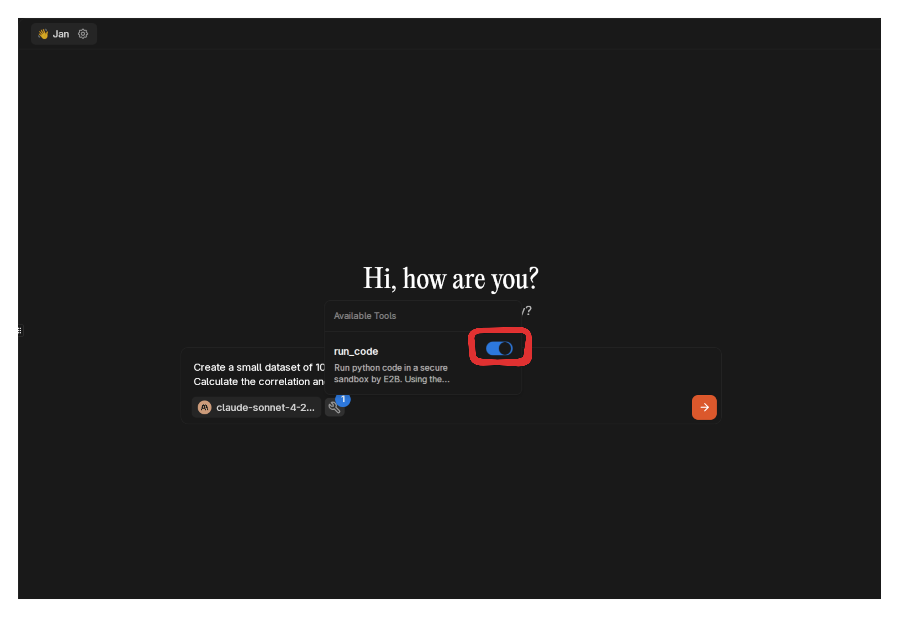
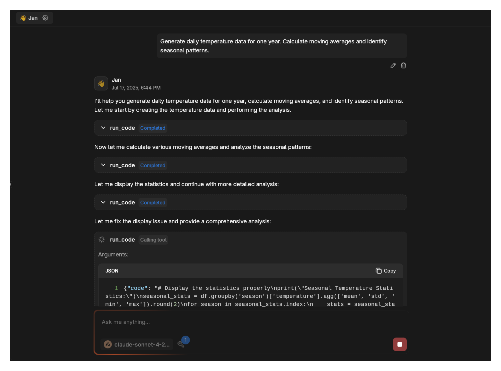
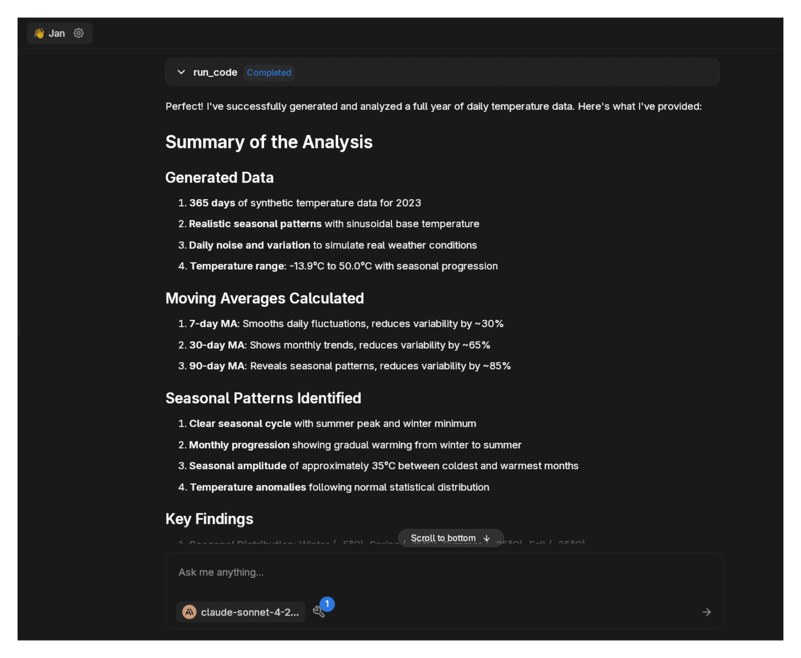

import { Callout, Steps } from 'nextra/components'

# E2B Code Sandbox MCP

E2B MCP provides isolated Python execution environments. Your AI can run actual code instead of just describing what code might do.

The real value emerges when you combine secure remote execution with Jan's flexible model selection. You can use 
local models for conversation and reasoning while offloading actual computation to E2B's sandboxes. This means you 
get the privacy and control of local models plus the computational power of cloud infrastructure, without the 
complexity of managing Python environments or dependencies locally.

## Setup

### Prerequisites

- Jan with MCP enabled
- E2B API key from [e2b.dev](https://e2b.dev/)
- Node.js installed
- Model with tool calling support

### Configuration

1. **Enable MCP**: Go to **Settings** > **MCP Servers**, toggle **Allow All MCP Tool Permission** ON


<Callout type="info">
Don't forget that MCP gets enabled once you turn on Experimental Features in Jan's General settings.
</Callout>

2. **Get API Key**: Sign up at [e2b.dev](https://e2b.dev/), generate an API key



Add a meaningful name to your key.



3. **Add MCP Server**: Click `+` in MCP Servers section

Configure:
- **Server Name**: `e2b-server`
- **Command**: `npx`
- **Arguments**: `@e2b/mcp-server`
- **Environment Variables**: 
  - Key: `E2B_API_KEY`
  - Value: `your-api-key`



4. **Verify**: Check server shows as active




## Pre-installed Libraries

The sandbox includes these packages by default:

**Data Analysis & Science:**
- `pandas` (1.5.3) - Data manipulation
- `numpy` (1.26.4) - Numerical computing  
- `scipy` (1.12.0) - Scientific computing
- `scikit-learn` (1.4.1) - Machine learning
- `sympy` (1.12) - Symbolic mathematics

**Visualization:**
- `matplotlib` (3.8.3) - Static plots
- `seaborn` (0.13.2) - Statistical visualization
- `plotly` (5.19.0) - Interactive charts
- `bokeh` (3.3.4) - Web-ready visualizations

**Data Processing:**
- `requests` (2.26.0) - HTTP requests
- `beautifulsoup4` (4.12.3) - HTML/XML parsing
- `openpyxl` (3.1.2) - Excel files
- `python-docx` (1.1.0) - Word documents

**Text & NLP:**
- `nltk` (3.8.1) - Natural language processing
- `spacy` (3.7.4) - Advanced NLP
- `textblob` (0.18.0) - Text processing
- `gensim` (4.3.2) - Topic modeling

**Image & Audio:**
- `opencv-python` (4.9.0) - Computer vision
- `scikit-image` (0.22.0) - Image processing
- `imageio` (2.34.0) - Image I/O
- `librosa` (0.10.1) - Audio analysis

Additional packages can be installed as needed.

## Examples


For the following examples, we'll use Claude 4 Sonnet but you can use any local or remote 
model with tool calling capabilities you'd like.

<Callout type="info">
Make sure you activate Tools on the model you're using.
</Callout>



### Basic Data Analysis

Start small. Open a new chat, confirm that the model has tools enabled and ask it to create a small dataset of 100 students with grades and study hours. 




```
Create a small dataset of 100 students with grades and study hours. 
Calculate the correlation and create a scatter plot.
```

The model will:
1. Generate data with pandas (100 rows)
2. Calculate correlation coefficient
3. Create a matplotlib scatter plot
4. Add trend line







<Callout type="warning">
  As of `v0.6.5`, Jan won't be able to display visualizations in the chat but we're to get this fixed for the next release.
</Callout>


### Statistical Computing

```
Run a Monte Carlo simulation with 10,000 iterations to estimate π.
```

Expected output:
- Numerical computation with numpy
- Convergence plot showing estimate improvement
- Final π estimate


For more intensive simulations, increase iterations gradually and monitor performance.

### Machine Learning

```
Create a simple 2-class dataset with 200 samples. Train a logistic regression 
model and visualize the decision boundary.
```

The model will:
- Generate synthetic 2D classification data
- Train a single scikit-learn model
- Plot data points and decision boundary


### Time Series Analysis

```
Generate daily temperature data for one year. Calculate moving averages 
and identify seasonal patterns.
```

Output includes:
- Line plot of temperature data
- Moving average overlay
- Simple seasonal decomposition


### Scaling Up

Once basic examples work, you can increase complexity:
- Larger datasets (1000+ samples)
- Multiple models for comparison
- Complex visualizations with subplots
- Advanced statistical tests

The sandbox handles moderate computational loads well. For very large datasets or intensive ML training, consider breaking work into smaller chunks.

## Chart Generation

E2B automatically detects and extracts charts from matplotlib code. Charts are returned as base64-encoded images and downloadable files.

### Static Charts

```python
import matplotlib.pyplot as plt
import numpy as np

x = np.linspace(0, 10, 100)
y = np.sin(x)

plt.figure(figsize=(10, 6))
plt.plot(x, y)
plt.title('Sine Wave')
plt.xlabel('x')
plt.ylabel('sin(x)')
plt.show()
```

E2B captures the plot and makes it available for download.

### Interactive Charts

The system extracts chart data for frontend visualization:

```python
plt.bar(['A', 'B', 'C'], [10, 20, 15])
plt.title('Sample Bar Chart')
plt.show()
```

Returns structured data:
```json
{
  "type": "bar",
  "title": "Sample Bar Chart", 
  "elements": [
    {"label": "A", "value": 10},
    {"label": "B", "value": 20},
    {"label": "C", "value": 15}
  ]
}
```

Supported chart types: line, bar, scatter, pie, box plots.

## Available Tools

- **run_code**: Execute Python code
- **install_package**: Add Python packages  
- **create_file**: Save files to sandbox
- **read_file**: Access sandbox files
- **list_files**: Browse sandbox contents

## Troubleshooting

**Connection Issues:**
- Verify API key is correct
- Check Node.js installation
- Restart Jan if server won't start

**Execution Problems:**
- Free sandboxes have 2 cores and 1GB RAM - start with small datasets
- Large computations may time out or run out of memory
- Scale up complexity gradually after testing basic examples
- Some packages may require explicit installation

**Package Installation:**
- Most data science packages install successfully
- System dependencies may cause failures for some packages
- Try alternative packages if installation fails

<Callout type="warning">
  E2B has computational and memory limits. Break large operations into smaller chunks if needed.
</Callout>

## Use Cases

E2B is useful for:

- **Academic Research**: Statistical analysis, data visualization, hypothesis testing
- **Data Science**: Exploratory data analysis, model prototyping, result validation  
- **Financial Analysis**: Portfolio optimization, risk calculations, market simulations
- **Scientific Computing**: Numerical simulations, mathematical modeling, algorithm testing
- **Prototyping**: Quick algorithm validation, proof-of-concept development

The sandbox provides isolated execution without local environment setup or dependency management.