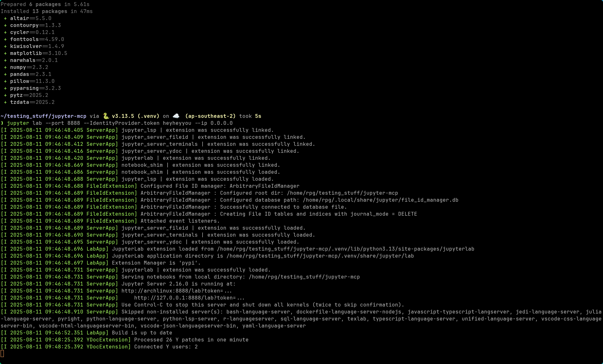
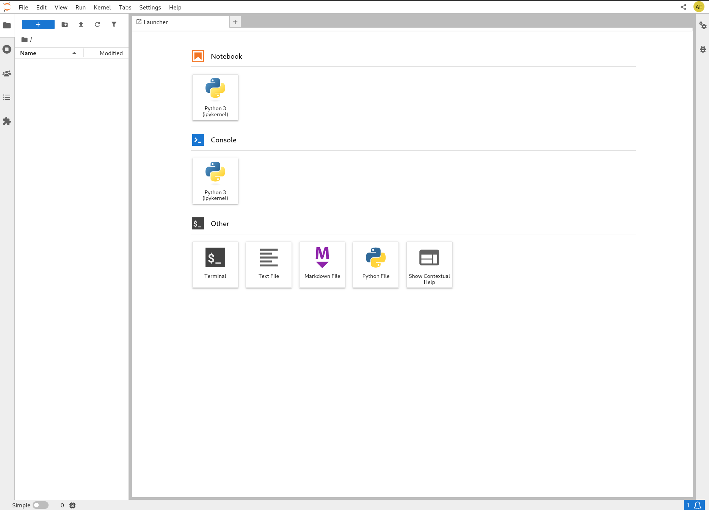
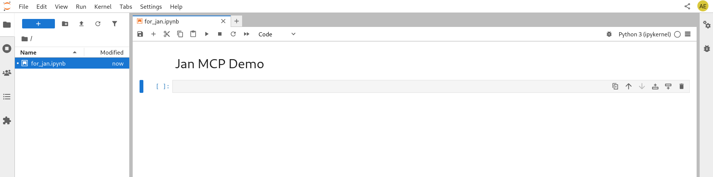
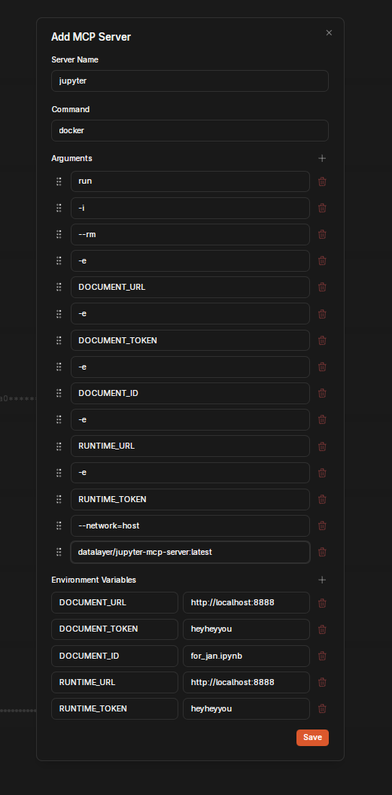
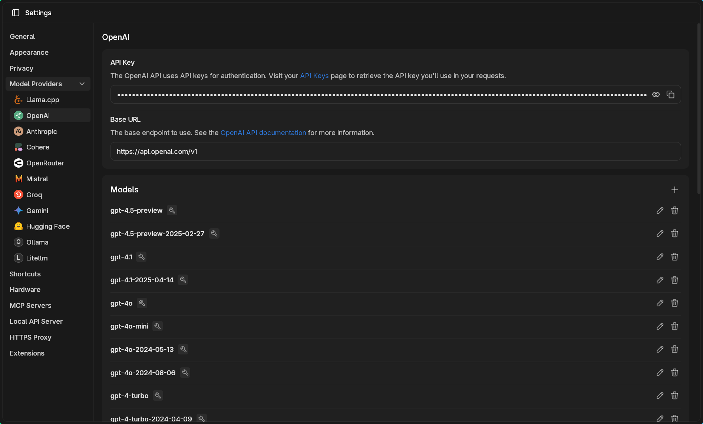
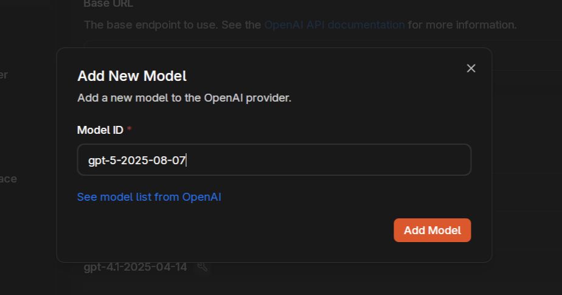
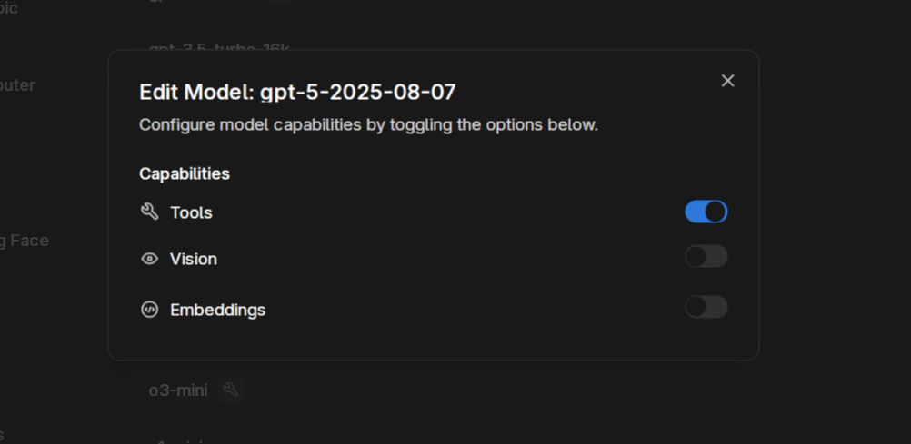
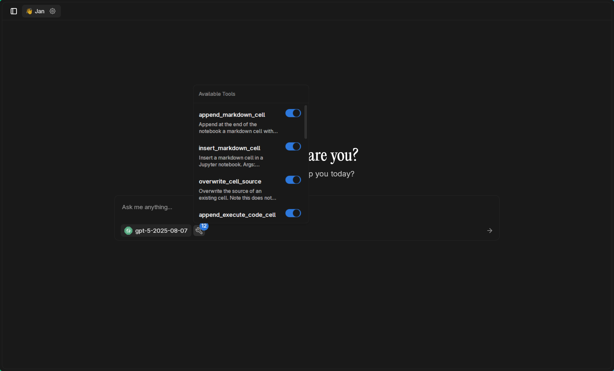
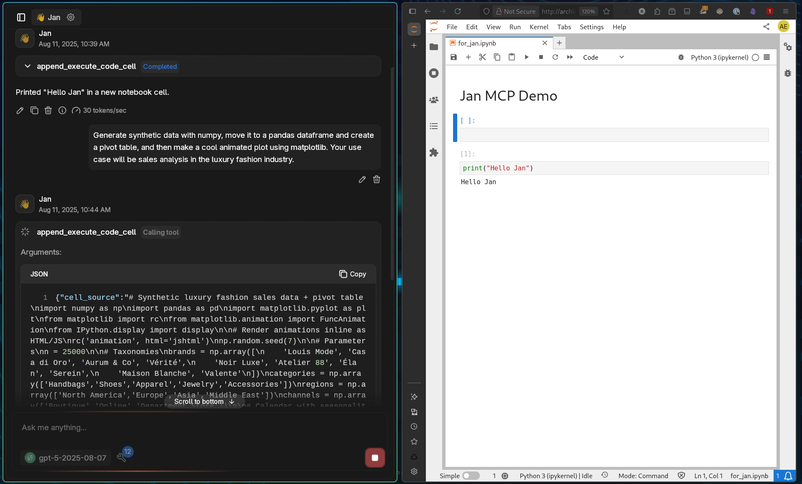

import { Callout } from 'nextra/components'

# Jupyter MCP

[Jupyter MCP Server](https://jupyter-mcp-server.datalayer.tech/) enables real-time interaction with Jupyter notebooks, allowing AI models to edit, execute, and document code for data analysis and visualization. Instead of just generating code suggestions, AI can actually run Python code and see the results.

This integration gives Jan the ability to execute analysis, create visualizations, and iterate based on actual results - turning your AI assistant into a capable data science partner.

<Callout type="info">
**Breaking Change**: Version 0.11.0+ renamed `room` to `document`. Check the [release notes](https://jupyter-mcp-server.datalayer.tech/releases) for details.
</Callout>

## Available Tools

The Jupyter MCP Server provides [12 comprehensive tools](https://jupyter-mcp-server.datalayer.tech/tools/):

### Core Operations
- `append_execute_code_cell`: Add and run code cells at notebook end
- `insert_execute_code_cell`: Insert and run code at specific positions
- `execute_cell_simple_timeout`: Execute cells with timeout control
- `execute_cell_streaming`: Long-running cells with progress updates
- `execute_cell_with_progress`: Execute with timeout and monitoring

### Cell Management
- `append_markdown_cell`: Add documentation cells
- `insert_markdown_cell`: Insert markdown at specific positions
- `delete_cell`: Remove cells from notebook
- `overwrite_cell_source`: Update existing cell content

### Information & Reading
- `get_notebook_info`: Retrieve notebook metadata
- `read_cell`: Examine specific cell content
- `read_all_cells`: Get complete notebook state

<Callout type="warning">
The MCP connects to **one notebook at a time**, not multiple notebooks. Specify your target notebook in the configuration.
</Callout>

## Prerequisites

- Jan with MCP enabled
- Python 3.8+ with uv package manager
- Docker installed
- OpenAI API key for GPT-5 access
- Basic understanding of Jupyter notebooks

## Setup

### Enable MCP

1. Go to **Settings** > **MCP Servers**
2. Toggle **Allow All MCP Tool Permission** ON


### Install uv Package Manager

If you don't have uv installed:

```bash
# macOS and Linux
curl -LsSf https://astral.sh/uv/install.sh | sh

# Windows
powershell -c "irm https://astral.sh/uv/install.ps1 | iex"
```

### Create Python Environment

Set up an isolated environment for Jupyter:

```bash
# Create environment with Python 3.13
uv venv .venv --python 3.13

# Activate environment
source .venv/bin/activate  # Linux/macOS
# or
.venv\Scripts\activate     # Windows

# Install Jupyter dependencies
uv pip install jupyterlab==4.4.1 jupyter-collaboration==4.0.2 ipykernel
uv pip uninstall pycrdt datalayer_pycrdt
uv pip install datalayer_pycrdt==0.12.17

# Add data science libraries
uv pip install pandas numpy matplotlib altair
```

### Start JupyterLab Server

Launch JupyterLab with authentication:

```bash
jupyter lab --port 8888 --IdentityProvider.token heyheyyou --ip 0.0.0.0
```



The server opens in your browser:



### Create Target Notebook

Create a new notebook named `for_jan.ipynb`:



### Configure MCP Server in Jan

Click `+` in MCP Servers section:

**Configuration for macOS/Windows:**
- **Server Name**: `jupyter`
- **Command**: `docker`
- **Arguments**:
  ```
  run -i --rm -e DOCUMENT_URL -e DOCUMENT_TOKEN -e DOCUMENT_ID -e RUNTIME_URL -e RUNTIME_TOKEN datalayer/jupyter-mcp-server:latest
  ```
- **Environment Variables**:
  - Key: `DOCUMENT_URL`, Value: `http://host.docker.internal:8888`
  - Key: `DOCUMENT_TOKEN`, Value: `heyheyyou`
  - Key: `DOCUMENT_ID`, Value: `for_jan.ipynb`
  - Key: `RUNTIME_URL`, Value: `http://host.docker.internal:8888`
  - Key: `RUNTIME_TOKEN`, Value: `heyheyyou`



## Using OpenAI's GPT-5

### Configure OpenAI Provider

Navigate to **Settings** > **Model Providers** > **OpenAI**:



### Add GPT-5 Model

Since GPT-5 is new, you'll need to manually add it to Jan:



<Callout type="info">
**About GPT-5**: OpenAI's smartest, fastest, most useful model yet. It features built-in thinking capabilities, state-of-the-art performance across coding, math, and writing, and exceptional tool use abilities. GPT-5 automatically decides when to respond quickly versus when to think longer for expert-level responses.
</Callout>

### Enable Tool Calling

Ensure tools are enabled for GPT-5:



## Usage

### Verify Tool Availability

Start a new chat with GPT-5. The tools bubble shows all available Jupyter operations:



### Initial Test

Start with establishing the notebook as your workspace:

```
You have access to a jupyter notebook, please use it as our data analysis scratchpad. Let's start by printing "Hello Jan" in a new cell.
```

GPT-5 creates and executes the code successfully:


### Advanced Data Analysis

Try a more complex task combining multiple operations:

```
Generate synthetic data with numpy, move it to a pandas dataframe and create a pivot table, and then make a cool animated plot using matplotlib. Your use case will be sales analysis in the luxury fashion industry.
```



Watch the complete output unfold:

<video width="100%" controls>
  <source src="https://catalog.jan.ai/docs/mcpjupyter.mp4" type="video/mp4" />
  Your browser does not support the video tag.
</video>

## Example Prompts to Try

### Financial Analysis
```
Create a Monte Carlo simulation for portfolio risk analysis. Generate 10,000 scenarios, calculate VaR at 95% confidence, and visualize the distribution.
```

### Time Series Forecasting
```
Generate synthetic time series data representing daily website traffic over 2 years with weekly seasonality and trend. Build an ARIMA model and forecast the next 30 days.
```

### Machine Learning Pipeline
```
Build a complete classification pipeline: generate a dataset with 3 classes and 5 features, split the data, try multiple algorithms (RF, SVM, XGBoost), and create a comparison chart of their performance.
```

### Interactive Dashboards
```
Create an interactive visualization using matplotlib widgets showing how changing interest rates affects loan payments over different time periods.
```

### Statistical Testing
```
Generate two datasets representing A/B test results for an e-commerce site. Perform appropriate statistical tests and create visualizations to determine if the difference is significant.
```

## Performance Considerations

<Callout type="warning">
Multiple tools can quickly consume context windows, especially for local models. GPT-5's unified system with smart routing helps manage this, but local models may struggle with speed and context limitations.
</Callout>

### Context Management
- Each tool call adds to conversation history
- 12 available tools means substantial system prompt overhead
- Local models may need reduced tool sets for reasonable performance
- Consider disabling unused tools to conserve context

### Cloud vs Local Trade-offs
- **Cloud models (GPT-5)**: Handle multiple tools efficiently with large context windows
- **Local models**: May require optimization, reduced tool sets, or smaller context sizes
- **Hybrid approach**: Use cloud for complex multi-tool workflows, local for simple tasks

## Security Considerations

<Callout type="warning">
MCP provides powerful capabilities but requires careful security practices.
</Callout>

### Authentication Tokens
- **Always use strong tokens** - avoid simple passwords
- **Never commit tokens** to version control
- **Rotate tokens regularly** for production use
- **Use different tokens** for different environments

### Network Security
- JupyterLab is network-accessible with `--ip 0.0.0.0`
- Consider using `--ip 127.0.0.1` for local-only access
- Implement firewall rules to restrict access
- Use HTTPS in production environments

### Code Execution Risks
- AI has full Python execution capabilities
- Review generated code before execution
- Use isolated environments for sensitive work
- Monitor resource usage and set limits

### Data Privacy
- Notebook content is processed by AI models
- When using cloud models like GPT-5, data leaves your system
- Keep sensitive data in secure environments
- Consider model provider's data policies

## Best Practices

### Environment Management
- Use virtual environments for isolation
- Document required dependencies
- Version control your notebooks
- Regular environment cleanup

### Performance Optimization
- Start with simple operations
- Monitor memory usage during execution
- Close unused notebooks
- Restart kernels when needed

### Effective Prompting
- Be specific about desired outputs
- Break complex tasks into steps
- Ask for explanations with code
- Request error handling in critical operations

## Troubleshooting

**Connection Problems:**
- Verify JupyterLab is running
- Check token matches configuration
- Confirm Docker can reach host
- Test with curl to verify connectivity

**Execution Failures:**
- Check Python package availability
- Verify kernel is running
- Look for syntax errors in generated code
- Restart kernel if stuck

**Tool Calling Errors:**
- Ensure model supports tool calling
- Verify all 12 tools appear in chat
- Check MCP server is active
- Review Docker logs for errors

**API Rate Limits:**
- Monitor OpenAI usage dashboard
- Implement retry logic for transient errors
- Consider fallback to local models
- Cache results when possible

## Conclusion

The Jupyter MCP integration combined with GPT-5's advanced capabilities creates an exceptionally powerful data science environment. With GPT-5's built-in reasoning and expert-level intelligence, complex analyses that once required extensive manual coding can now be accomplished through natural conversation.

Whether you're exploring data, building models, or creating visualizations, this integration provides the computational power of Jupyter with the intelligence of GPT-5 - all within Jan's privacy-conscious interface.

Remember: with great computational power comes the responsibility to use it securely. Always validate generated code, use strong authentication, and be mindful of data privacy when using cloud-based models.
