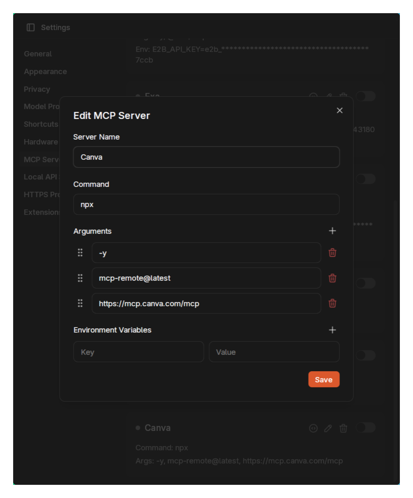
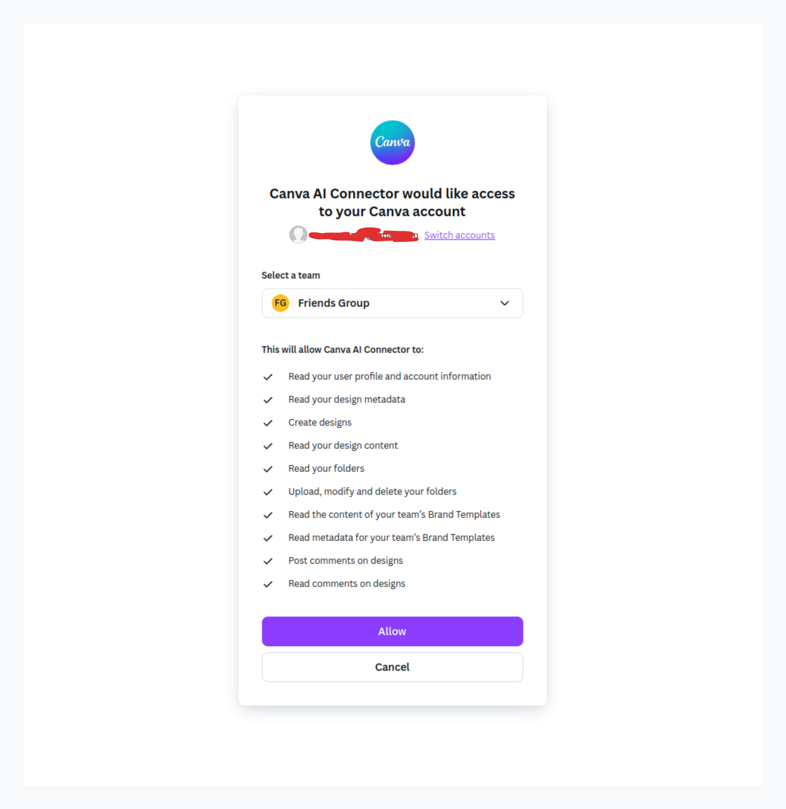
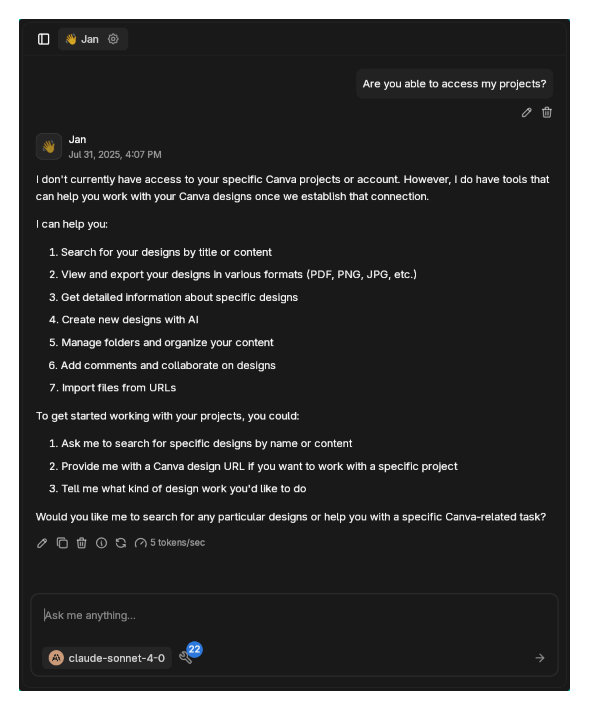
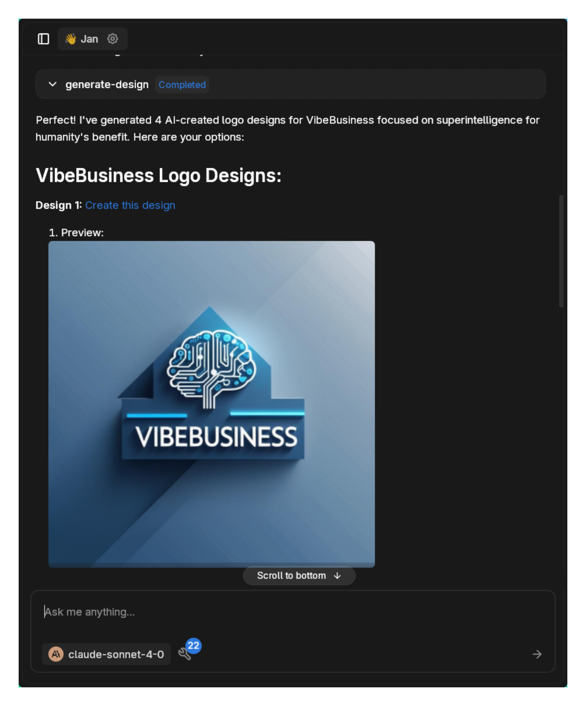
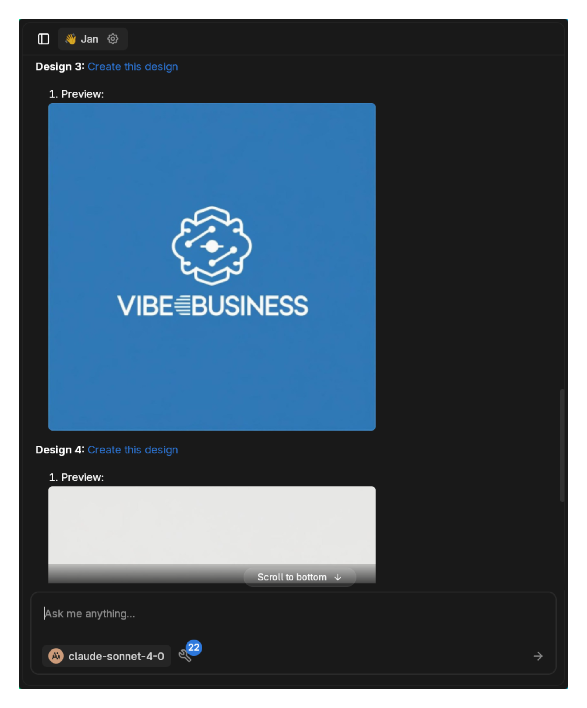
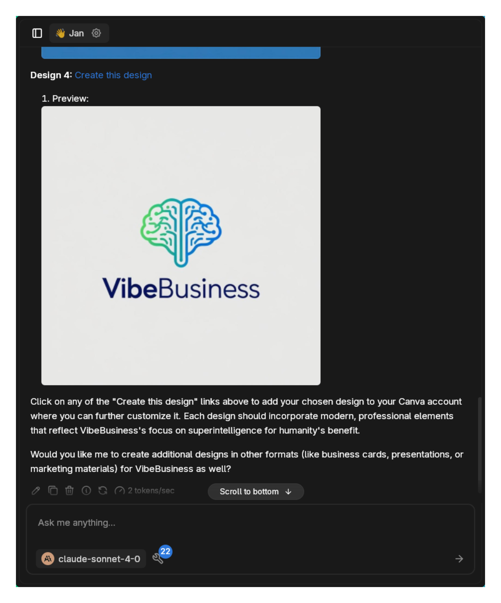

import { Callout, Steps } from 'nextra/components'

# Canva MCP

[Canva MCP](https://www.canva.com/newsroom/news/deep-research-integration-mcp-server/) gives AI models the ability to create, search, and manage designs directly within Canva. As the first design platform with native MCP integration, it lets you generate presentations, logos, and marketing materials through conversation rather than clicking through design interfaces.

The integration provides comprehensive design capabilities without leaving your chat, though actual editing still happens in Canva's interface.

## Available Tools

<Callout type="info">
Canva's MCP tools may change over time as the integration evolves. This list reflects current capabilities.
</Callout>

### Design Operations
- **generate-design**: Create new designs using AI prompts
- **search-designs**: Search docs, presentations, videos, whiteboards
- **get-design**: Get detailed information about a Canva design
- **get-design-pages**: List pages in multi-page designs
- **get-design-content**: Extract content from designs
- **resize-design**: Adapt designs to different dimensions
- **get-design-resize-status**: Check resize operation status
- **get-design-generation-job**: Track AI generation progress

### Import/Export
- **import-design-from-url**: Import files from URLs as new designs
- **get-design-import-from-url**: Check import status
- **export-design**: Export designs in various formats
- **get-export-formats**: List available export options
- **get-design-export-status**: Track export progress

### Organization
- **create-folder**: Create folders in Canva
- **move-item-to-folder**: Organize designs and assets
- **list-folder-items**: Browse folder contents

### Collaboration
- **comment-on-design**: Add comments to designs
- **list-comments**: View design comments
- **list-replies**: See comment threads
- **reply-to-comment**: Respond to feedback

### Legacy Tools
- **search**: ChatGPT connector (use search-designs instead)
- **fetch**: Content retrieval for ChatGPT

## Prerequisites

- Jan with MCP enabled
- Canva account (free or paid)
- Model with tool calling support
- Node.js installed
- Internet connection for Canva API access

## Setup

### Enable MCP

1. Go to **Settings** > **MCP Servers**
2. Toggle **Allow All MCP Tool Permission** ON


### Configure Canva MCP Server

Click `+` in MCP Servers section:

**Configuration:**
- **Server Name**: `Canva`
- **Command**: `npx`
- **Arguments**: `-y mcp-remote@latest https://mcp.canva.com/mcp`
- **Environment Variables**: Leave empty (authentication handled via OAuth)



### Authentication Process

When you first use Canva tools:

1. **Browser Opens Automatically**
   - Canva authentication page appears in your default browser
   - Log in with your Canva account


2. **Team Selection & Permissions**
   - Select your team (if you have multiple)
   - Review permissions the AI will have
   - Click **Allow** to grant access



The permissions include:
- Reading your profile and designs
- Creating new designs
- Managing folders and content
- Accessing team brand templates
- Commenting on designs

### Model Configuration

Use a tool-enabled model:

- **Anthropic Claude 3.5+ Sonnet**
- **OpenAI GPT-4o**
- **Google Gemini Pro**

## Real-World Usage Example

Here's an actual workflow creating a company logo:

### Initial Setup Confirmation

```
Are you able to access my projects?
```

The AI explains available capabilities:



### Design Creation Request

```
Create new designs with AI. Call it "VibeBusiness" and have it be a company focused on superintelligence for the benefit of humanity.
```

The AI initiates design generation:


### Design Options

The AI creates multiple logo variations:

**First Option:**


**Selected Design:**


### Final Result

After selection, the AI confirms:



Clicking the design link opens it directly in Canva:


## Practical Use Cases

### Marketing Campaign Development
```
Create a social media campaign for our new product launch. Generate Instagram posts, Facebook covers, and LinkedIn banners with consistent branding.
```

### Presentation Automation
```
Search for our Q4 sales presentation and create a simplified 5-slide version for the board meeting.
```

### Brand Asset Management
```
List all designs in our "2025 Marketing" folder and export the approved ones as PDFs.
```

### Design Iteration
```
Find our company logo designs from last month and resize them for business cards, letterheads, and email signatures.
```

### Content Extraction
```
Extract all text from our employee handbook presentation so I can update it in our documentation.
```

### Collaborative Review
```
Add a comment to the new website mockup asking the design team about the color scheme choices.
```

## Workflow Tips

### Effective Design Generation
- **Be specific**: "Create a minimalist tech company logo with blue and silver colors"
- **Specify format**: "Generate an Instagram story template for product announcements"
- **Include context**: "Design a professional LinkedIn banner for a AI research company"
- **Request variations**: Ask for multiple options to choose from

### Organization Best Practices
- Create folders before generating multiple designs
- Use descriptive names for easy searching later
- Move designs to appropriate folders immediately
- Export important designs for backup

### Integration Patterns
- Generate designs → Review options → Select preferred → Open in Canva for fine-tuning
- Search existing designs → Extract content → Generate new versions
- Create templates → Resize for multiple platforms → Export all variants

## Limitations and Considerations

**Design Editing**: While the MCP can create and manage designs, actual editing requires opening Canva's interface.

**Project Access**: The integration may not access all historical projects immediately, focusing on designs created or modified after connection.

**Generation Time**: AI design generation takes a few moments. The tool provides job IDs to track progress.

**Team Permissions**: Access depends on your Canva team settings and subscription level.

## Troubleshooting

**Authentication Issues:**
- Clear browser cookies for Canva
- Try logging out and back into Canva
- Ensure pop-ups aren't blocked for OAuth flow
- Check team admin permissions if applicable

**Design Generation Failures:**
- Verify you have creation rights in selected team
- Check Canva subscription limits
- Try simpler design prompts first
- Ensure stable internet connection

**Tool Availability:**
- Some tools require specific Canva plans
- Team features need appropriate permissions
- Verify MCP server is showing as active
- Restart Jan after authentication

**Search Problems:**
- Use search-designs (not the legacy search tool)
- Be specific with design types and names
- Check folder permissions for team content
- Allow time for new designs to index

<Callout type="warning">
Design generation uses Canva's AI capabilities and may be subject to usage limits based on your account type.
</Callout>

## Advanced Workflows

### Batch Operations
```
Create 5 variations of our product announcement banner, then resize all of them for Twitter, LinkedIn, and Facebook.
```

### Content Migration
```
Import all designs from [URLs], organize them into a "2025 Campaign" folder, and add review comments for the team.
```

### Automated Reporting
```
Search for all presentation designs created this month, extract their content, and summarize the key themes.
```

## Next Steps

Canva MCP bridges the gap between conversational AI and visual design. Instead of describing what you want and then manually creating it, you can generate professional designs directly through natural language commands.

The real power emerges when combining multiple tools - searching existing assets, generating new variations, organizing content, and collaborating with teams, all within a single conversation flow.