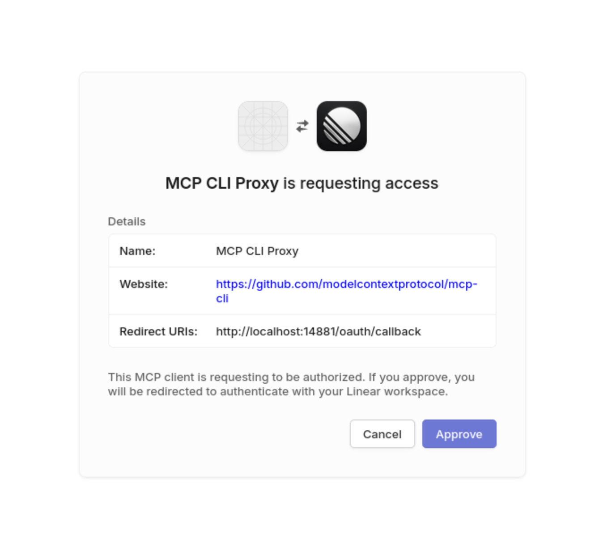
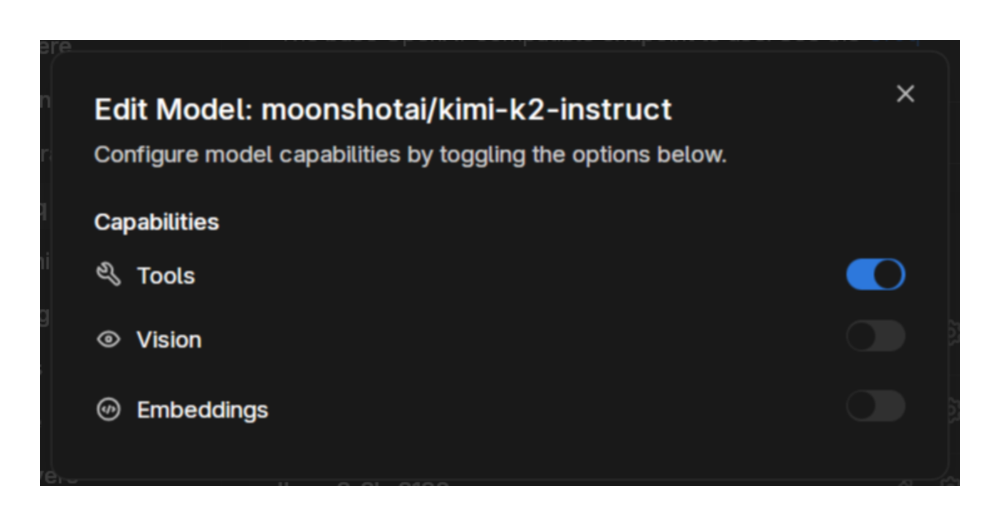
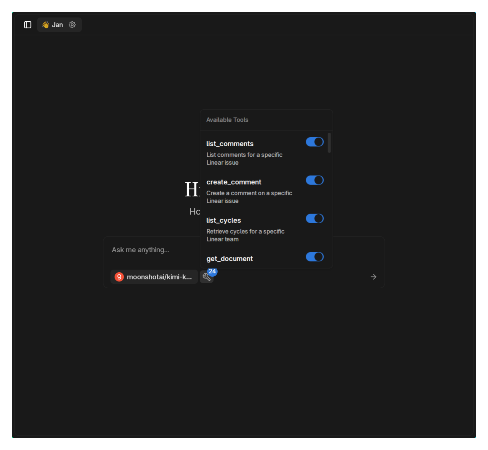

import { Callout, Steps } from 'nextra/components'

# Linear MCP

[Linear MCP](https://linear.app) provides comprehensive project management capabilities through natural conversation. Transform your software development workflow by managing issues, projects, and team collaboration directly through AI.

## Available Tools

Linear MCP offers extensive project management capabilities:

### Issue Management
- `list_issues`: View all issues in your workspace
- `get_issue`: Get details of a specific issue
- `create_issue`: Create new issues with full details
- `update_issue`: Modify existing issues
- `list_my_issues`: See your assigned issues
- `list_issue_statuses`: View available workflow states
- `list_issue_labels`: See and manage labels
- `create_issue_label`: Create new labels

### Project & Team
- `list_projects`: View all projects
- `get_project`: Get project details
- `create_project`: Start new projects
- `update_project`: Modify project settings
- `list_teams`: See all teams
- `get_team`: Get team information
- `list_users`: View team members

### Documentation & Collaboration
- `list_documents`: Browse documentation
- `get_document`: Read specific documents
- `search_documentation`: Find information
- `list_comments`: View issue comments
- `create_comment`: Add comments to issues
- `list_cycles`: View sprint cycles

## Prerequisites

- Jan with experimental features enabled
- Linear account (free for up to 250 issues)
- Model with strong tool calling support
- Active internet connection

<Callout type="info">
Linear offers a generous free tier perfect for small teams and personal projects. Unlimited users, 250 active issues, and full API access included.
</Callout>

## Setup

### Create Linear Account

1. Sign up at [linear.app](https://linear.app)
2. Complete the onboarding process


Once logged in, you'll see your workspace:


### Enable MCP in Jan

<Callout type="warning">
Enable **Experimental Features** in **Settings > General** if you don't see the MCP Servers option.
</Callout>

1. Go to **Settings > MCP Servers**
2. Toggle **Allow All MCP Tool Permission** ON

### Configure Linear MCP

Click the `+` button to add Linear MCP:

**Configuration:**
- **Server Name**: `linear`
- **Command**: `npx`
- **Arguments**: `-y mcp-remote https://mcp.linear.app/sse`


### Authenticate with Linear

When you first use Linear tools, a browser tab will open for authentication:



Complete the OAuth flow to grant Jan access to your Linear workspace.

## Usage

### Select a Model with Tool Calling

For this example, we'll use kimi-k2 from Groq:

1. Add the model in Groq settings: `moonshotai/kimi-k2-instruct`


2. Enable tools for the model:



### Verify Available Tools

You should see all Linear tools in the chat interface:



### Epic Project Management

Watch AI transform mundane tasks into epic narratives:


## Creative Examples

### 🎭 Shakespearean Sprint Planning
```
Create Linear tickets in the '👋Jan' team for my AGI project as battles in a Shakespearean war epic. Each sprint is a military campaign, bugs are enemy spies, and merge conflicts are sword fights between rival houses. Invent unique epic titles and dramatic descriptions with battle cries and victory speeches. Characterize bugs as enemy villains and developers as heroic warriors in this noble quest for AGI glory. Make tasks like model training, testing, and deployment sound like grand military campaigns with honor and valor.
```

### 🚀 Space Mission Development
```
Transform our mobile app redesign into a NASA space mission. Create issues where each feature is a mission objective, bugs are space debris to clear, and releases are launch windows. Add dramatic mission briefings, countdown sequences, and astronaut logs. Priority levels become mission criticality ratings.
```

### 🏴‍☠️ Pirate Ship Operations
```
Set up our e-commerce platform project as a pirate fleet adventure. Features are islands to conquer, bugs are sea monsters, deployments are naval battles. Create colorful pirate-themed tickets with treasure maps, crew assignments, and tales of high seas adventure.
```

### 🎮 Video Game Quest Log
```
Structure our API refactoring project like an RPG quest system. Create issues as quests with XP rewards, boss battles for major features, side quests for minor tasks. Include loot drops (completed features), skill trees (learning requirements), and epic boss fight descriptions for challenging bugs.
```

### 🍳 Gordon Ramsay's Kitchen
```
Manage our restaurant app project as if Gordon Ramsay is the head chef. Create brutally honest tickets criticizing code quality, demanding perfection in UX like a Michelin star dish. Bugs are "bloody disasters" and successful features are "finally, some good code." Include Kitchen Nightmares-style rescue plans.
```

## Practical Workflows

### Sprint Planning
```
Review all open issues in the Backend team, identify the top 10 by priority, and create a new sprint cycle called "Q1 Performance Sprint" with appropriate issues assigned.
```

### Bug Triage
```
List all bugs labeled "critical" or "high-priority", analyze their descriptions, and suggest which ones should be fixed first based on user impact. Update their status to "In Progress" for the top 3.
```

### Documentation Audit
```
Search our documentation for anything related to API authentication. Create issues for any gaps or outdated sections you find, labeled as "documentation" with detailed improvement suggestions.
```

### Team Workload Balance
```
Show me all active issues grouped by assignee. Identify anyone with more than 5 high-priority items and suggest redistributions to balance the workload.
```

### Release Planning
```
Create a project called "v2.0 Release" with milestones for: feature freeze, beta testing, documentation, and launch. Generate appropriate issues for each phase with realistic time estimates.
```

## Advanced Integration Patterns

### Cross-Project Dependencies
```
Find all issues labeled "blocked" across all projects. For each one, identify what they're waiting on and create linked issues for the blocking items if they don't exist.
```

### Automated Status Updates
```
Look at all issues assigned to me that haven't been updated in 3 days. Add a comment with a status update based on their current state and any blockers.
```

### Smart Labeling
```
Analyze all unlabeled issues in our workspace. Based on their titles and descriptions, suggest appropriate labels and apply them. Create any missing label categories we need.
```

### Sprint Retrospectives
```
Generate a retrospective report for our last completed cycle. List what was completed, what was pushed to next sprint, and create discussion issues for any patterns you notice.
```

## Tips for Maximum Productivity

- **Batch Operations**: Create multiple related issues in one request
- **Smart Templates**: Ask AI to remember your issue templates
- **Natural Queries**: "Show me what John is working on this week"
- **Context Awareness**: Reference previous issues in new requests
- **Automated Workflows**: Set up recurring management tasks

## Troubleshooting

**Authentication Issues:**
- Clear browser cookies for Linear
- Re-authenticate through the OAuth flow
- Check Linear workspace permissions
- Verify API access is enabled

**Tool Calling Errors:**
- Ensure model supports multiple tool calls
- Try breaking complex requests into steps
- Verify all required fields are provided
- Check Linear service status

**Missing Data:**
- Refresh authentication token
- Verify workspace access permissions
- Check if issues are in archived projects
- Ensure proper team selection

**Performance Issues:**
- Linear API has rate limits (see dashboard)
- Break bulk operations into batches
- Cache frequently accessed data
- Use specific filters to reduce data

<Callout type="tip">
Linear's keyboard shortcuts work great alongside MCP! Use CMD+K for quick navigation while AI handles the heavy lifting.
</Callout>

## Integration Ideas

Combine Linear with other MCP tools:

- **Serper + Linear**: Research technical solutions, then create implementation tickets
- **Jupyter + Linear**: Analyze project metrics, generate data-driven sprint plans
- **Todoist + Linear**: Sync personal tasks with work issues
- **E2B + Linear**: Run code tests, automatically create bug reports

## Privacy & Security

Linear MCP uses OAuth for authentication, meaning:
- Your credentials are never shared with Jan
- Access can be revoked anytime from Linear settings
- Data stays within Linear's infrastructure
- Only requested permissions are granted

## Next Steps

Linear MCP transforms project management from clicking through interfaces into natural conversation. Whether you're planning sprints, triaging bugs, or crafting epic development sagas, AI becomes your project management companion.

Start with simple issue creation, then explore complex workflows like automated sprint planning and workload balancing. The combination of Linear's powerful platform with AI's creative capabilities makes project management both efficient and entertaining!