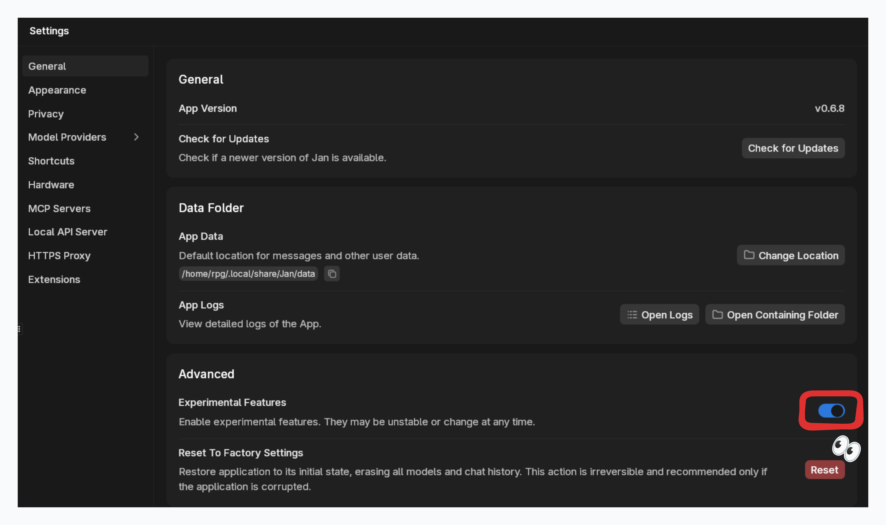
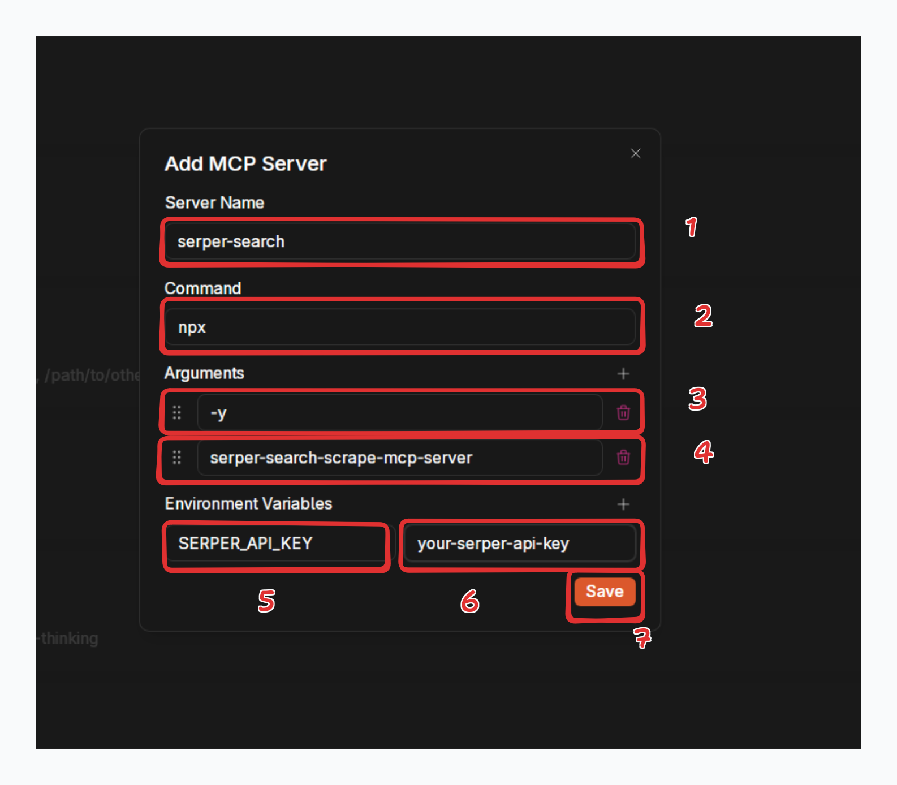
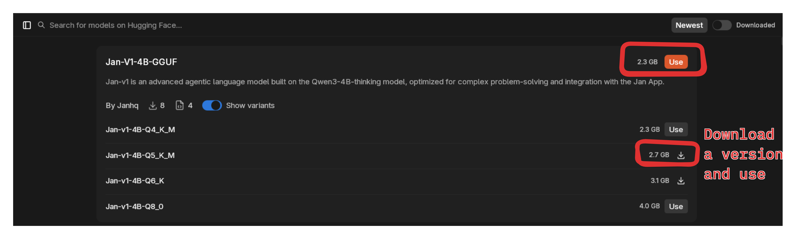
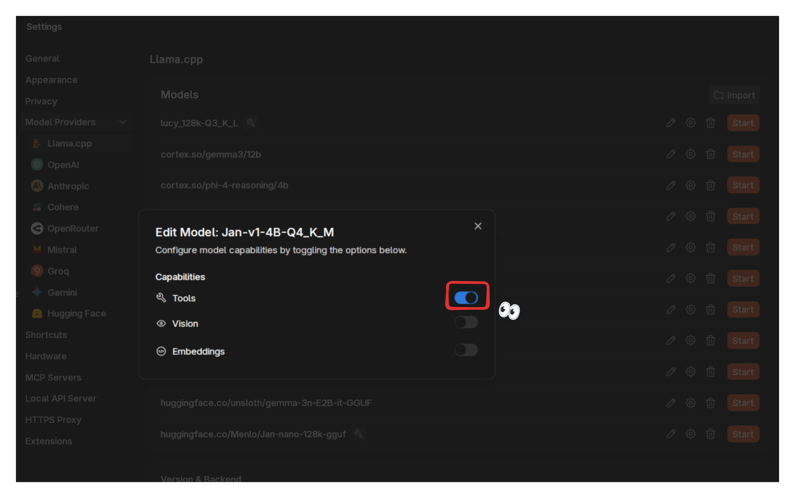

---

title: Serpex Search MCP

description: Connect Jan to multi-engine web search with structured JSON results through Serpex API.

keywords:

  [

    Jan,

    MCP,

    Model Context Protocol,

    Serpex,

    SERP API,

    multi-engine search,

    web search,

    real-time search,

    tool calling,

    Jan v1,

    Google search,

    Bing search,

    DuckDuckGo,

    Brave search,

  ]

---

import { Callout, Steps } from 'nextra/components'

# Serpex Search MCP

[Serpex](https://serpex.dev) provides unified access to multiple search engines (Google, Bing, DuckDuckGo, Brave, Yahoo, Yandex) through a single API, making it perfect for giving AI models access to real-time web information with automatic engine routing, captcha handling, and structured JSON results.

## Available Tools

- `serpex_search`: Search across multiple engines with automatic routing and time filtering

## Key Features

- **Web Search**: Search across multiple engines with automatic routing
- **Multi-Engine Support**: Google, Bing, DuckDuckGo, Brave, Yahoo, Yandex
- **Auto Routing**: Automatically selects the best available search engine
- **Time Filtering**: Filter results by time range (day, week, month, year)
- **Structured Results**: Get clean, structured JSON data
- **No Captcha Hassles**: Built-in captcha solving and proxy rotation
- **Fast & Affordable**: Optimized infrastructure for speed and cost-efficiency

## Prerequisites

- Jan with experimental features enabled
- Serpex API key from [serpex.dev](https://serpex.dev)
- Model with tool calling support (recommended: Jan v1)
- Node.js installed for creating custom MCP server

<Callout type="info">
Serpex offers a generous free tier perfect for testing and personal projects. The API is fast, affordable, and handles blocking and captchas automatically.
</Callout>

## Setup

### Enable Experimental Features

1. Go to **Settings** > **General**
2. Toggle **Experimental Features** ON



### Enable MCP

1. Go to **Settings** > **MCP Servers**
2. Toggle **Allow All MCP Tool Permission** ON


### Get Serpex API Key

1. Visit [serpex.dev](https://serpex.dev)
2. Sign up for an account
3. Navigate to your dashboard
4. Copy your API key

### Configure MCP Server

Click `+` in MCP Servers section:

**Configuration:**
- **Server Name**: `serpex`
- **Command**: `npx`
- **Arguments**: `-y serpex-search-mcp-server`
- **Environment Variables**:
  - Key: `SERPEX_API_KEY`, Value: `your-api-key`



<Callout type="tip">
Using `npx` means you don't need to install anything - it will automatically download and run the latest version of the Serpex MCP server from npm.
</Callout>

### Download Jan v1

Jan v1 is optimized for tool calling and works excellently with Serpex:

1. Go to the **Hub** tab
2. Search for **Jan v1**
3. Choose your preferred quantization
4. Click **Download**



### Enable Tool Calling

1. Go to **Settings** > **Model Providers** > **Llama.cpp**
2. Find Jan v1 in your models list
3. Click the edit icon
4. Toggle **Tools** ON



## Usage

### Start a New Chat

With Jan v1 selected and Serpex configured, you'll see the Serpex search tool available.

### Example Queries

**Current Information:**
```
What are the latest developments in quantum computing this week?
```

**Multi-Engine Search:**
```
Search for "best AI models 2025" using different search engines and compare the results.
```

**Comparative Analysis:**
```
What are the main differences between TypeScript and JavaScript? Give me current best practices.
```

**Research Tasks:**
```
Find recent news about SpaceX Starship launches.
```

**Time-Filtered Search:**
```
What are the top tech news stories from the last 24 hours?
```

**Local Information:**
```
Find coffee shops in San Francisco that opened this year.
```

## How It Works

1. **Query Processing**: Jan v1 analyzes your question and determines search parameters
2. **Engine Selection**: Serpex automatically routes to the best available engine (or uses your specified engine)
3. **Web Search**: Calls Serpex API which handles captchas, blocks, and retries automatically
4. **Result Parsing**: Returns clean, structured JSON with titles, URLs, snippets, and metadata
5. **Synthesis**: Jan v1 combines search results into a comprehensive, conversational answer

## Key Advantages of Serpex

- **Multi-Engine Support**: Access Google, Bing, DuckDuckGo, Brave, Yahoo, and Yandex through one API
- **Auto Routing**: Automatic engine selection based on availability and performance
- **Block-Free**: Handles captchas, rate limits, and blocking automatically
- **Fast & Affordable**: Optimized for speed and cost-effectiveness
- **Structured Data**: Clean JSON output perfect for AI processing
- **Time Filtering**: Filter results by recency (day, week, month, year)

## Search Parameters

The `serpex_search` tool supports these parameters:

- **q** (required): Your search query
- **engine** (optional): Choose from:
  - `auto` (default) - Automatically selects best engine
  - `google` - Google Search
  - `bing` - Microsoft Bing
  - `duckduckgo` - DuckDuckGo
  - `brave` - Brave Search
  - `yahoo` - Yahoo Search
  - `yandex` - Yandex
- **time_range** (optional): Filter by time:
  - `all` (default)
  - `day` - Past 24 hours
  - `week` - Past 7 days
  - `month` - Past 30 days
  - `year` - Past year

## Tips for Best Results

- **Be specific**: "Tesla Model 3 2024 price in California" works better than "Tesla price"
- **Use auto engine**: Let Serpex choose the best engine automatically with `engine: 'auto'`
- **Request recent info**: Use time_range parameter or add "latest", "recent" to queries
- **Ask follow-ups**: Jan v1 maintains context for deeper research
- **Combine with analysis**: Ask for comparisons, summaries, or insights from search results

## Troubleshooting

### Server Won't Start

- Verify `SERPEX_API_KEY` is set correctly in environment variables
- Check that Node.js is installed and accessible
- Ensure all dependencies are installed: `npm install`
- Verify the path to `index.js` is absolute and correct

### No Results Returned

- Check your API key is valid at [serpex.dev](https://serpex.dev)
- Verify you have available credits in your Serpex account
- Try with `engine: 'auto'` to let Serpex choose the best engine
- Check the MCP server logs for error messages

### Tool Not Showing in Jan

- Ensure experimental features are enabled
- Verify MCP is enabled and permissions are granted
- Restart Jan after adding the MCP server
- Check that Jan v1 has tools enabled in model settings

### API Rate Limits

- Serpex has generous rate limits on all plans
- Free tier: Check your dashboard for current limits
- Paid plans: Higher limits and priority routing
- Use caching when possible to reduce API calls

## Advantages Over Other Search APIs

- **Multi-Engine**: Access 6 engines vs single engine APIs
- **Auto Routing**: No manual engine switching needed
- **No Captchas**: Built-in handling vs manual solving
- **Affordable**: Competitive pricing with generous free tier
- **Structured Data**: Consistent JSON format across all engines
- **Fast Response**: Optimized infrastructure

## API Limits & Pricing

Serpex offers flexible pricing:

- **Free Tier**: Generous limits for testing and personal use
- **Pay-as-you-go**: Only pay for what you use
- **Enterprise**: Custom limits and SLA options

Visit [serpex.dev/pricing](https://serpex.dev/pricing) for current pricing details.

## Next Steps

Serpex MCP enables Jan v1 to access current web information across multiple search engines, making it a powerful research assistant. Combine with other MCP tools for even more capabilities:

- Use Serpex for search, then E2B for data analysis
- Combine with Jupyter for visualization
- Integrate with file system tools for saving research

## Learn More

- [Serpex Documentation](https://serpex.dev/docs)
- [Serpex API Reference](https://serpex.dev/docs/api)
- [MCP Server on npm](https://www.npmjs.com/package/serpex-search-mcp-server)
- [Serpex TypeScript SDK](https://www.npmjs.com/package/serpex)
- [Serpex Python SDK](https://pypi.org/project/serpex)

## Additional Resources

- [Model Context Protocol Specification](https://modelcontextprotocol.io)
- [Jan MCP Documentation](https://jan.ai/docs/desktop/mcp)
- [Serpex Pricing](https://serpex.dev/pricing)

<Callout type="success">
Using Serpex MCP with Jan v1 gives you powerful web search capabilities across multiple engines. The npm package is regularly updated with improvements and bug fixes.
</Callout>
