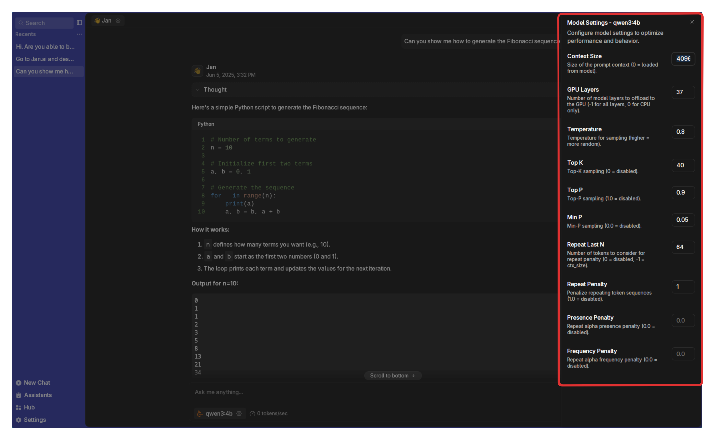
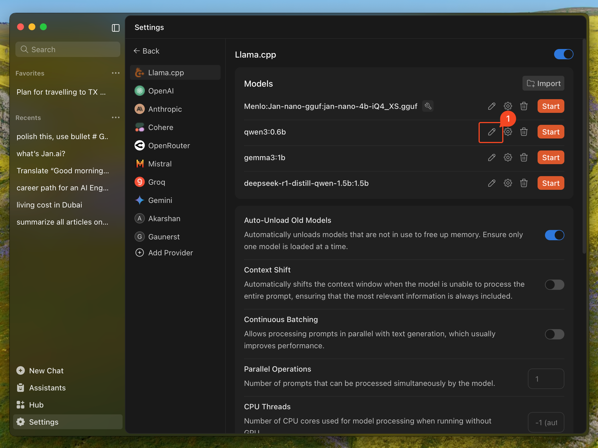

import { Callout, Steps } from 'nextra/components'

# Model Parameters

Model parameters control how your AI thinks and responds. Think of them as the AI's personality settings and performance controls.

## How to Access Settings

**For individual conversations:**
- In **Threads**, click the **gear icon** next to your selected model

**For permanent model settings:**
- Go to **Settings > Model Providers > Llama.cpp**, click the **gear icon** next to a model

**For model capabilities:**
- Click the **edit button** next to a model to enable features like vision or tools

## Performance Settings (Gear Icon)

These settings control how the model thinks and performs:

| Setting | What It Does | Simple Explanation |
|---------|-------------|-------------------|
| **Context Size** | How much text the model remembers | Like the model's working memory. Larger = remembers more of your conversation, but uses more computer memory. |
| **GPU Layers** | How much work your graphics card does | More layers on GPU = faster responses, but needs more graphics memory. Start high and reduce if you get errors. |
| **Temperature** | How creative vs. predictable responses are | Low (0.1-0.3) = focused, consistent answers. High (0.7-1.0) = creative, varied responses. Try 0.7 for general use. |
| **Top K** | How many word choices the model considers | Smaller numbers (20-40) = more focused. Larger numbers (80-100) = more variety. Most people don't need to change this. |
| **Top P** | Another way to control word variety | Works with Top K. Values like 0.9 work well. Lower = more focused, higher = more creative. |
| **Min P** | Minimum chance a word needs to be chosen | Prevents very unlikely words. Usually fine at default settings. |
| **Repeat Last N** | How far back to check for repetition | Helps prevent the model from repeating itself. Default values usually work well. |
| **Repeat Penalty** | How much to avoid repeating words | Higher values (1.1-1.3) reduce repetition. Too high makes responses awkward. |
| **Presence Penalty** | Encourages talking about new topics | Higher values make the model explore new subjects instead of staying on one topic. |
| **Frequency Penalty** | Reduces word repetition | Similar to repeat penalty but focuses on how often words are used. |

## Model Capabilities (Edit Button)

These toggle switches enable special features:

- **Vision**: Let the model see and analyze images you share
- **Tools**: Enable advanced features like web search, file operations, and code execution
- **Embeddings**: Allow the model to create numerical representations of text (for advanced users)
- **Web Search**: Let the model search the internet for current information
- **Reasoning**: Enable step-by-step thinking for complex problems

## Hardware Settings

These control how efficiently the model runs on your computer:

### GPU Layers
Think of your model as a stack of layers, like a cake. Each layer can run on either your main processor (CPU) or graphics card (GPU). Your graphics card is usually much faster.

- **More GPU layers** = Faster responses, but uses more graphics memory
- **Fewer GPU layers** = Slower responses, but uses less graphics memory

Start with the maximum number and reduce if you get out-of-memory errors.

### Context Length
This is like the model's short-term memory - how much of your conversation it can remember at once.

- **Longer context** = Remembers more of your conversation, better for long discussions
- **Shorter context** = Uses less memory, runs faster, but might "forget" earlier parts of long conversations

<Callout type="info">
Jan defaults to 8192 tokens (roughly 6000 words) or your model's maximum, whichever is smaller. This handles most conversations well.
</Callout>

## Quick Setup Guide

**For most users:**
1. Enable **Tools** if you want web search and code execution
2. Set **Temperature** to 0.7 for balanced creativity
3. Max out **GPU Layers** (reduce only if you get memory errors)
4. Leave other settings at defaults

**For creative writing:**
- Increase **Temperature** to 0.8-1.0
- Increase **Top P** to 0.95

**For factual/technical work:**
- Decrease **Temperature** to 0.1-0.3
- Enable **Tools** for web search and calculations

**Troubleshooting:**
- **Responses too repetitive?** Increase Temperature or Repeat Penalty
- **Out of memory errors?** Reduce GPU Layers or Context Size
- **Responses too random?** Decrease Temperature
- **Model running slowly?** Increase GPU Layers (if you have VRAM) or reduce Context Size
