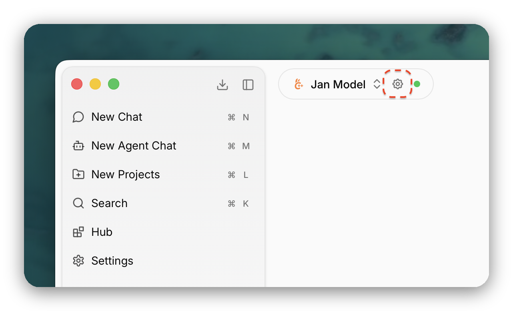
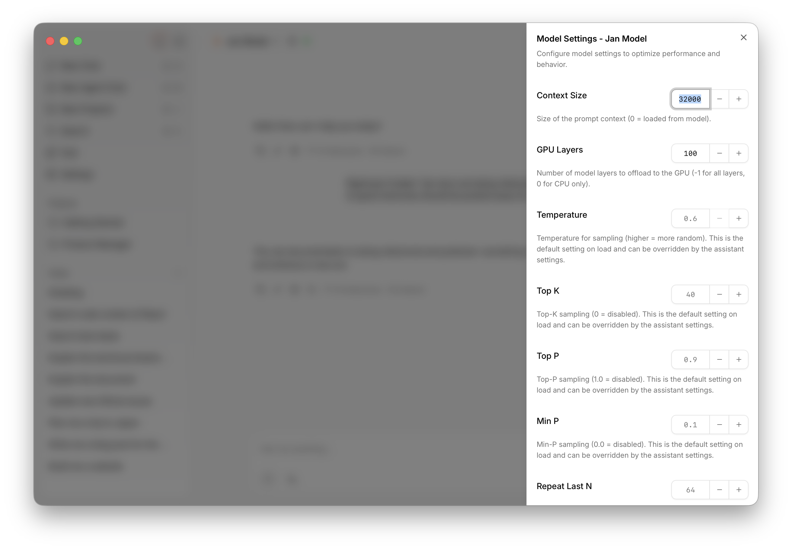

import { Callout } from 'nextra/components'

# Model Settings

Model settings control how your AI thinks and responds. Think of them as the AI's personality settings and performance controls.

## How to Access Settings

Click the **gear icon** next to your selected model in the chat interface to open Model Settings.

A panel will slide open on the right with all available model settings:

## Settings Reference

| Setting | What It Does | Simple Explanation |
|---------|-------------|-------------------|
| **Context Size** | How much text the model remembers | Like the model's working memory. Larger = remembers more of your conversation, but uses more computer memory. |
| **GPU Layers** | How much work your graphics card does | More layers on GPU = faster responses, but needs more graphics memory. Start high and reduce if you get errors. |
| **Temperature** | How creative vs. predictable responses are | Low (0.1-0.3) = focused, consistent answers. High (0.7-1.0) = creative, varied responses. Try 0.7 for general use. |
| **Top K** | How many word choices the model considers | Smaller numbers (20-40) = more focused. Larger numbers (80-100) = more variety. |
| **Top P** | Another way to control word variety | Works with Top K. Values like 0.9 work well. Lower = more focused, higher = more creative. |
| **Min P** | Minimum chance a word needs to be chosen | Prevents very unlikely words. Usually fine at default. |
| **Repeat Last N** | How far back to check for repetition | Helps prevent the model from repeating itself. Default values usually work well. |
| **Repeat Penalty** | How much to avoid repeating words | Higher values (1.1-1.3) reduce repetition. Too high makes responses awkward. |
| **Presence Penalty** | Encourages talking about new topics | Higher values make the model explore new subjects instead of staying on one topic. Remote providers only — has no effect on local llama.cpp models. |
| **Frequency Penalty** | Reduces word repetition | Similar to repeat penalty but focuses on how often words are used. Remote providers only — has no effect on local llama.cpp models. |

## Reasoning Mode

When using the **llama.cpp** provider, a brain icon appears in the chat input toolbar for models that support extended thinking (e.g. DeepSeek-R1, QwQ). Use it to set the reasoning mode for that model:

| Mode | Behavior |
|------|----------|
| **Auto** | Model decides when to reason internally |
| **On** | Always reason before responding |
| **Off** | Skip reasoning, reply directly |

This setting persists per model and does not require reloading. The toggle is only shown for the llama.cpp provider — it is not available for remote cloud providers.

## Advanced Sampling (llama.cpp only)

<Callout type="info">
The following settings are only applied when using a local llama.cpp model. They have no effect on remote cloud providers.
</Callout>

### Mirostat

An alternative sampling algorithm that targets a specific perplexity level, producing more consistent output length and coherence compared to top-p/top-k.

| Setting | What It Does | Simple Explanation |
|---------|-------------|-------------------|
| **Mirostat Mode** | Sampling algorithm to use | Off = standard top-p/k. V1 or V2 = Mirostat (V2 is more stable) |
| **Mirostat Learning Rate** | How quickly the algorithm adapts | Lower (0.05) = more stable, higher (0.2) = adapts faster |
| **Mirostat Target Entropy** | Desired output complexity | Higher values allow more variety; lower values produce tighter focus |

### Output Constraints

Force the model to produce output that matches a specific format.

| Setting | What It Does | Simple Explanation |
|---------|-------------|-------------------|
| **Grammar File** | Path to a GBNF grammar file | Constrains every token to match the grammar, useful for code, lists, or custom formats |
| **JSON Schema File** | Path to a JSON Schema file | Enforces a specific JSON structure in every response |

## Hardware Settings

These control how efficiently the model runs on your computer:

### GPU Layers
Think of your model as a stack of layers, like a cake. Each layer can run on either your main processor (CPU) or graphics card (GPU). Your graphics card is usually much faster.

- **More GPU layers** = Faster responses, but uses more graphics memory
- **Fewer GPU layers** = Slower responses, but uses less graphics memory

Start with the maximum number and reduce if you get out-of-memory errors.

### Context Length
This is like the model's short-term memory - how much of your conversation it can remember at once.

- **Longer context** = Remembers more of your conversation, better for long discussions
- **Shorter context** = Uses less memory, runs faster, but might "forget" earlier parts of long conversations

<Callout type="info">
When **Fit to Hardware** is enabled, Jan automatically caps context size based on your model and available memory. This is on by default for Windows and Linux with a discrete GPU, and off by default for integrated GPUs and macOS (Apple Silicon uses unified memory, so the cap is less critical). If fit is disabled, you can set context size freely — but values beyond what your hardware can handle will cause slowdowns or out-of-memory errors.
</Callout>

## Quick Setup Guide

**For most users:**
1. Set **Temperature** to 0.7 for balanced creativity
2. Max out **GPU Layers** (reduce only if you get memory errors)
3. Leave other settings at defaults

**For creative writing:**
- Increase **Temperature** to 0.8-1.0
- Increase **Top P** to 0.95

**For factual/technical work:**
- Decrease **Temperature** to 0.1-0.3

**Troubleshooting:**
- **Responses too repetitive?** Increase Temperature or Repeat Penalty
- **Out of memory errors?** Reduce GPU Layers or Context Size
- **Responses too random?** Decrease Temperature
- **Model running slowly?** Increase GPU Layers (if you have VRAM) or reduce Context Size
