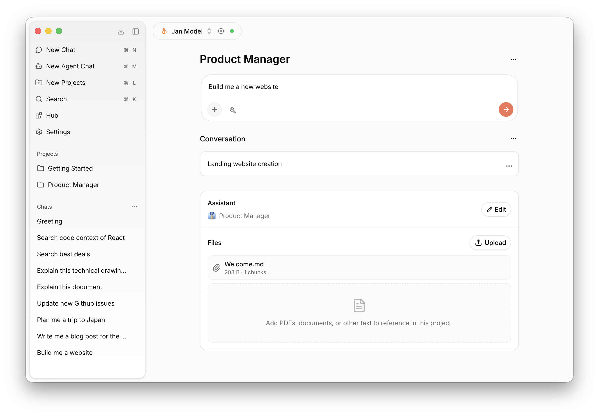

import { Steps } from 'nextra/components'

# Projects

Projects let you organize your AI work around a topic or goal. Each project has its own conversations, an assigned assistant, and a shared set of files — all in one place.

## Create a Project

<Steps>

### New Project

Press **⌘ L** or click **New Projects** in the left sidebar.

### Name your project

Give it a name that reflects the goal — e.g. "Product Manager", "Research", "Code Review".

### Start a conversation

Type your message in the input field. All conversations inside the project share the same assistant and files.

</Steps>

## Assistant

Each project can have an assigned [Assistant](/docs/desktop/assistants). The assistant's instructions apply automatically to every conversation within the project. Click **Edit** to change or update the assistant.

## Files

Upload documents to a project and reference them in any conversation within it. Supported formats include PDFs, Markdown, and other text files.

- Click **Upload** to add files
- Uploaded files are chunked and available as context across all project conversations
- Ask questions about documents, extract information, or use them as background reference

The file panel shows each uploaded file with its size and chunk count.
