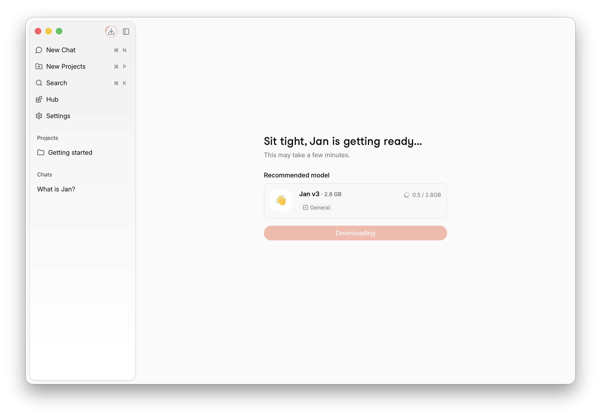
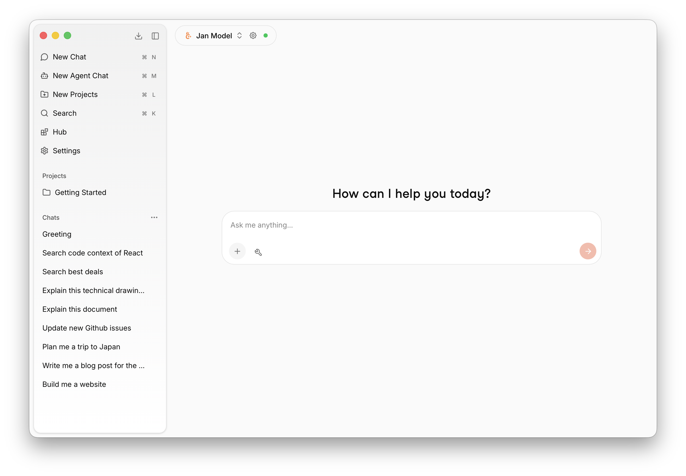
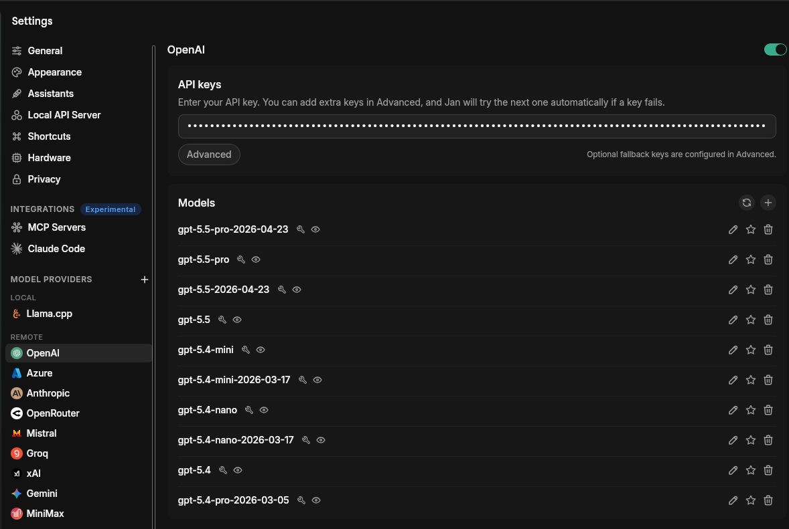

import { Callout, Steps } from 'nextra/components'
import { Link } from 'nextra-theme-docs'
import { DocCard, DocCards } from '@/components/DocCard'
import { FolderOpen, Bot, Cpu, Plug, Brain } from 'lucide-react'

# QuickStart

Get up and running with Jan in minutes. This guide will help you install Jan, download a model, and start chatting immediately.

<Steps>

### Install Jan

1. <Link href="https://jan.ai/download" target="_blank" rel="noopener noreferrer">Download Jan</Link>
2. Install the app ([Mac](/docs/desktop/install/mac), [Windows](/docs/desktop/install/windows), [Linux](/docs/desktop/install/linux))
3. Launch Jan

### Getting Ready

Jan automatically downloads its default foundation model on first launch. Once the download completes, you're ready to chat — no setup required.

### Start Chatting

Type your message and start chatting. Jan is ready to go.

Try asking:
- "Explain quantum computing in simple terms"
- "Help me write a Python function to sort a list"
- "What are the pros and cons of electric vehicles?"

<Callout type="tip">
Jan comes pre-configured with [Exa](https://exa.ai) for web search. To enable it, add your Exa API key under **Settings > MCP Servers** and toggle the Exa server on. Once active, you can ask about the latest news and current events.
</Callout>

### Download More Models

The **Hub** is where you browse and download local models. Each model shows whether it fits your
hardware, so you can pick one your machine can run comfortably.

1. Open the **Hub** from the left sidebar
2. Browse or search for a model, then click **Download**
3. Once downloaded, select it from the model selector in any chat

Want help choosing? See [Manage Models](/docs/desktop/manage-models) and the
[local engine guide](/docs/desktop/local-engine/llama-cpp).

</Steps>

## Local or Cloud

Jan runs models two ways, and you can mix both in the same app:

- **Local models** run entirely on your machine — private, offline, no API key. This is the default.
- **Cloud models** run on a provider's servers (OpenAI, Anthropic, Google, and more). They need an
  API key but let you use the largest frontier models without local hardware.

### Connect a Cloud Provider

1. Navigate to **Settings** > **Model Providers**
2. Select a provider (e.g. **OpenAI** or **Anthropic**) and paste your API key
3. Select one of its models from the model selector and start chatting

<Callout type="info">
Running your own server or using a provider Jan doesn't list? Connect any OpenAI- or
Anthropic-compatible endpoint — see [Custom Endpoints](/docs/desktop/remote-models/custom-endpoint).
</Callout>

See all [Cloud Providers](/docs/desktop/remote-models/openai) for per-provider setup.

## App Features

Jan is more than a chat interface. Organize your work with Projects, build custom Assistants, run autonomous Agents, and connect external tools via MCP.

<DocCards>
  <DocCard title="Projects" href="/docs/desktop/projects" icon={<FolderOpen size={20} />}>Organize conversations with shared instructions and files.</DocCard>
  <DocCard title="Assistants" href="/docs/desktop/assistants" icon={<Bot size={20} />}>Set up a personal AI assistant tailored to how you work.</DocCard>
  <DocCard title="Agents" href="/docs/desktop/agents" icon={<Cpu size={20} />}>Autonomous AI that reads files, manages calendars, and takes actions.</DocCard>
  <DocCard title="Connectors (MCP)" href="/docs/desktop/mcp" icon={<Plug size={20} />}>Extend your AI with web search, code execution, databases, and more.</DocCard>
</DocCards>

## Models

Beyond the default model, Jan comes with a range of foundation models for different tasks — from image understanding and reasoning to coding.

<DocCards>
  <DocCard title="Jan-Code-4B" href="/docs/desktop/jan-models/jan-code-4b" icon={<Brain size={20} />}>Optimized for code generation and reasoning tasks.</DocCard>
  <DocCard title="Jan-v3-4B" href="/docs/desktop/jan-models/jan-v3-4b-base-instruct" icon={<Brain size={20} />}>General purpose instruction-following model.</DocCard>
  <DocCard title="Jan-v2-VL" href="/docs/desktop/jan-models/jan-v2-vl-med" icon={<Brain size={20} />}>Vision-language model with strong reasoning capability for image understanding.</DocCard>
</DocCards>
