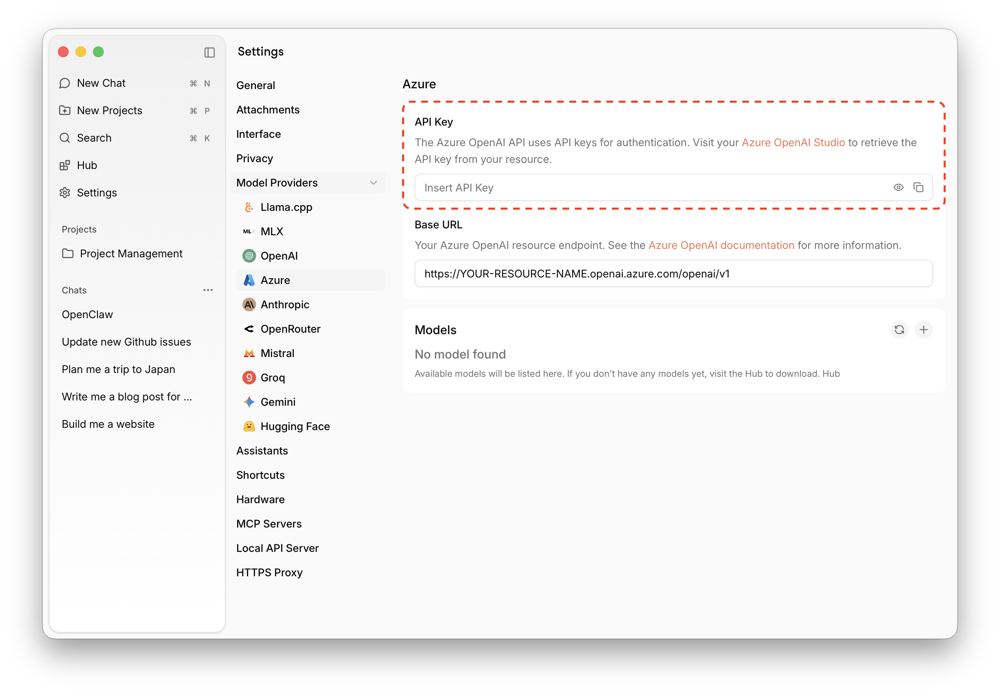

import { Callout, Steps } from 'nextra/components'
import { Settings } from 'lucide-react'

# Azure OpenAI

Jan supports [Azure OpenAI](https://azure.microsoft.com/en-us/products/ai-services/openai-service) API integration, allowing you to use Azure-hosted OpenAI models through Jan's interface.

## Integrate Azure OpenAI with Jan

<Steps>

### Step 1: Get Your API Key
1. Visit [Azure OpenAI Studio](https://oai.azure.com/) and sign in
2. Navigate to your resource and copy the API key

<Callout type='info'>
Ensure your Azure resource has the model deployments you want to use.
</Callout>

### Step 2: Configure Jan

1. Navigate to **Settings** (<Settings width={16} height={16} style={{display:"inline"}}/>)
2. Under **Model Providers**, select **Azure**
3. Insert your **API Key** and set your **Base URL** to your Azure OpenAI resource endpoint (e.g. `https://YOUR-RESOURCE-NAME.openai.azure.com/openai/v1`)

### Step 3: Start Using Azure Models

1. In any existing **Chat** or create a new one
2. Select an Azure model from **model selector**
3. Start chatting

</Steps>

## Troubleshooting

**1. API Key Issues**
- Verify your API key is correct and not expired
- Check if your Azure resource has the model deployment active

**2. Connection Problems**
- Check your internet connection
- Verify the Base URL matches your Azure resource endpoint exactly
- Look for error messages in [Jan's logs](/docs/desktop/troubleshooting#how-to-get-error-logs)

Need more help? Join our [Discord community](https://discord.gg/FTk2MvZwJH) or check the [Azure OpenAI documentation](https://learn.microsoft.com/en-us/azure/ai-services/openai/).
