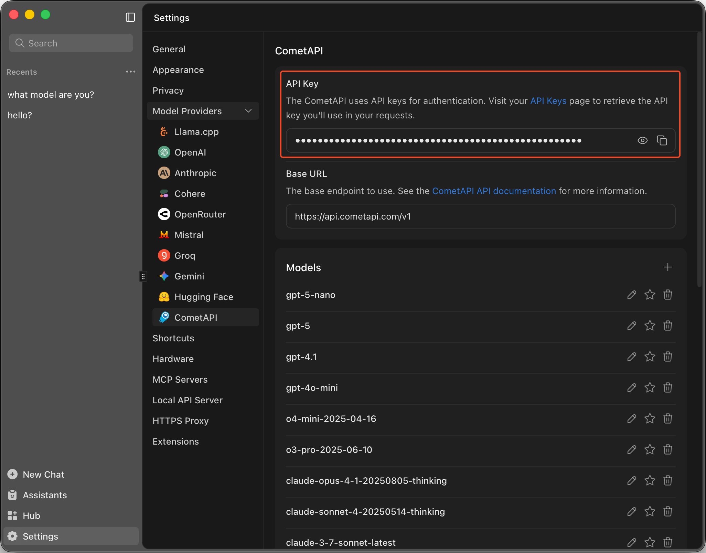

import { Callout, Steps } from 'nextra/components'
import { Settings, Plus } from 'lucide-react'

# CometAPI

Jan supports [CometAPI](https://www.cometapi.com/?utm_source=jan&utm_campaign=integration&utm_medium=integration&utm_content=integration) integration, providing access to 500+ AI models
through a unified API. CometAPI aggregates models from various providers including GPT, Claude, 
Gemini, Grok, DeepSeek, and Qwen series, offering competitive pricing and comprehensive model access.

## Integrate CometAPI with Jan

<Steps>

### Step 1: Get Your API Key
1. Visit [CometAPI Console](https://api.cometapi.com/console/token) and sign in
2. Create a new API key and/or copy your existing one

<Callout type='info'>
Ensure your API key has sufficient credits. CometAPI credits work across all 500+ available models.
</Callout>

### Step 2: Configure Jan

1. Navigate to **Settings** (<Settings width={16} height={16} style={{display:"inline"}}/>)
2. Under **Model Providers**, select **CometAPI**
3. Insert your **API Key**

 

 

### Step 3: Start Using CometAPI Models

1. Jump into any existing **Chat** or create a new one
2. Select any CometAPI model from the **model selector**
3. Start chatting with access to 500+ models
</Steps>

## Available CometAPI Models

Jan automatically fetches CometAPI's available models. The platform provides access to:

### Popular Model Series:
- **GPT Series**: `gpt-5-chat-latest`, `chatgpt-4o-latest`, `gpt-5-mini`, `gpt-5-nano`, `gpt-5`, `gpt-4.1`, `gpt-4o-mini`
- **Claude Series**: `claude-opus-4-1-20250805`, `claude-sonnet-4-20250514`, `claude-3-7-sonnet-latest`, `claude-3-5-haiku-latest`
- **Gemini Series**: `gemini-2.5-pro`, `gemini-2.5-flash`, `gemini-2.5-flash-lite`, `gemini-2.0-flash`
- **Grok Series**: `grok-4-0709`, `grok-3`, `grok-3-mini`, `grok-2-image-1212`
- **DeepSeek Series**: `deepseek-v3.1`, `deepseek-v3`, `deepseek-r1-0528`, `deepseek-chat`, `deepseek-reasoner`
- **Qwen Series**: `qwen3-30b-a3b`, `qwen3-coder-plus-2025-07-22`

### Custom Model Configuration:
For models not automatically listed in Jan, you can manually add them by following the instructions in [Add Cloud Models](/docs/manage-models):
- See the complete list of available models at [CometAPI Pricing](https://api.cometapi.com/pricing)
- Use the exact model `id` from the [CometAPI Models API](https://api.cometapi.com/v1/models)
- The `id` property must match the model name exactly (e.g., `gpt-5-mini`, `claude-sonnet-4-20250514`)

<Callout type='warning'>
CometAPI automatically filters out non-chat models (image generation, audio, video, and utility models) to show only conversational AI models in Jan.
</Callout>

## Troubleshooting

Common issues and solutions:

**1. API Key Issues**
- Verify your API key is correct and not expired
- Check if you have sufficient credits in your CometAPI account
- Ensure you have access to the model you're trying to use
- Test your API key with the [CometAPI Models endpoint](https://api.cometapi.com/v1/models)

**2. Connection Problems**
- Check your internet connection
- Verify CometAPI service availability
- Look for error messages in [Jan's logs](/docs/troubleshooting#how-to-get-error-logs)
- Ensure the base URL `https://api.cometapi.com/v1/` is accessible

**3. Model Unavailable**
- Confirm the model is currently available on CometAPI
- Check if you're using the correct model ID format
- Verify your account has access to the specific model
- Some models may require higher tier access

**4. Rate Limiting**
- CometAPI implements rate limiting per model and tier
- Consider upgrading your plan for higher rate limits
- Distribute requests across multiple models if needed

Need more help? Join the [CometAPI Discord community](https://discord.gg/cometapi) or check the [CometAPI documentation](https://api.cometapi.com/doc). You can also visit their [GitHub organization](https://github.com/cometapi-dev) for additional resources.