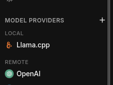
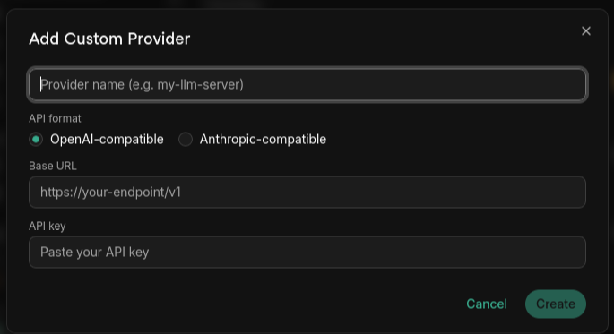
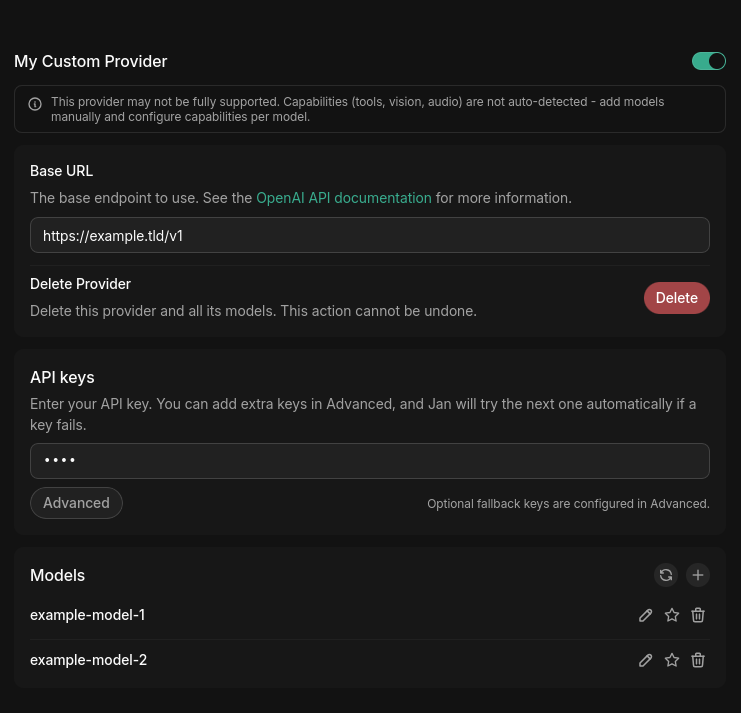
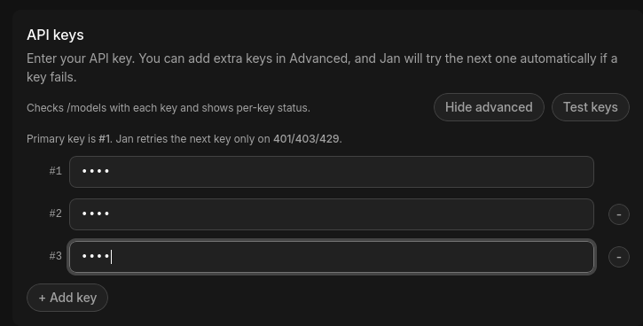

import { Callout, Steps } from 'nextra/components'
import { Settings, Plus } from 'lucide-react'

# Custom Endpoints

Beyond the built-in cloud providers, Jan can connect to **any endpoint that speaks the OpenAI or
Anthropic wire format**. This covers self-hosted servers (vLLM, Ollama, LocalAI, llama.cpp server,
TGI), gateways and proxies (LiteLLM, OpenRouter-style routers, Amazon Bedrock proxies), and any
provider that exposes an OpenAI- or Anthropic-compatible API.

## When to use a custom endpoint

- You run your own inference server (vLLM, Ollama, LocalAI, TGI, llama.cpp `llama-server`) on your
  machine or LAN.
- You use a gateway/proxy (LiteLLM, a Bedrock or Vertex proxy, an internal company gateway).
- You have a provider that isn't in Jan's built-in list but offers an OpenAI- or Anthropic-compatible API.

## Add a custom provider

<Steps>

### Step 1: Open the Add Provider dialog

1. Navigate to **Settings** (<Settings width={16} height={16} style={{display:"inline"}}/>) > **Model Providers**.
2. Click the **Add Provider** (<Plus width={16} height={16} style={{display:"inline"}}/>) button next to the providers list.

### Step 2: Choose the API format

In the **Add Custom Provider** dialog, pick the **API format** your endpoint speaks:

- **OpenAI-compatible** (default) — for vLLM, Ollama, LocalAI, TGI, llama.cpp server, LiteLLM in
  OpenAI mode, and most third-party providers.
- **Anthropic-compatible** — for endpoints that expose the Anthropic Messages API (Claude proxies,
  LiteLLM in Anthropic mode, Bedrock/Vertex Anthropic gateways).

<Callout type="info">
The API format determines how Jan formats requests and parses responses. Picking the wrong one will
cause requests to fail even if the base URL and key are correct. If you're unsure, your endpoint's
docs will say whether it's "OpenAI-compatible" or exposes the "Anthropic Messages API".
</Callout>

### Step 3: Fill in the details

| Field | Description |
| --- | --- |
| **Provider name** | A unique name for this provider (shown in the model selector). |
| **Base URL** | The root of the API. For OpenAI-compatible endpoints this is usually the URL ending in `/v1` (e.g. `http://localhost:8000/v1`). For Anthropic-compatible endpoints, use the base your gateway documents. |
| **API key** | Required. For local servers that don't check auth, enter any non-empty placeholder (e.g. `sk-no-key`). |

Click **Create** to add the provider.

<Callout type="warning">
**Base URL must include the version path your server expects.** A common mistake is entering
`http://localhost:8000` instead of `http://localhost:8000/v1` for OpenAI-compatible servers — the
request will 404. Trailing slashes are stripped automatically.
</Callout>

### Step 4: Add models

Jan tries to fetch the available models from `{base_url}/models` when you save. If your endpoint
doesn't expose that, add models manually: in the provider's **Models** section, click the **+**
button and enter the model ID exactly as your server expects it (e.g. `llama-3.1-8b-instruct`).

<Callout type="info">
Custom providers aren't capability-detected automatically — Jan can't infer whether a model supports
tools, vision, or audio. Add each model manually and configure its capabilities per model.
</Callout>

</Steps>

## Example base URLs

| Server / gateway | API type | Typical base URL |
| --- | --- | --- |
| vLLM | OpenAI-Compatible | `http://localhost:8000/v1` |
| Ollama | OpenAI-Compatible | `http://localhost:11434/v1` |
| LocalAI | OpenAI-Compatible | `http://localhost:8080/v1` |
| Text Generation Inference (TGI) | OpenAI-Compatible | `http://localhost:8080/v1` |
| LiteLLM (OpenAI mode) | OpenAI-Compatible | `http://localhost:4000/v1` |
| LiteLLM (Anthropic mode) | Anthropic-Compatible | `http://localhost:4000` |

<Callout type="info">
Ports and paths depend on how you launched the server — check its startup logs. The values above
are defaults and may differ in your setup.
</Callout>

## API key fallbacks

For remote providers you can configure **multiple API keys**. Jan uses the primary key first and
automatically retries with the next key **only** on HTTP `401` (unauthorized), `403` (forbidden),
or `429` (rate limited). Other errors do not trigger a retry.

<Steps>

### Configure fallback keys

1. Open the provider in **Settings** > **Model Providers**.
2. In the **API keys** section, click **Advanced**.
3. Add keys with **+ Add key** as numbered entries — `#1` is the primary, `#2` and onward are fallbacks.
4. Click **Test keys** to validate each one. Jan calls `{base_url}/models` per key and reports the
   result: **OK**, **Invalid/revoked (401)**, **Forbidden (403)**, **Rate limited (429)**, or
   **Network error**.

</Steps>

<Callout type="info">
If all keys fail with 401/403, Jan reports that key rotation is exhausted — every configured key is
bad or unauthorized. A persistent 429 across all keys means you're being rate limited; wait or add
more keys.
</Callout>

## Sampling parameters

For local engines (llama.cpp, MLX) and **custom providers**, Jan exposes the full set of sampling
parameters (temperature, top-K, top-P, min-P, repetition penalty, and more). For built-in cloud
providers these controls are hidden, because those providers manage or ignore most samplers.

<Callout type="warning">
Custom endpoints are permissive: Jan sends whatever samplers you set, but **your server may silently
ignore the ones it doesn't support.** If a parameter seems to have no effect, check whether your
backend implements it.
</Callout>

## Troubleshooting

| Symptom | Likely cause | Fix |
| --- | --- | --- |
| Requests fail immediately | Wrong **API type** for the endpoint | Match OpenAI- vs Anthropic-Compatible to what your server speaks |
| `404` on every request | Base URL missing `/v1` (or wrong path) | Add the version path your server expects |
| `401` / `403` | Bad or missing API key | Verify the key; for keyless local servers enter any non-empty placeholder |
| `429` | Rate limited | Wait, or add fallback keys |
| Connection refused / network error | Server not running, wrong host/port, or firewall | Confirm the server is up and reachable from your machine |
| No models listed | Endpoint doesn't expose `/models` | Add the model ID manually |

For deeper diagnosis, check [Jan's logs](/docs/desktop/troubleshooting#how-to-get-error-logs).

Need more help? Join our [Discord community](https://discord.gg/FTk2MvZwJH).
