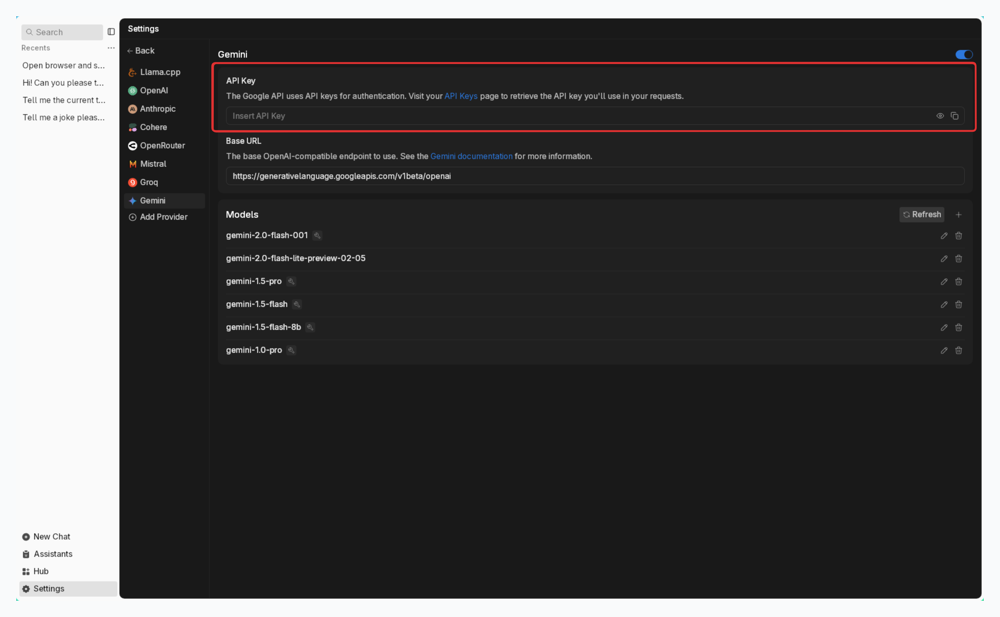

import { Callout, Steps } from 'nextra/components'
import { Settings, Plus } from 'lucide-react'

# Google

Jan supports [Google](https://ai.google/get-started/our-models/) API integration, allowing you to use Google models (like Gemini series) through Jan's interface.

## Integrate Google API with Jan

<Steps>
### Step 1: Get Your API Key
1. Visit [Google AI Studio](https://aistudio.google.com/app/apikey) and sign in
2. Create & copy a new API key or copy your existing one

<Callout type='info'>
Ensure your API key has sufficient credits
</Callout>

### Step 2: Configure Jan

1. Navigate to the **Settings** page (<Settings width={16} height={16} style={{display:"inline"}}/>)
2. Under **Model Providers**, select **Gemini**
3. Insert your **API Key**

 

 

### Step 3: Start Using Google's Models

1. Got to any existing **Chat** or create a new one
2. Select an Gemini model from **model selector**
3. Start chatting
</Steps>

## Available Google Models

Jan automatically includes Google's available models like Gemini series. In case you want to use a specific
Gemini model that you cannot find in **Jan**, follow instructions in [Add Cloud Models](/docs/desktop/manage-models#add-models-1):
- See list of available models in [Google Models](https://ai.google.dev/gemini-api/docs/models/gemini).
- The `id` property must match the model name in the list. For example, `gemini-1.5-pro` or `gemini-2.0-flash-lite-preview`.

## Troubleshooting

Common issues and solutions:

**1. API Key Issues**
- Verify your API key is correct and not expired
- Check if you have billing set up on your Google account
- Ensure you have access to the model you're trying to use

**2. Connection Problems**
- Check your internet connection
- Verify [Gemini's system status](https://www.google.com/appsstatus/dashboard/)
- Look for error messages in [Jan's logs](/docs/desktop/troubleshooting#how-to-get-error-logs)

**3. Model Unavailable**
- Confirm your API key has access to the model
- Check if you're using the correct model ID
- Verify your Google account has the necessary permissions

Need more help? Join our [Discord community](https://discord.gg/FTk2MvZwJH).
