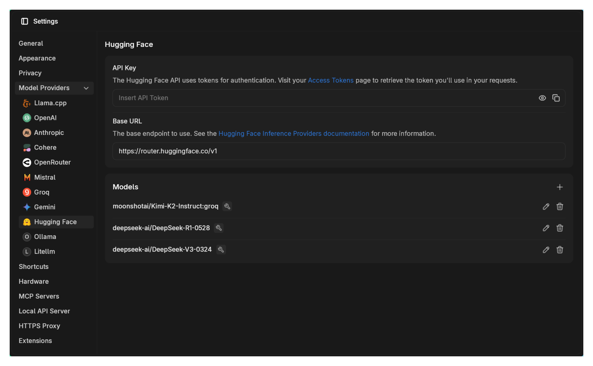
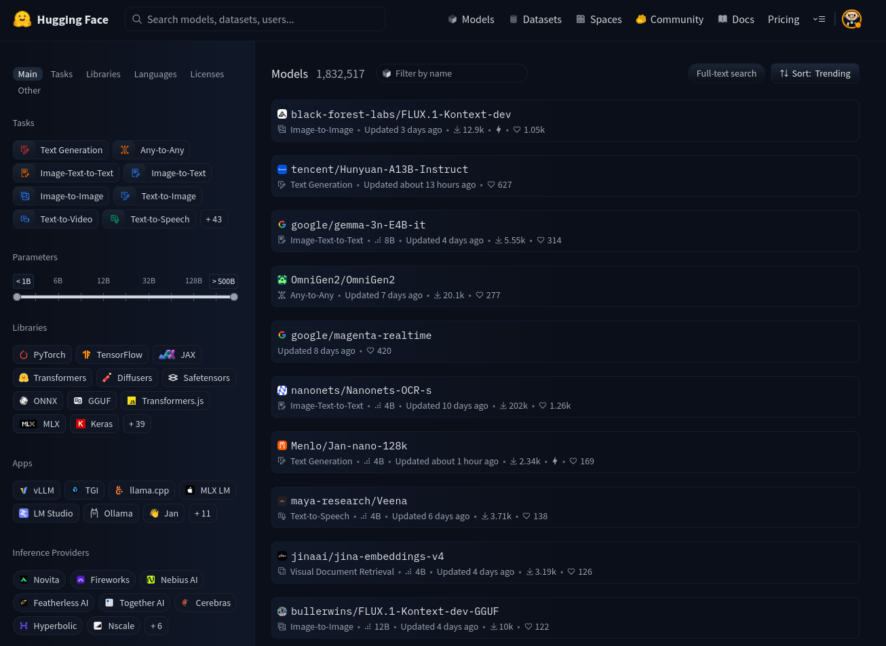
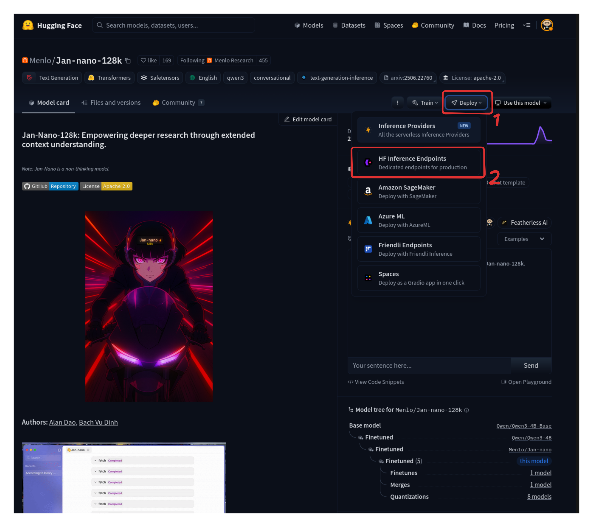
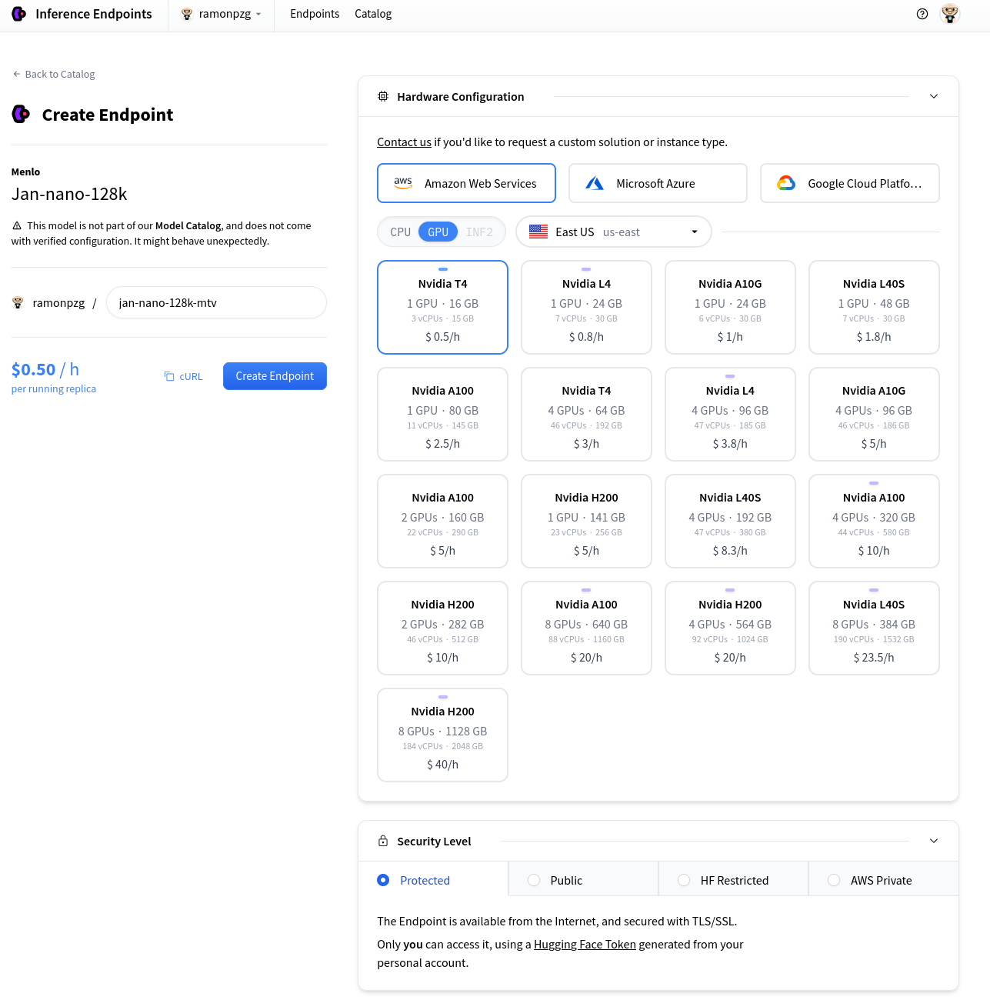
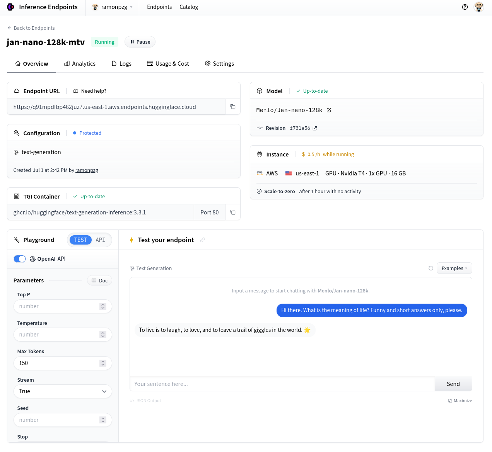
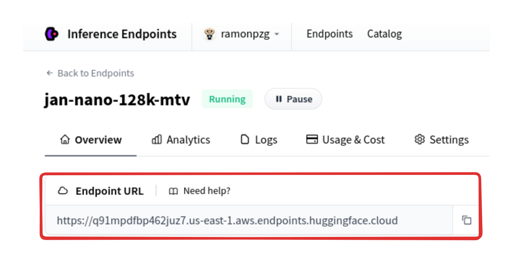
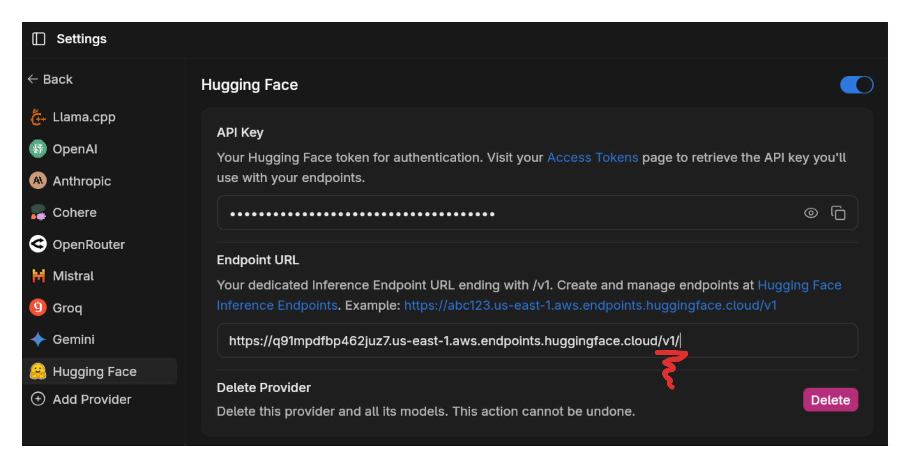
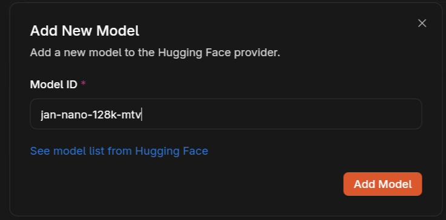
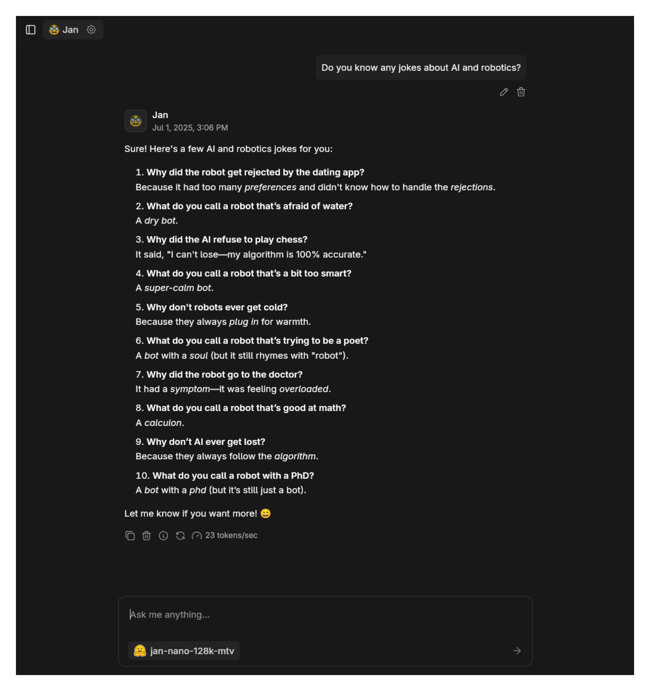
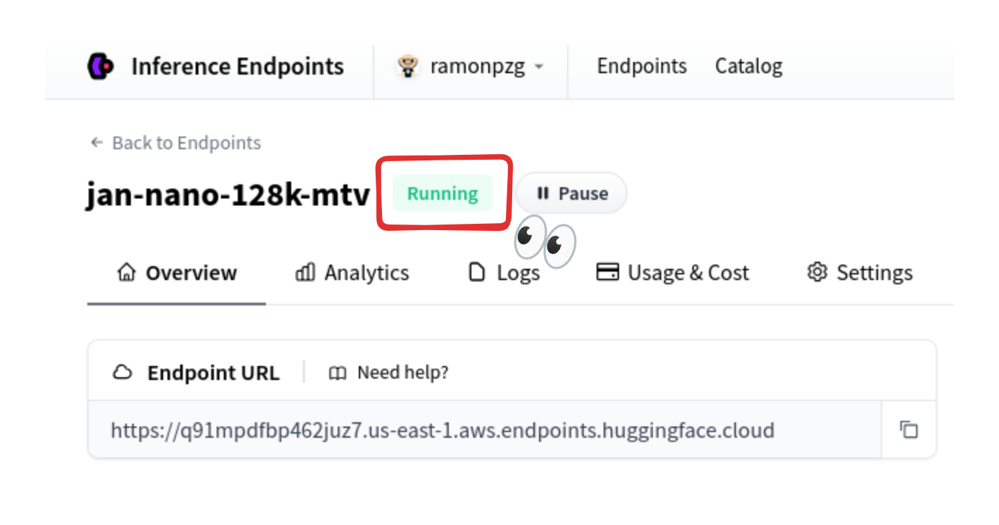

import { Callout, Steps } from 'nextra/components'
import { Settings, Plus } from 'lucide-react'

# Hugging Face

Jan supports Hugging Face models through two methods: the new **HF Router** (recommended) and **Inference Endpoints**. Both methods require a Hugging Face token and **billing to be set up**.

## Option 1: HF Router (Recommended)

The HF Router provides access to models from multiple providers (Replicate, Together AI, SambaNova, Fireworks, Cohere, and more) through a single endpoint.

<Steps>

### Step 1: Get Your HF Token

Visit [Hugging Face Settings > Access Tokens](https://huggingface.co/settings/tokens) and create a token. Make sure you have billing set up on your account.

### Step 2: Configure Jan

1. Go to **Settings** > **Model Providers** > **HuggingFace**
2. Enter your HF token
3. Use this URL: `https://router.huggingface.co/v1`

You can find out more about the HF Router [here](https://huggingface.co/docs/inference-providers/index).

### Step 3: Start Using Models

Jan comes with three HF Router models pre-configured. Select one and start chatting immediately.

</Steps>

<Callout type='info'>
The HF Router automatically routes your requests to the best available provider for each model, giving you access to a wide variety of models without managing individual endpoints.
</Callout>

## Option 2: HF Inference Endpoints

For more control over specific models and deployment configurations, you can use Hugging Face Inference Endpoints.

<Steps>

### Step 1: Navigate to the HuggingFace Model Hub

Visit the [Hugging Face Model Hub](https://huggingface.co/models) (make sure you are logged in) and pick the model you want to use.

### Step 2: Configure HF Inference Endpoint and Deploy

After you have selected the model you want to use, click on the **Deploy** button and select a deployment method. We will select HF Inference Endpoints for this one.

 

This will take you to the deployment set up page. For this example, we will leave the default settings as they are under the GPU tab and click on **Create Endpoint**.

 

Once your endpoint is ready, test that it works on the **Test your endpoint** tab.

 

If you get a response, you can click on **Copy** to copy the endpoint URL and API key.

<Callout type='info'>
  You will need to be logged into the HuggingFace Inference Endpoints and have a credit card on file to deploy a model.
</Callout>

### Step 3: Configure Jan

If you do not have an API key you can create one under **Settings** > **Access Tokens** [here](https://huggingface.co/settings/tokens). Once you finish, copy the token and add it to Jan alongside your endpoint URL at **Settings** > **Model Providers** > **HuggingFace**.

**3.1 HF Token**

 

**3.2 HF Endpoint URL**

 

**3.3 Jan Settings**

<Callout type='warning'>
Make sure to add `/v1/` to the end of your endpoint URL. This is required by the OpenAI API.
</Callout>

**3.4 Add Model Details**

### Step 4: Start Using the Model

Now you can start using the model in any chat.

If you want to learn how to use Jan Nano with MCP, check out [the guide here](../jan-models/jan-nano-32).
 

</Steps>

## Available Hugging Face Models

**Option 1 (HF Router):** Access to models from multiple providers as shown in the providers image above.

**Option 2 (Inference Endpoints):** You can follow the steps above with a large amount of models on Hugging Face and bring them to Jan. Check out other models in the [Hugging Face Model Hub](https://huggingface.co/models).

## Troubleshooting

Common issues and solutions:

**1. Started a chat but the model is not responding**
- Verify your API_KEY/HF_TOKEN is correct and not expired
- Ensure you have billing set up on your HF account
- For Inference Endpoints: Ensure the model you're trying to use is running again since, after a while, they go idle so that you don't get charged when you are not using it

**2. Connection Problems**
- Check your internet connection
- Verify Hugging Face's system status
- Look for error messages in [Jan's logs](/docs/desktop/troubleshooting#how-to-get-error-logs)

**3. Model Unavailable**
- Confirm your API key has access to the model
- Check if you're using the correct model ID
- Verify your Hugging Face account has the necessary permissions

Need more help? Join our [Discord community](https://discord.gg/FTk2MvZwJH) or check the
[Hugging Face's documentation](https://docs.huggingface.co/en/inference-endpoints/index).
