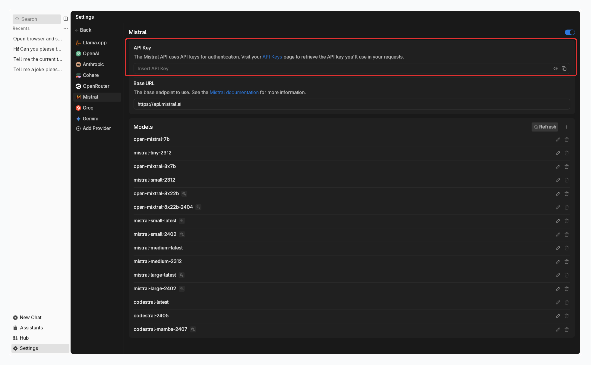

import { Callout, Steps } from 'nextra/components'
import { Settings, Plus } from 'lucide-react'

# Mistral AI

Jan supports all models available via the [Mistral AI](https://mistral.ai/) API, allowing you to use Mistral's
powerful models (Mistral Large, Mistral Medium, Mistral Small and more) through Jan's interface.

## Integrate Mistral AI with Jan

<Steps>

### Step 1: Get Your API Key
1. Visit the [Mistral AI Platform](https://console.mistral.ai/api-keys/) and sign in
2. Create & copy a new API key or copy your existing one

<Callout type='info'>
Ensure your API key has sufficient credits
</Callout>

### Step 2: Configure Jan

1. Navigate to the **Settings** page (<Settings width={16} height={16} style={{display:"inline"}}/>)
2. Under **Model Providers**, select **Mistral AI**
3. Insert your **API Key**

 

 

### Step 3: Start Using Mistral's Models

1. Open any existing **Chat** or create a new one
2. Select a Mistral model from **model selector**
3. Start chatting
</Steps>

## Available Mistral Models

Jan automatically includes Mistral's available models. In case you want to use a specific Mistral model
that you cannot find in **Jan**, follow the instructions in [Add Cloud Models](/docs/desktop/manage-models#add-models-1):
- See list of available models in [Mistral AI Documentation](https://docs.mistral.ai/platform/endpoints).
- The `id` property must match the model name in the list. For example, if you want to use
Mistral Large, you must set the `id` property to `mistral-large-latest`

## Troubleshooting

Common issues and solutions:

**1. API Key Issues**
- Verify your API key is correct and not expired
- Check if you have billing set up on your Mistral AI account
- Ensure you have access to the model you're trying to use

**2. Connection Problems**
- Check your internet connection
- Verify Mistral AI's system status
- Look for error messages in [Jan's logs](/docs/desktop/troubleshooting#how-to-get-error-logs)

**3. Model Unavailable**
- Confirm your API key has access to the model
- Check if you're using the correct model ID
- Verify your Mistral AI account has the necessary permissions

Need more help? Join our [Discord community](https://discord.gg/FTk2MvZwJH) or check the [Mistral AI documentation](https://docs.mistral.ai/).
