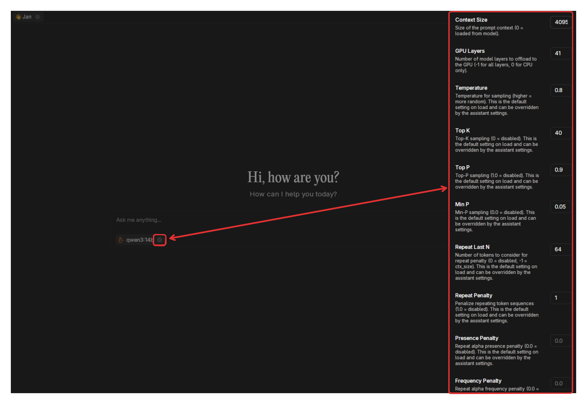
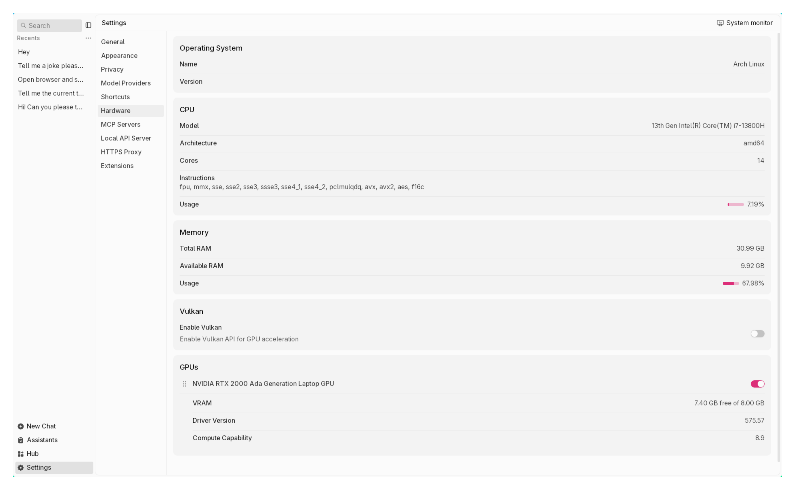
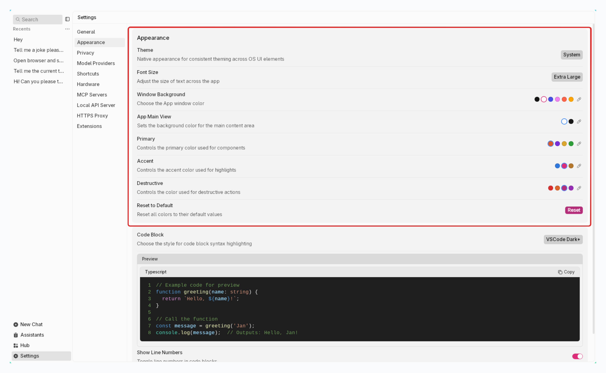
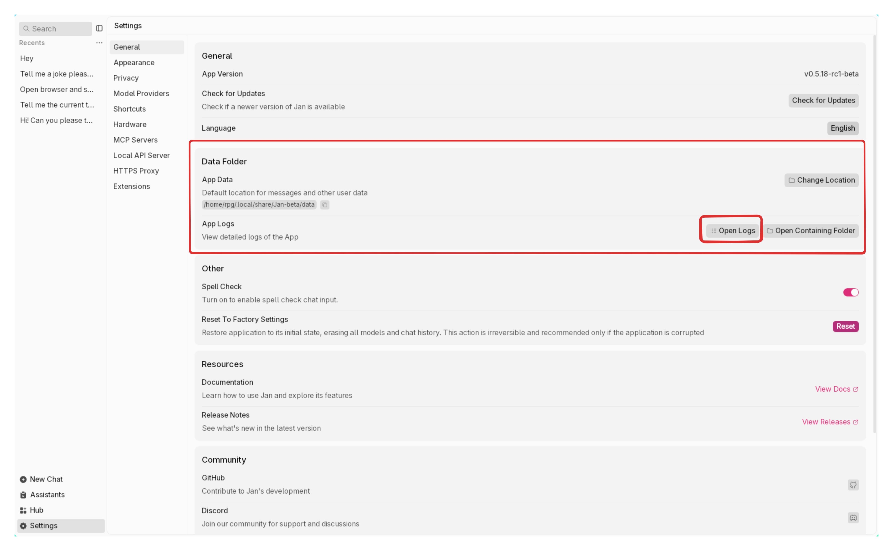
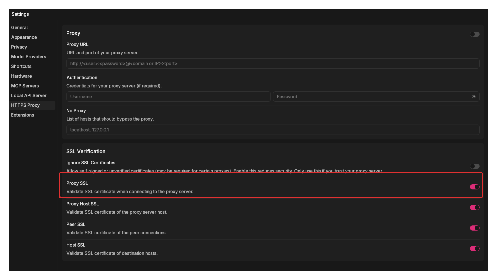

import { Tabs, Steps, Callout } from 'nextra/components'
import { Settings, EllipsisVertical, Plus, FolderOpen, Pencil } from 'lucide-react'


# Settings

To access the **Settings**, click <Settings width={16} height={16} style={{display:"inline"}}/> icon in the bottom left corner of Jan.

## Model Management

Manage your installed AI models in **Settings** > **Model Providers**:

### Import Models
- **From Hugging Face:**
  - Enter a model's Hugging Face ID (e.g., `org/model_name_or_id`) in the Hub's search bar.
  - **Note:** Some models require a Hugging Face Access Token. Enter your token in **Settings > Model Providers > Hugging Face Access Token**.
- **From Local Files:**
  - Click **Import Model** and select your GGUF files.

### Remove Models

- Click the trash icon next to the **Start** button and then click **Delete**.

### Start Models

1. Open a new chat and select the model you want to start.
2. Click the **Start** button on the **Settings > Model Providers**

### Hugging Face Access Token
To download models from Hugging Face that require authentication, for example, like the llama models from meta:
1. Get your token from [Hugging Face Tokens](https://huggingface.co/docs/hub/en/security-tokens)
2. Enter it in **Settings > Model Providers > Hugging Face**.

## Model Settings (Gear Icon)



Click the gear icon next to a model to configure advanced settings:
- **Context Size**: Maximum prompt context length
- **GPU Layers**: Number of model layers to offload to GPU. If you have an NVIDIA GPU and notice that your model won't fully load in it, you can reduce this value to load smaller parts of the model and try again.
- **Temperature**: Controls randomness (higher = more random)
- **Top K**: Limits token selection to K most likely next tokens (smaller K = more focused responses)
- **Top P**: Limits token selection to tokens comprising P probability mass (smaller P = more focused responses)
- **Min P**: Sets a minimum threshold for words the model can select (higher values filter out less likely words)
- **Repeat Last N**: Determines how many recent words the model checks to avoid repetition
- **Repeat Penalty**: Controls how strongly the model avoids repeating phrases (higher values reduce repetition)
- **Presence Penalty**: Discourages reusing words that already appeared in the text (helps with variety)

_See [Model Parameters](/docs/desktop/model-parameters) for a more detailed explanation._


## Hardware

Monitor and manage system resources at **Settings > Hardware**:
- **CPU, RAM, GPU**: View usage and specs
- **GPU Acceleration**: Enable/disable and configure GPU settings

<br/>

<br/>

## Preferences

### Interface & Theme
Control the visual theme of Jan's interface with any color combo you'd like. You can also control the color use in the code blocks.

<br/>

<br/>

### Spell Check
Jan includes a built-in spell check feature to help catch typing errors in your messages.

<br/>

<br/>


## Privacy
At **Settings** (<Settings width={16} height={16} style={{display:"inline"}}/>) > **Privacy**, you can control analytics & logs in Jan:

### Analytics
Jan is built with privacy at its core. By default, no data is collected. Everything stays local on your device.
You can help improve Jan by sharing anonymous usage data:
1. Toggle on **Analytics** to share anonymous data
2. You can change this setting at any time

<Callout type="info">
Read more about that we collect with opt-in users at [Privacy](/privacy).
</Callout>

<br/>

<br/>

### Log Management

**1. View Logs**
- Logs are stored at:
  - App log: `~/Library/Application\ Support/jan/data/logs/app.log`
  - Cortex log: `~/Library/Application\ Support/jan/data/logs/cortex.log`
- To open logs from Jan's interface: at **Logs**, click <FolderOpen width={16} height={16} style={{display:"inline"}}/> icon to open App Logs & Cortex Logs:

<br/>

<br/>

**2. Clear Logs**

Jan retains your logs for only **24 hours**. To remove all logs from Jan, at **Clear Logs**, click the **Clear** button:

<Callout type="warning">
This action cannot be undone.
</Callout>

<br/>

<br/>


### Jan Data Folder
Jan stores your data locally in your own filesystem in a universal file format. See detailed [Jan Folder Structure](/docs/desktop/data-folder#directory-structure).

**1. Open Jan Data Folder**

At **Jan Data Folder**, click <FolderOpen width={16} height={16} style={{display:"inline"}}/> icon to open Jan application's folder:
<br/>

<br/>

**2. Edit Jan Data Folder**

1. At **Jan Data Folder**, click <Pencil width={16} height={16} style={{display:"inline"}}/> icon to edit Jan application's folder
2. Choose a new directory & click **Select**, make sure the new folder is empty
3. Confirmation pop-up shows up:

> Are you sure you want to relocate Jan Data Folder to `new directory`?
Jan Data Folder will be duplicated into the new location while the original folder remains intact.
An app restart will be required afterward.

4. Click **Yes, Proceed**

<br/>

<br/>

### HTTPs Proxy
HTTPS Proxy encrypts data between your browser and the internet, making it hard for outsiders to intercept or read. It also helps you maintain your privacy and security while bypassing regional restrictions on the internet.

<Callout type="info">
- Model download speeds may be affected due to the encryption/decryption process and your cloud service provider's networking
- HTTPS Proxy does not affect the remote model usage.
</Callout>

1. **Enable** the proxy toggle
2. Enter your proxy server details in the following format:
```
http://<user>:<password>@<domain or IP>:<port>
```
Where:
- `<user>`: Your proxy username (if authentication is required)
- `<password>`: Your proxy password (if authentication is required)
- `<domain or IP>`: Your proxy server's domain name or IP address
- `<port>`: The port number for the proxy server

<br/>

<br/>

**Ignore SSL Certificates**

This setting allows Jan to accept self-signed or unverified SSL certificates. This may be necessary when:
- Working with corporate proxies using internal certificates
- Testing in development environments
- Connecting through specialized network security setups

<Callout type="info">
Only enable this option if you trust your network environment.
</Callout>

<br/>

<br/>


### Factory Reset
Reset to Factory Settings restores Jan to its initial state by erasing all user data, including downloaded models and chat history. This action is irreversible and should only be used as a last resort when experiencing serious application issues.

<Callout type="warning">
This action cannot be undone. All data will be permanently deleted.
</Callout>

Only use factory reset if:
- The application is corrupted
- You're experiencing persistent technical issues that other solutions haven't fixed
- You want to completely start fresh with a clean installation

To begin the process:
1. At  **Reset to Factory Settings**, click **Reset** button
<br/>

<br/>
2. In the confirmation dialog:
- Type the word **RESET** to confirm
- Optionally check **Keep the current app data location** to maintain the same data folder
- Click **Reset Now**
3. App restart is required upon confirmation
<br/>

<br/>
